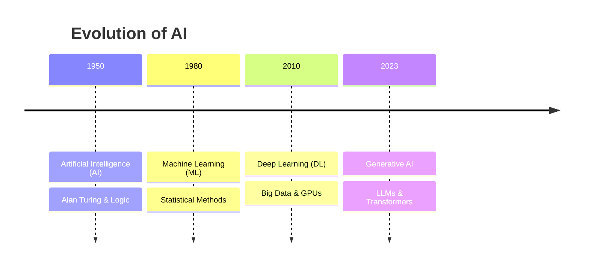
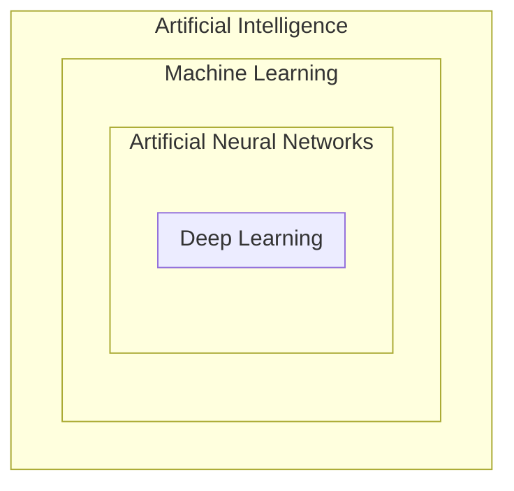
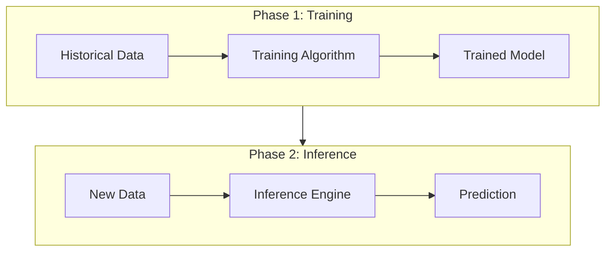

Links: 
___
# Foundations of AI and ML

## AI, ML, and DL

- **Artificial Intelligence (AI):** The broad discipline of creating intelligent machines that can simulate human capability.
- **Machine Learning (ML):** A subset of AI that provides systems the ability to automatically learn and improve from experience without being explicitly programmed.
- **Deep Learning (DL):** A specialized subset of ML based on artificial neural networks (ANN).
- **Artificial Neural Networks (ANN):** Computational models inspired by the human brain, consisting of interconnected nodes (neurons) that process information in layers.

> [!NOTE] Hierarchy Relationship
> **AI** includes **ML**, which includes **ANN**, which defines **DL**.
> All Deep Learning uses ANNs, but ANNs can be shallow (not "Deep").

#### Real vs. Synthetic Data
- **Synthetic Data:** Artificial data generated to test or design an algorithm under ideal conditions.
- **Real-Life Data:** Actual observed data. It often contains **deviations**, noise, and anomalies that the model must handle.

## How Machine Learning Works

[[00 Data Analytics#The Data Processing Cycle]]

At its core, Machine Learning is about **pattern recognition**.

### Traditional Programming vs. Machine Learning
In traditional programming, you give the computer the **Data** and the **Rules**, and it yields the **Answers**. In ML, you give the computer the **Data** and the **Answers**, and it learns the **Rules**.

| Approach             | Input          | Output        |
|:-------------------- |:-------------- |:------------- |
| **Traditional**      | Data + Rules   | Answers       |
| **Machine Learning** | Data + Answers | Rules (Model) |

### The 7 Stages of Machine Learning
The process of building an ML application typically follows these steps:

1.  **Data Collection:** Gathering raw data from various sources (files, databases, sensors).
2.  **Data Preparation:** Cleaning, formatting, and normalizing the data (handling missing values).
3.  **Choose a Model:** Selecting the mathematical approach (e.g., Regression, Decision Tree).
4.  **Training:** The model "learns" from the prepared data by finding patterns.
5.  **Evaluation:** Testing the model against data it hasn't seen to check accuracy.
6.  **Parameter Tuning:** Adjusting the internal settings (hyperparameters) to improve performance.
7.  **Prediction (Inference):** Using the trained model on new, live data to get results.

### Training vs. Inference
It is crucial to distinguish between the two main phases:

- **Training:** The "Learning" phase. Computationally expensive. The model iterates over historical data to minimize error.
- **Inference:** The "Using" phase. Fast. The trained model applies its learned rules to new data.

## Applications of ML
Machine Learning powers many technologies we use daily.

- **Social Media:** Friend recommendations (Facebook) and content feeds (Instagram).
- **Video Streaming:** Personalized video recommendations (YouTube, Netflix) based on watch history.
- **E-Commerce:** Product suggestions like "Customers who bought this also bought..." (Amazon).
- **Security:** Image recognition systems like FaceID (Apple).
- **Natural Language Processing (NLP):** Real-time language translation (Google Translate) and sentiment analysis.
- **Healthcare:** Medical diagnosis and disease detection.

> [!CAUTION] Explainability in Medicine
> In fields like **Medical Diagnosis**, accuracy isn't enough. The AI's decision must be **explainable**. A wrong diagnosis can be fatal, so doctors need to trust *why* the model made a prediction.
