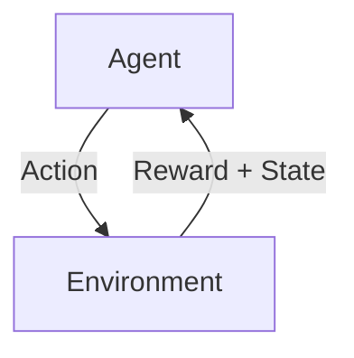

Links: 
___
# Types of Machine Learning

Machine Learning algorithms are categorized by how they learn and the type of data they use.

> [!TIP] The Three Types Simplified
> - **Supervised:** Learning with a Teacher (Answer Key provided).
> - **Unsupervised:** Learning by Self-Discovery (No Answer Key).
> - **Reinforcement:** Learning by Trial and Error (Rewards/Punishments).

## Supervised Learning
The model is trained on **labeled data**.

- **Mechanism:** The system is given both the input and the correct output (ground truth). It learns the mapping function from input to output.
- **Key Requirement:** A **feature list** where data is already mapped to the target.

> [!EXAMPLE] Labeled Data Example
> Input: Image of a cat.
> Label: "Cat".
> The model learns to associate the pixels with the label "Cat".

## Unsupervised Learning
The model is trained on **unlabeled data**.

- **Goal:** To discover hidden patterns, structures, or groupings within the data without human intervention.
- **Use Case:** When we do not have mapped outputs and the machine must find structure itself.

### Clustering
A common unsupervised technique that groups similar data points together. Common algorithms include:
- **K-Means:** Partitions data into 'k' distinct clusters.
- **Mean Shift:** Updates candidates for centroids to be the mean of the points within a given region.
- **DBSCAN:** Density-based spatial clustering that finds core samples of high density.
- **Principal Component Analysis (PCA):** Used for dimensionality reduction (simplifying complex data).

> [!EXAMPLE] Customer Segmentation
> A bank has millions of customers. By clustering them based on spending habits, they find 3 groups: "Students", "High Earners", and "Retirees". They can then target each with different offers.

### Association
Discovering mathematical rules that describe large portions of your data.

- **Goal:** Finding relationships between variables in large databases.
- **Example:** Market Basket Analysis (e.g., "If a customer buys Bread, they are 80% likely to buy Butter").
- **Algorithm:** Apriori.

> [!EXAMPLE] Playlist Generation
> Streaming services use association rules: "Users who listen to *Song A* frequently listen to *Song B*." This builds your "Discover Weekly" playlist.

## Reinforcement Learning (RL)

Learning by interacting with an environment. It is **feedback-based**.

- **Mechanism:** An **Agent** performs actions and observes the results.
- **Feedback Loop:**
    - **Positive Reward:** For a good action (e.g., winning a point).
    - **Negative Reward:** For a bad action (e.g., crashing).
- **Goal:** To maximize the cumulative reward over time.
- **Examples:** Robotics, Game Playing (AlphaGo).

> [!EXAMPLE] Training a Dog
> - **Action:** Dog sits on command.
> - **Reward (+ve):** Treat.
> - **Result:** Probability of sitting increases.
> - **Action:** Dog chews shoes.
> - **Punishment (-ve):** Scolding.
> - **Result:** Probability of chewing decreases.

