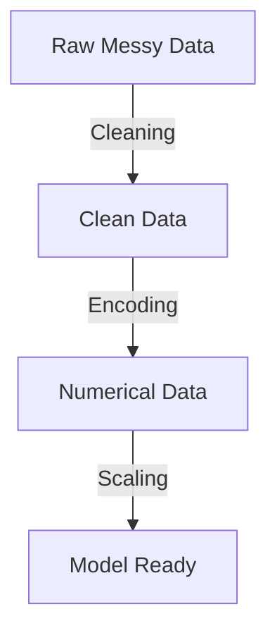

Links: 
___
# Data Preprocessing

**Data Preprocessing** involves cleaning, transforming, and preparing raw data to make it suitable for Machine Learning models.

## Why is it Important?
Real-world data is often "messy":

- **Missing Values:** Incomplete data affects model performance.
- **Noise:** Outliers or errors can mislead the algorithm.
- **Format:** Algorithms require numerical input (Maths don't work on strings like "Cat").
- **Scaling:** Inconsistent scales (e.g., Age vs Salary) can bias the model.

#### Pipeline of Data Preprocessing



## Handling Missing Values
> [!QUESTION] Why?
> Most algorithms (Linear Regression, SVM, Neural Nets) **cannot handle NaNs** and will crash. Simply ignoring them reduces dataset size, potentially losing valuable patterns.

Missing data occurs in three main forms:
1.  **MCAR (Missing Completely At Random):** No pattern to missingness.
    - *Example:* A lab vial is accidentally dropped and broken. The missing data has nothing to do with the patient or the result.
2.  **MAR (Missing At Random):** Missingness is related to other observed data.
    - *Example:* Women (observed variable) are less likely to disclose their weight (missing variable) than men.
3.  **MNAR (Missing Not At Random):** Missingness is related to the value itself.
    - *Example:* People with very high incomes are less likely to disclose their salary. The missingness is directly caused by the high salary.

### Removing Data
If the dataset is large and missing rows are few, we can simply drop them.

> [!EXAMPLE] Dropping Rows
> - **Scenario:** You have 1000 rows of customer data. 5 rows have a missing `Age`.
> - **Action:** Delete those 5 rows. You still have 995 valid rows (99.5% data retained).

```python
import pandas as pd
df = pd.read_csv("data.csv")

# Drop rows with any missing values
df.dropna(inplace=True)

# Drop columns with missing values
df.dropna(axis=1, inplace=True)
```

### Imputation (Filling)
Replacing missing values with statistical estimates.

> [!EXAMPLE] Mean Imputation
> - **Scenario:** An employee's `Salary` is missing. The average salary of the company is $50,000.
> - **Action:** Fill the missing cell with **$50,000**.

#### Simple Imputation
- **Mean:** Good for normal distributions. Affected by outliers.
- **Median:** Robust to outliers. Best for skewed data.
- **Mode:** Used for categorical data.

**Using Sklearn:**
```python
from sklearn.impute import SimpleImputer 

imputer = SimpleImputer(strategy='mean') # or 'median', 'most_frequent'
df['age'] = imputer.fit_transform(df[['age']])
```

#### Advanced Imputation
- **KNN Imputation:** Finds the 'k' nearest neighbors to the missing data point and imputes based on their values. More accurate but computationally expensive.
- **Regression Imputation:** Predicts the missing value using other variables as features in a regression model.

```python
from sklearn.impute import KNNImputer

knn = KNNImputer(n_neighbors=5)
df_filled = knn.fit_transform(df)
```

### Forward/Backward Fill
Propagating the last valid observation forward or backward (common in Time Series).

```python
# Forward fill (propagate last valid value)
df.fillna(method='ffill', inplace=True)

# Backward fill (use next valid value)
df.fillna(method='bfill', inplace=True)
```

## Encoding Categorical Variables
> [!QUESTION] Why?
> Computers cannot "read" text like "Cat" or "Dog". Models are mathematical functions ($y = mx + c$). We must translate text into numbers so the model can perform calculations on them.

Machine Learning models typically require numerical input. We must convert text categories into numbers.

### Label Encoding (Ordinal)
Assigns a unique integer to each category.

**Use Case:** **Ordinal Data** (Data with order: Low, Medium, High).
> [!CAUTION] 
> Do not use for Nominal data, as the model might misinterpret the order (e.g., Cat=1, Dog=2 implies Dog \> Cat).

```python
from sklearn.preprocessing import LabelEncoder

le = LabelEncoder()
df['size'] = le.fit_transform(df['size'])
```

### One-Hot Encoding (Nominal)
Creates a new binary column for each category.

> [!QUESTION] Why is it called "One-Hot"?
> In digital circuits, "One-Hot" refers to a group of bits where legal combinations of values are only those with a single high (1) bit and all others low (0). Here, for each row, only one category column is "Hot" (1).

**Use Case:** **Nominal Data** (No order: Red, Blue, Green).
**Result:** 'City' column becomes 'City_Paris', 'City_London'.

> [!CAUTION] Dummy Variable Trap (Multicollinearity)
> **The Issue:** If we check `Gender` (Male/Female), and we create two columns `Is_Male` and `Is_Female`:
> - If `Is_Male = 1`, then `Is_Female` **MUST** be 0.
> - If `Is_Male = 0`, then `Is_Female` **MUST** be 1.
> 
> This means one variable perfectly predicts the other (`Is_Female = 1 - Is_Male`). This strong correlation confuses the model (it can't distinguish the effect of one from the other).
> 
> **Solution:** Always drop one column (`n-1` dummies).
> - If `Is_Male = 1` -> Male.
> - If `Is_Male = 0` -> Female (Implied).
> - *We don't need a separate column for Female.*

**Using Pandas:**
```python
# drop_first=True avoids the Dummy Variable Trap
df = pd.get_dummies(df, columns=['city'], drop_first=True)
```

**Using Sklearn:**
```python
from sklearn.preprocessing import OneHotEncoder

ohe = OneHotEncoder(drop='first')
encoded = ohe.fit_transform(df[['city']])
```


