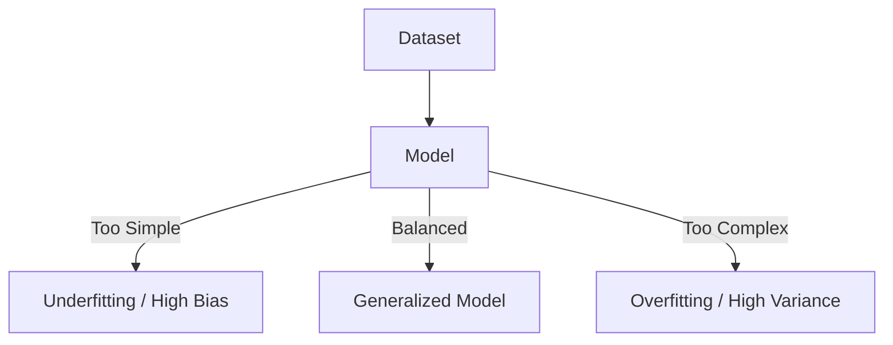

Links: [[01 Types of Machine Learning]]
___
# Model Evaluation

Evaluating how well a model generalizes to new, unseen data is critical. We often encounter two major problems:

## Underfitting (High Bias)
The model is **too simple** to capture the underlying patterns in the data.

- **Analogy:** Trying to fit a straight line through a curve.
- **Result:** It performs poorly on both Training Data and Testing Data.
- **Cause:** Not enough features, model is too simple (e.g., Linear Regression for complex data).
- **Solution:** Increase model complexity, add more features.

## Overfitting (High Variance)
The model is **too complex** and learns the "noise" or random fluctuations in the training data instead of the actual pattern.

- **Analogy:** Memorizing the answers to a test instead of learning the concept.
- **Result:** It performs **perfectly** on Training Data but **poorly** on Testing Data.
- **Cause:** Too many features, training for too long, not enough data.
- **Solution:** Simplify the model, use Regularization, get more data.

## Bias-Variance Tradeoff
The goal of any ML model is to find the "Sweet Spot" between Underfitting and Overfitting.

- **Bias:** Error due to overly simplistic assumptions (Underfitting).
- **Variance:** Error due to excessive sensitivity to small fluctuations in the training set (Overfitting).

> [!TIP] The Goal
> Low Bias + Low Variance = **Good Generalization**.



## Confusion Matrix

A **Confusion Matrix** is a table used to describe the performance of a classification model.

|                          | **Predicted True**                                                                 | **Predicted False**                                                                 |
|:------------------------ |:---------------------------------------------------------------------------------- |:----------------------------------------------------------------------------------- |
| **Actual Answer: True**  | **True Positive (TP)** <br> (Correctly predicted as True)                          | **False Negative (FN)** <br> (Incorrectly predicted as False) <br> *(Type 2 Error)* |
| **Actual Answer: False** | **False Positive (FP)** <br> (Incorrectly predicted as True) <br> *(Type 1 Error)* | **True Negative (TN)** <br> (Correctly predicted as False)                          |

> [!QUESTION] Only Two Classes?
> A Confusion Matrix is not limited to Binary (True/False) classification; it can be expanded to any arbitrary number of $N$ classes (e.g., predicting "Dog", "Cat", or "Bird"). It simply becomes an $N \times N$ matrix where the diagonal represents correct predictions, and the off-diagonals represent misclassifications.

```python
from sklearn.metrics import confusion_matrix
import seaborn as sns
import matplotlib.pyplot as plt

y_true = ["Dog", "Cat", "Bird", "Cat", "Dog", "Bird"]
y_pred = ["Dog", "Dog", "Bird", "Cat", "Cat", "Bird"]

cm = confusion_matrix(y_true, y_pred, labels=["Dog", "Cat", "Bird"])
sns.heatmap(cm, annot=True, xticklabels=["Dog", "Cat", "Bird"], yticklabels=["Dog", "Cat", "Bird"])
plt.xlabel("Predicted")
plt.ylabel("Actual")
plt.show()
```

### Key Metrics
```python
from sklearn.metrics import accuracy_score, precision_score, recall_score, f1_score, confusion_matrix

y_true = [1, 0, 1, 1, 0, 1]
y_pred = [1, 0, 0, 1, 0, 1]

```

1. **Accuracy:** The percentage of correct predictions.
   $$\text{Accuracy} = \frac{TP + TN}{TP + TN + FP + FN}$$
```py
# Accuracy
print(f"Accuracy: {accuracy_score(y_true, y_pred)}")
```

2. **Precision:** Out of all the positive predictions, how many were actually correct?
   $$\text{Precision} = \frac{TP}{TP + FP}$$
```py
# Precision
print(f"Precision: {precision_score(y_true, y_pred)}")
```

3. **Recall (Sensitivity):** Out of all the actual positive cases, how many did we predict correctly?
   $$\text{Recall} = \frac{TP}{TP + FN}$$
```py
# Recall (Sensitivity)
print(f"Recall: {recall_score(y_true, y_pred)}")
```

4. **F1-Score:** The Harmonic Mean of Precision and Recall. Useful when classes are imbalanced.
   $$F1 = 2 \times \frac{\text{Precision} \times \text{Recall}}{\text{Precision} + \text{Recall}}$$
```py
# F1 Score
print(f"F1 Score: {f1_score(y_true, y_pred)}")
```

5. **Specificity:** Out of all the actual negative cases, how many did we predict correctly?
   $$\text{Specificity} = \frac{TN}{TN + FP}$$
```py
# Specificity (No direct function in sklearn)
tn, fp, fn, tp = confusion_matrix(y_true, y_pred).ravel()
specificity = tn / (tn + fp)
print(f"Specificity: {specificity}")
```

### Errors

- **Type 1 Error (False Positive):** Predicting something is True when it is actually False.
    $$\text{False Positive Rate} = \frac{FP}{FP + TN}$$
    - *Example:* Telling a man he is pregnant.

```python
# Type 1 Error (False Positive Rate)
# tn, fp, fn, tp = confusion_matrix(y_true, y_pred).ravel()
type1_error = fp / (fp + tn)
print(f"Type 1 Error (False Positive Rate): {type1_error}")
```

- **Type 2 Error (False Negative):** Predicting something is False when it is actually True.
	$$\text{False Negative Rate} = \frac{FN}{TP + FN}$$
    - *Example:* Telling a pregnant woman she is not pregnant.

```python
# Type 2 Error (False Negative Rate)
type2_error = fn / (tp + fn)
print(f"Type 2 Error (False Negative Rate): {type2_error}")
```


## Various Performance Metrics

### Classification Metrics
- **ROC (Receiver Operating Characteristic) Curve:** A graph showing the performance of a classification model at all classification thresholds.
    - **X-axis:** False Positive Rate ($FPR = 1 - Specificity$).
    - **Y-axis:** True Positive Rate ($Recall$).
    
    ```mermaid
    %%{init: { 'xyChart': { 'width': 500, 'height': 350 } } }%%
    xychart-beta
        title "ROC Curve Example"
        x-axis "False Positive Rate" 0 --> 1
        y-axis "True Positive Rate" 0 --> 1
        line [0.0, 0.2, 0.4, 0.6, 0.8, 0.9, 0.95, 1.0]
        line [0.0, 0.1, 0.2, 0.3, 0.4, 0.5, 0.6, 1.0]
    ```
    *(Note: The top curve represents a good model, the bottom straight line represents random guessing).*

- **AUC (Area Under the Curve):** Represents the degree of separability. High AUC means the model is good at distinguishing between classes.
- **Log Loss:** Measures the performance of a classification model where the prediction input is a probability value between 0 and 1.
    - *Formula:* $LogLoss = - \frac{1}{N} \sum_{i=1}^{N} [y_i \log(p_i) + (1-y_i) \log(1-p_i)]$

### Regression Metrics
- **Mean Absolute Error (MAE):** The average of the absolute differences between predictions and actual values.
    $$MAE = \frac{1}{n} \sum_{i=1}^{n} |y_i - \hat{y}_i|$$
- **Mean Squared Error (MSE):** The average of the squared differences. Penalizes larger errors more than MAE.
    $$MSE = \frac{1}{n} \sum_{i=1}^{n} (y_i - \hat{y}_i)^2$$
- **Root Mean Squared Error (RMSE):** The square root of MSE. It is in the same units as the target variable (standard deviation of the residuals).
    $$RMSE = \sqrt{MSE}$$
- **R-Squared ($R^2$):** Represents the proportion of the variance for a dependent variable that's explained by an independent variable.
    $$R^2 = 1 - \frac{\sum (y_i - \hat{y}_i)^2}{\sum (y_i - \bar{y})^2}$$

> [!CAUTION] Standard Deviation vs RMSE
> RMSE and Standard Deviation have similar formula, but there is one distinction,
> $$\sigma = \sqrt{ \frac{ 1 }{ n } \sum_{i=1}^{n} (y_{i} - \bar{y_{i}}) }$$
> Here, we are measuring how far the data is from the mean. 
> 
> However in RMSE:
> $$\sigma = \sqrt{ \frac{ 1 }{ n } \sum_{i=1}^{n} (y_{i} - \hat{y_{i}}) }$$
> Here, we are measuring how far the data is from the predicted value ($\hat{y}$).


### Python Implementation for Regression Metrics

```python
from sklearn.metrics import mean_absolute_error, mean_squared_error, r2_score
import numpy as np

y_test = [3, -0.5, 2, 7]
y_pred = [2.5, 0.0, 2, 8]

# MAE
print(f"MAE: {mean_absolute_error(y_test, y_pred)}")

# MSE
print(f"MSE: {mean_squared_error(y_test, y_pred)}")

# RMSE
print(f"RMSE: {np.sqrt(mean_squared_error(y_test, y_pred))}")

# R-Squared
print(f"R2 Score: {r2_score(y_test, y_pred)}")
```

### Clustering Metrics
- **Silhouette Score:** Measures how similar an object is to its own cluster (cohesion) compared to other clusters (separation). Range: -1 to +1. High value indicates clear, well-separated clusters.
- **Cohesion (Inertia):** Measures how tightly grouped the points in a cluster are. Mathematically represented as the Within-Cluster Sum of Squares (WCSS). Lower is better.
- **Davies-Bouldin Index:** Measures the average 'similarity' between each cluster and its most similar one. The "similarity" is a ratio of within-cluster distances to between-cluster distances. Lower is better (0 is minimum).

```python
from sklearn.metrics import silhouette_score, davies_bouldin_score
from sklearn.cluster import KMeans

# X is our unlabeled input data
kmeans = KMeans(n_clusters=3, random_state=42).fit(X)
labels = kmeans.labels_

# 1. Cohesion (Inertia)
cohesion = kmeans.inertia_
print(f"Cohesion (Inertia): {cohesion}")

# 2. Silhouette Score
sil_score = silhouette_score(X, labels)
print(f"Silhouette Score: {sil_score}")

# 3. Davies-Bouldin Index
db_index = davies_bouldin_score(X, labels)
print(f"Davies-Bouldin Index: {db_index}")
```

