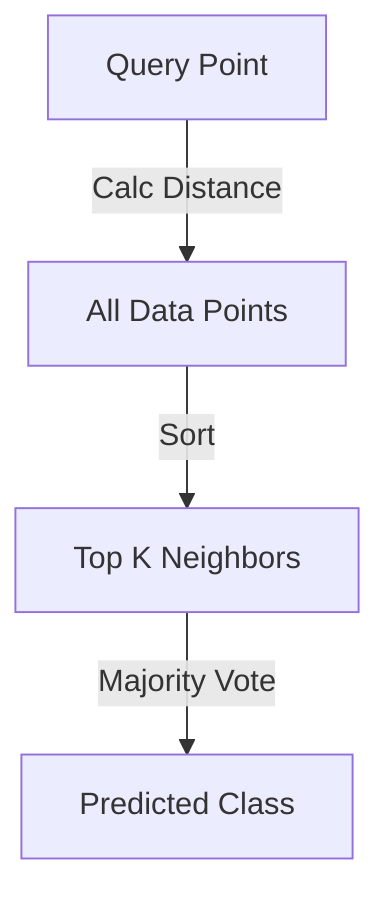

Links: [[01 Types of Machine Learning]]
___
# K-Nearest Neighbors (KNN)

**KNN** is a simple, supervised machine learning algorithm used for both Classification and Regression. It is often summarized by the phrase: *"Tell me your neighbors, and I will tell you who you are."*

## Core Concepts

### Lazy Learning
KNN is a **Lazy Learner**.
- **No Training Phase:** It does not learn a discriminative function from the training data. Instead, it "memorizes" the training dataset.
- **Action:** All computation happens at the time of prediction (inference).

### Non-Parametric
KNN makes **no assumptions** about the underlying data distribution (it doesn't assume data is Normal/Gaussian).
- *Parametric Data:* Assumes a fixed shape (like a line in Linear Regression).
- *Non-Parametric:* Adapts to the shape of the data.

## How it Works
1.  **Select K:** Choose the number of neighbors (e.g., K=5).
2.  **Calculate Distance:** Find the distance between the query point and all other points.
    - **Euclidean Distance:** The straight line distance (L2 Norm).
      $$ d(p, q) = \sqrt{\sum_{i=1}^{n} (q_i - p_i)^2} $$
    - **Manhattan Distance:** The "city block" distance (L1 Norm).
      $$ d(p, q) = \sum_{i=1}^{n} |q_i - p_i| $$
3.  **Find Neighbors:** Pick the K closest points.
4.  **Vote (Classification):** Assign the class that is most common among the neighbors.
5.  **Average (Regression):** Calculate the average value of the neighbors.




> [!TIP] Choosing K
> - **Small K:** Sensitive to noise (Overfitting).
> - **Large K:** Snooth decision boundary but may miss details (Underfitting).
> - *Rule of Thumb:* $K = \sqrt{N}$ (where N is total data points).


## Example: Movie Genre Classification

Let's classify a new movie as **Action** or **Romance** based on the number of **Kicks** and **Kisses**.

**Dataset:**

| Movie | Kicks | Kisses | Genre   |
|:----- |:----- |:------ |:------- |
| A     | 100   | 0      | Action  |
| B     | 90    | 5      | Action  |
| C     | 80    | 10     | Action  |
| D     | 5     | 90     | Romance |
| E     | 10    | 85     | Romance |
| F     | 7     | 95     | Romance |

**Query Movie:** (18 Kicks, 90 Kisses)
**K = 3**

**Step 1: Calculate Distance (Euclidean)**
$$ d = \sqrt{(x_2 - x_1)^2 + (y_2 - y_1)^2} $$

- **Distance to A (100, 0):** $\sqrt{(100-18)^2 + (0-90)^2} = \sqrt{6724 + 8100} = 121.7$
- **Distance to B (90, 5):** $\sqrt{(90-18)^2 + (5-90)^2} = \sqrt{5184 + 7225} = 111.4$
- **Distance to C (80, 10):** $\sqrt{(80-18)^2 + (10-90)^2} = \sqrt{3844 + 6400} = 101.2$
- **Distance to D (5, 90):** $\sqrt{(5-18)^2 + (90-90)^2} = \sqrt{169 + 0} = 13.0$
- **Distance to E (10, 85):** $\sqrt{(10-18)^2 + (85-90)^2} = \sqrt{64 + 25} = 9.4$
- **Distance to F (7, 95):** $\sqrt{(7-18)^2 + (95-90)^2} = \sqrt{121 + 25} = 12.1$

**Step 2: Find Neighbors (Top 3)**
1.  **Movie E:** Dist = 9.4 (Romance)
2.  **Movie F:** Dist = 12.1 (Romance)
3.  **Movie D:** Dist = 13.0 (Romance)

**Step 3: Vote**
- Neighbors: {Romance, Romance, Romance}
- **Majority:** Romance (3/3)
- **Prediction:** The new movie is a **Romance**.

### Implementation in Python

```python
import pandas as pd
from sklearn.neighbors import KNeighborsClassifier

# 1. Prepare Data
data = {
    'Kicks': [100, 90, 80, 5, 10, 7],
    'Kisses': [0, 5, 10, 90, 85, 95],
    'Genre': ['Action', 'Action', 'Action', 'Romance', 'Romance', 'Romance']
}
df = pd.DataFrame(data)

# Features (X) and Target (y)
X = df[['Kicks', 'Kisses']]
y = df['Genre']

# 2. Create Model (K=3)
knn = KNeighborsClassifier(n_neighbors=3)
knn.fit(X, y)

# 3. Predict for new movie (18 Kicks, 90 Kisses)
new_movie = [[18, 90]]
prediction = knn.predict(new_movie)

print(f"Prediction: {prediction[0]}") 
# Output: Romance
```

## Advantages & Disadvantages

| Feature               | Description                                 |
|:--------------------- |:------------------------------------------- |
| **Easy to Implement** | Simple to understand and code.              |
| **No Training**       | Instant model creation (just storing data). |
| **Non-Parametric**    | Effective for complex, non-linear data.     |
| **Parameters**        | Only two: Value of K and Distance Function. |

| Limitation                  | Description                                                                                        |
|:--------------------------- |:-------------------------------------------------------------------------------------------------- |
| **Slow Prediction**         | Must calculate distance to *every* training point for *every* prediction. High computational cost. |
| **Memory Intensive**        | Must store the entire dataset in RAM.                                                              |
| **Curse of Dimensionality** | Performs poorly with high-dimensional data (many features).                                        |
| **Features**                | Doesn't handle Categorical features well without encoding.                                         |
