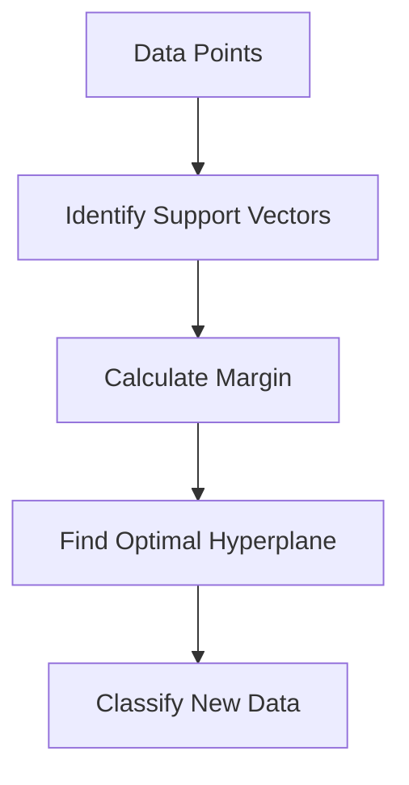

Links: [[01 Types of Machine Learning]]
___
# Support Vector Machine (SVM)

**Support Vector Machine (SVM)** is a powerful, supervised machine learning algorithm used for both **Classification** and **Regression** (SVR). However, it is primarily used for classification problems.

It works by finding the finding the best boundary, known as the **Hyperplane**, that separates the data points into different classes.

> [!NOTE] Goal of SVM
> To create the best line or decision boundary that can segregate n-dimensional space into classes so that we can easily put the new data point in the correct category in the future.

## Core Concepts



### Hyperplane
The decision boundary that separates the different classes.
- **2D Space:** A Line.
- **3D Space:** A Plane.
- **Higher Dimensions:** A Hyperplane.

### Support Vectors
The data points effectively "support" or define the orientation of the hyperplane.
- These are the points **closest** to the hyperplane.
- If these points are removed or changed, the position of the hyperplane changes.
- SVM cares *only* about these points; other points far from the boundary don't matter.

### Margin
The distance between the hyperplane and the nearest data point (Support Vector) from either class.
- **Goal:** SVM aims to **maximize** this margin.
- **Why?** A larger margin ("Good Margin") means the model is more confident and generalizes better to new data. A smaller margin ("Bad Margin") risks overfitting.

## How it Works

### Linearly Separable Data
If the data can be separated by a straight line (or flat plane), SVM finds the Hyperplane that maximizes the distance between the two classes.

- **Hard Margin:** Assumes data is perfectly separable. No outliers allowed inside the margin.

### Non-Linearly Separable Data (Kernel Trick)
Real-world data is often not linearly separable. SVM handles this using the **Kernel Trick**.

- **Mechanism:** It projects the data from a lower-dimensional space (2D) to a higher-dimensional space (3D or more) where it *becomes* linearly separable.


> [!EXAMPLE] The Chessboard Problem (Kernel Trick)
> Imagine a chessboard where you want to separate the pieces in the **center** from the pieces on the **outer rim**.
> 
> - **In 2D:** You cannot draw a single straight line to separate the center from the rim.
> - **In 3D (The Kernel Trick):** Imagine the board is a flexible sheet. If you **lift the center** up like a hill (adding a 3rd dimension), you can now slide a flat sheet of cardboard horizontally between the peak (center) and the base (rim).
> - **Result:** This flat sheet in 3D becomes a circular boundary when projected back down to 2D.

### Types of Kernels

The **Kernel Function** ($K$) takes inputs from the original space and calculates the dot product in the higher-dimensional space.

#### Linear Kernel
The simplest kernel, used when data is linearly separable. It creates a straight line (or plane) decision boundary.

$$K(x, x') = x \cdot x'$$

- **Mechanism:** Uses original features directly to find a linear separator.
- **Use Case:** Text Classification (High-dimensional sparse data).

> [!EXAMPLE] Spam Classification
> In a simple spam detector, every email is a data point.
> - **Feature 1:** Count of word "Free".
> - **Feature 2:** Count of word "Money".
> 
> The Linear Kernel draws a straight line. If ("Free" > 5 AND "Money" > 2), it falls on the "Spam" side of the line. If not, it falls on the "Not Spam" side.

#### Polynomial Kernel
Represents the similarity of vectors in a training set of polynomials of original variables. It allows for curved decision boundaries.

$$K(x, x') = (x \cdot x' + c)^d$$

- **Mechanism:** Transforms data by combining features (e.g., $x_1^2, x_1x_2$) to create curved boundaries (circles, ellipses).
- **Example:** **Facial Recognition**. It identifies non-linear relationships, like "if pixel A is dark AND pixel B is dark" (interaction), likely forming an eye.
- **Use Case:** Image Processing.

#### RBF (Radial Basis Function) Kernel
The **default** and most popular kernel. It maps data into an infinite-dimensional space. It creates complex, non-linear boundaries by defining similarity based on distance.

$$K(x, x') = \exp(-\gamma ||x - x'||^2)$$

- **Mechanism:** Objects are classified based on how "close" they are to a specific center point. It draws "blobs" or circles around class clusters.
- **Example:** **Land Classification**. Classifying a point on a map as "Urban" or "Rural". If a point is close to the city center (high similarity), it's Urban; if far, it's Rural.
- **Use Case:** General purpose, when specific data shape is unknown.

#### Sigmoid Kernel
Behaves like the activation function in Neural Networks. It allows SVM to act essentially as a simple Neural Network.

$$K(x, x') = \tanh(\alpha (x \cdot x') + c)$$

- **Mechanism:** Uses an S-shaped soft threshold to separate classes.
- **Example:** **Binary Decisions** where there is a "soft" transition, acting like a single-layer Perceptron.
- **Use Case:** Neural Network proxies.

## Multi-Class Classification
While SVM is natively a binary classifier (2 classes), it can handle multi-class problems (like classifying 4 seasons: Spring, Summer, Autumn, Winter) by breaking the problem down into multiple binary classification problems.

### One-vs-Rest (OvR) / One-vs-All
- **Concept:** Train **K** classifiers (where K is the number of classes).
- **Process:** For "Summer", train a binary classifier for "Summer vs Not Summer" (Spring + Autumn + Winter). Repeat for all seasons.
- **Decision:** The class with the highest confidence score wins.
- **Efficiency:** Requires training K models.

### One-vs-One (OvO)
- **Concept:** Train a classifier for **every pair** of classes.
- **Process:** Train "Summer vs Winter", "Summer vs Spring", "Spring vs Winter", etc.
- **Formula:** Trains $K(K-1)/2$ classifiers. For 4 seasons: $4(3)/2 = 6$ models.
- **Decision:** The class that wins the most "duels" is selected.
- **Use Case:** Used by default in `sklearn.svm.SVC` because it handles complex overlaps better, though it's computationally more expensive for many classes.

## Implementation in Python

```python
from sklearn import datasets, svm
from sklearn.model_selection import train_test_split
from sklearn.metrics import accuracy_score

# 1. Load Data (Iris Dataset)
# Classes: Setosa, Versicolor, Virginica
iris = datasets.load_iris()
X = iris.data
y = iris.target

# 2. Split Data (80% Train, 20% Test)
X_train, X_test, y_train, y_test = train_test_split(X, y, test_size=0.2, random_state=42)

# 3. Create Model
# Using RBF Kernel (good for non-linear data)
clf = svm.SVC(kernel='rbf') 

# 4. Train
clf.fit(X_train, y_train)

# 5. Predict & Evaluate
y_pred = clf.predict(X_test)
print(f"Accuracy: {accuracy_score(y_test, y_pred) * 100:.2f}%")

# Predict for a new flower
# Features: Sepal Length, Sepal Width, Petal Length, Petal Width
new_flower = [[5.1, 3.5, 1.4, 0.2]]
print(f"Prediction: {iris.target_names[clf.predict(new_flower)][0]}")
# Output: Setosa
```

## Advantages & Disadvantages

| Feature              | Description                                                                  |
|:-------------------- |:---------------------------------------------------------------------------- |
| **Accuracy**         | Effective in high-dimensional spaces.                                        |
| **Memory Efficient** | Uses a subset of training points (Support Vectors) in the decision function. |
| **Versatile**        | Different Kernel functions can be specified for the decision function.       |
| **Robust**           | Generally robust to outliers (especially with Soft Margin).                  |

| Limitation         | Description                                                                        |
|:------------------ |:---------------------------------------------------------------------------------- |
| **Large Datasets** | Not suitable for large datasets doesn't scale well.                                |
| **Noise**          | Performance drops if the dataset has extensive noise (overlapping target classes). |
| **Probabilities**  | Does not directly provide probability estimates (unlike Logistic Regression).      |
