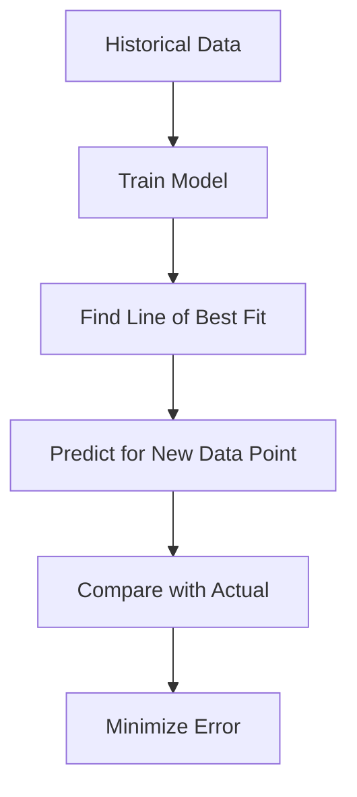

Links: [[01 Types of Machine Learning]]
___
# Regression Analysis

**Regression Analysis** is a statistical method used in **Supervised Learning** to model the relationship between a dependent (target) variable and one or more independent (predictor) variables.

> [!NOTE] Core Concept
> Checks if there is a **linear relationship** between the input (independent variable) and the output (dependent variable).



## Simple Linear Regression

In **Simple Linear Regression**, we predict the value of a dependent variable ($y$) based on a single independent variable ($x$).

**Goal:** To find the **Line of Best Fit** that minimizes the error between the predicted values and the actual values.

### The Equation

The relationship is represented by the equation of a straight line:

$$y = b_0 + b_1x$$

Where:
- $y \to$ The dependent variable (Target).
- $x \to$ The independent variable (Predictor).
- $b_{0}\to$ The **Intercept** (the value of $y$ when $x=0$).
- $b_{1}\to$ The **Slope** (coefficient), representing how much $y$ changes for a unit change in $x$.

### Least Square Error
The concept focuses on minimizing the difference between the actual value and the predicted value.

$$E = \sum_{i=1}^{n} (y_i - \hat{y}_i)^2$$

Where:
- $y_i$: The actual value.
- $\hat{y}_i$: The predicted value ($b_0 + b_1x_i$).

- The **lower** the difference (residual), the **better** the fit.
- If the line does not fit well, predictions for new data will be inaccurate.

> [!EXAMPLE] House Price Prediction
> Imagine we want to predict the **Price** of a house based on its **Size** (sq ft).
> 
> - **Independent Variable ($x$):** Size (e.g., 2000 sq ft).
> - **Dependent Variable ($y$):** Price (e.g., $300,000).
> - **Goal:** Fit a line through historical data of Size vs. Price so we can predict the price of a new house given its size.

## Multiple Linear Regression

When there are **multiple** independent variables, the equation expands. This allows us to predict a target variable based on several factors simultaneously.

### The Equation

$$y = b_0 + b_1x_1 + b_2x_2 + \dots + b_nx_n$$

Where:
- **$y$**: The dependent variable (predicted output).
- **$b_0$**: The Y-intercept (constant term).
- **$b_1, b_2, \dots, b_n$**: The slopes (coefficients) for each independent variable.
- **$x_1, x_2, \dots, x_n$**: The independent variables (features).

### Key Concepts

1.  **Multicollinearity:** A situation where independent variables are highly correlated with each other. This is bad because it makes it hard to determine the individual effect of each variable.
    -   *Example:* Predicting weight based on "Height in cm" and "Height in inches". These two are perfectly correlated, confusing the model.
2.  **Feature Selection:** Not all variables are useful. We use techniques like **Backward Elimination** or **Forward Selection** to pick only the significant variables (those with a low P-value).

> [!EXAMPLE] Enhanced House Price Prediction
> Instead of just **Size**, we now use multiple features:
> - **$y$:** Price of the House.
> - **$x_1$:** Size (sq ft).
> - **$x_2$:** Number of Bedrooms.
> - **$x_3$:** Age of the House (Years).
> 
> **Equation:** Price = $b_0$ + $b_1$(Size) + $b_2$(Rooms) + $b_3$(Age).

## Polynomial Regression

Sometimes, the relationship between the independent and dependent variables is not a straight line, but rather a curve. **Polynomial Regression** is a special case of Multiple Linear Regression where we add polynomial terms (powers of $x$) to the equation to fit a non-linear relationship.

> [!NOTE] Linear Nature
> Even though the *curve* is non-linear, it is still considered a "Linear" regression model because the equation is linear with respect to the **coefficients** ($b_0, b_1, b_2...$). We are simply transforming the input features.

### The Equation

For a single variable $x$ modeled to the $n$-th degree:

$$y = b_0 + b_1x + b_2x^2 + b_3x^3 + \dots + b_nx^n$$

Where:
- **$y$**: The dependent variable.
- **$x, x^2, x^3$**: The independent variable raised to different powers.
- **$n$**: The degree of the polynomial (e.g., $n=2$ creates a parabola).

### When to Use
- When a simple straight line (Linear Regression) **underfits** the data (High Bias) because the true relationship curves.
- *Example:* Predicting the spread rate of a virus over time, or measuring a car's fuel efficiency against its speed (efficiency drops off at very high *and* very low speeds, creating a curve).

```python
import numpy as np
import matplotlib.pyplot as plt
from sklearn.linear_model import LinearRegression
from sklearn.preprocessing import PolynomialFeatures

# Dummy non-linear data
X = np.array([1, 2, 3, 4, 5, 6, 7]).reshape(-1, 1)
y = np.array([2, 5, 10, 17, 26, 37, 50]) # Follows y = x^2 + 1 roughly

# 1. Transform the features to include polynomial terms (e.g., x^2)
degree = 2
poly_converter = PolynomialFeatures(degree=degree, include_bias=False)
X_poly = poly_converter.fit_transform(X)

# 2. Fit a standard Linear Regression model on the transformed features
model = LinearRegression()
model.fit(X_poly, y)

# Prediction for x=8 (Expected roughly 8^2 + 1 = 65)
new_x = np.array([[8]])
new_X_poly = poly_converter.transform(new_x)
prediction = model.predict(new_X_poly)
```

## Advantages and Disadvantages

| Feature              | Description                                      |
| :------------------- | :----------------------------------------------- |
| **Simplicity**       | Simple to implement and interpret.               |
| **Efficiency**       | Efficient to train.                              |

| Limitation           | Description                                                                              |
| :------------------- | :--------------------------------------------------------------------------------------- |
| **Linearity**        | Assumes a straight-line relationship, which is often not true for complex real-world data.|
| **Outliers**         | Sensitive to outliers; a single outlier can significantly skew the line of best fit.     |
| **Underfitting**     | If the data is complex/curved, a straight line will be too simple (High Bias).           |
| **Overfitting**      | If we add too many irrelevant features (High Variance).                                  |


