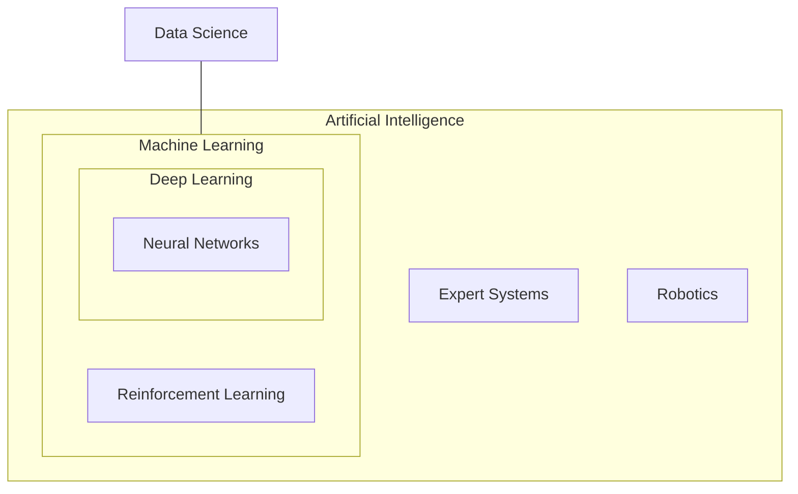

Links:

---

# Artificial Intelligence

## Introduction to AI

### Formal Definition & Purpose

**Artificial Intelligence (AI)** is the branch of computer science dedicated to creating systems capable of performing tasks that typically require human intelligence. These tasks include reasoning, learning, problem-solving, perception, and language understanding.

> [!NOTE] > **Formal Definition (Russell & Norvig):** AI is the study of agents that receive percepts from the environment and perform actions. Ideally, an **intelligent agent** takes the best possible action in a situation to maximize its chances of success.

**Purpose:** To automate intellectual tasks, enhance human capabilities, and solve complex problems that are intractable for traditional algorithmic approaches.

### The AI Hierarchy (AI vs. ML vs. DL)

Understanding the relationship between these fields is crucial. They are not mutually exclusive but rather concentric circles.

1.  **Artificial Intelligence (AI):** The broadest umbrella. Any technique that enables computers to mimic human behavior (includes logic-based systems, rule-based engines, and ML).
2.  **Machine Learning (ML):** A subset of AI. It uses statistical methods to enable machines to improve with experience. Instead of explicitly programming rules (e.g., `if x > 5 then y`), the system learns rules from data.
3.  **Deep Learning (DL):** A subset of ML. It uses multi-layered neural networks (resembling the human brain) to learn from vast amounts of data. It excels in perceptual tasks like vision and speech.
4.  **Data Science:** An interdisciplinary field that uses scientific methods, processes, algorithms, and systems to extract knowledge and insights from data. It intersects heavily with AI/ML but also includes data visualization and statistical analysis.



### Tools & Libraries Overview

Modern AI is built on a robust ecosystem of Python libraries.

| Library                  | Domain            | Purpose                                                    |
| :----------------------- | :---------------- | :--------------------------------------------------------- |
| **NumPy**                | Foundation        | Numerical computing, N-dimensional arrays, matrix algebra. |
| **Pandas**               | Data Manipulation | Data analysis, cleaning, and preparation (DataFrames).     |
| **Scikit-learn**         | Machine Learning  | Classical ML algorithms (Regression, SVM, Random Forest).  |
| **TensorFlow / PyTorch** | Deep Learning     | Building and training neural networks.                     |
| **OpenCV**               | Computer Vision   | Image processing and video analysis.                       |
| **NLTK / SpaCy**         | NLP               | Natural Language Processing tasks.                         |

```python
# A glimpse into the ecosystem
import numpy as np
import pandas as pd
from sklearn.linear_model import LinearRegression
import torch

print("AI Ecosystem Loaded")
```

### Example: The Spam Filter Scenario

**Scenario:** We want to build a system to classify emails as "Spam" or "Not Spam".

1.  **Traditional AI (Rule-Based):**
    - _Logic:_ If email contains "Buy Now" AND "Free", mark as Spam.
    - _Flaw:_ Spammers change words to "Purchase Now". The programmer must manually update rules.
2.  **Machine Learning:**
    - _Logic:_ Feed the system 10,000 emails labeled Spam/Not Spam. The algorithm finds patterns (e.g., specific word combinations, sender reputation).
    - _Advantage:_ If spammers change tactics, we just retrain with new data. The system "learns".

### When to use AI?

| Feature      | Traditional Programming                  | Artificial Intelligence                                |
| :----------- | :--------------------------------------- | :----------------------------------------------------- |
| **Input**    | Data + Rules                             | Data + Answers (Labels)                                |
| **Output**   | Answers                                  | Rules (Model)                                          |
| **Nature**   | Deterministic (Same input = Same output) | Probabilistic (Output is a prediction with confidence) |
| **Use Case** | Payroll, Inventory, CRUD Apps            | Face Recognition, Recommendations, fraud detection     |

## AI Development Pipeline

According to Russell & Norvig, developing an AI agent involves a structured pipeline to ensure the system behaves rationally in its environment.

1.  **Problem Formulation:**
    - Define the goals and the environment.
    - Identify states, actions, and constraints (e.g., "Navigate from A to B avoiding obstacles").
2.  **Data Collection & Preparation:**
    - Gather raw data (sensors, databases, logs).
    - Preprocess: Cleaning, normalization, and feature extraction.
3.  **Model Selection & Training:**
    - Choose the agent structure (Reflex, Goal-based, Learning).
    - Train the model using algorithms (Search, Logic, or ML) on the prepared data.
4.  **Evaluation & Tuning:**
    - Test the agent in simulated environments.
    - Tune hyperparameters to optimize performance metrics (Accuracy, Speed, Reward).
5.  **Deployment & Monitoring:**
    - Deploy the agent to the real world.
    - Continuously monitor for "Concept Drift" and retrain as the environment evolves.

## Practical Impact of AI

AI is transforming industries by enhancing efficiency, enabling new capabilities, and sometimes replacing human labor in repetitive tasks.

### Healthcare

- **Diagnostics:** AI models (like CNNs) analyze X-rays and MRIs to detect tumors with higher accuracy than radiologists.
- **Drug Discovery:** Generative AI accelerates the discovery of new molecular structures for drugs.
- **Personalized Medicine:** Tailoring treatment plans based on a patient's genetic profile.

### Finance

- **Algorithmic Trading:** High-frequency trading bots execute millions of orders in milliseconds based on market patterns.
- **Fraud Detection:** Anomaly detection algorithms flag suspicious transactions in real-time.
- **Credit Scoring:** Evaluating loan risk using alternative data sources.

### Robotics & Manufacturing

- **Predictive Maintenance:** Sensors predict when a machine will fail before it happens, minimizing downtime.
- **Quality Control:** Computer vision systems inspect products on assembly lines for microscopic defects.
- **Autonomous Robots:** Robots that navigate warehouses (e.g., Amazon Kiva) to retrieve goods.

### Transportation

- **Self-Driving Cars:** Using Sensor Fusion (Lidar, Radar, Cameras) and Reinforcement Learning to navigate traffic.
- **Route Optimization:** AI (like GAs or A\*) optimizes delivery routes for logistics companies like UPS to save fuel.

### Entertainment & Media

- **Recommendation Systems:** Netflix and Spotify use Matrix Factorization and Deep Learning to suggest content.
- **Content Generation:** Generative Adversarial Networks (GANs) and Transformers (GPT) create art, music, and text.

## Key Domains of AI

### Machine Learning (ML)

- **Definition:** Algorithms that parse data, learn from it, and make a determination or prediction.
- **Types:** Supervised (labeled data), Unsupervised (unlabeled data), Reinforcement (reward-based).

### Deep Learning (DL)

- **Definition:** A subset of ML based on artificial neural networks with representation learning.
- **Key:** Can automatically extract features from raw data (e.g., pixels to edges to shapes to faces).

### Natural Language Processing (NLP)

- **Definition:** Interaction between computers and human language.
- **Tasks:** Translation, Sentiment Analysis, Chatbots.
- **Internals:** Tokenization, Embeddings (Word2Vec), Transformers.

### Computer Vision (CV)

- **Definition:** Enabling computers to "see" and interpret visual information.
- **Tasks:** Object Detection, Facial Recognition, Medical Imaging.
- **Internals:** Convolutional Neural Networks (CNNs).
