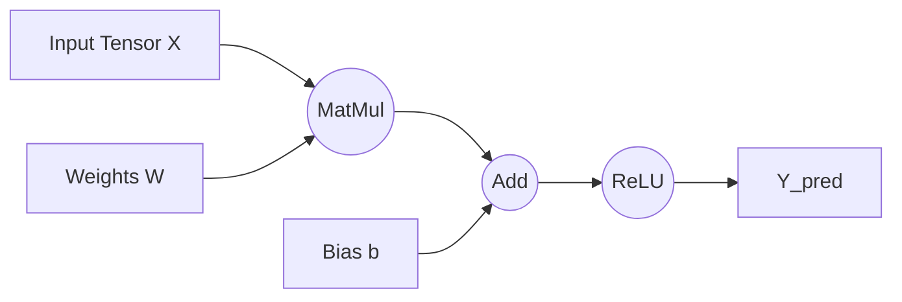

Links:
___
# DL Frameworks

## Introduction to Deep Learning Frameworks

### The Engine of Modern AI

Deep Learning frameworks are libraries that provide high-level APIs to build, train, and deploy neural networks. They abstract away the complex math (backpropagation, gradient descent) and hardware optimization (CUDA for GPUs).

**The Big Two:**

1.  **TensorFlow (Google):** Industrial-grade, production-focused. Originally used static graphs.
2.  **PyTorch (Meta):** Research-focused, pythonic. Uses dynamic graphs.

### Tensors and Computational Graphs

#### Tensors

A **Tensor** is the fundamental data structure in DL. It is a generalization of vectors and matrices to $N$ dimensions.

- **Scalar:** 0-D Tensor
- **Vector:** 1-D Tensor
- **Matrix:** 2-D Tensor
- **Cube/Volume:** 3-D Tensor

**Key Difference from NumPy Arrays:** Tensors can live on the **GPU** for massive parallel acceleration.

#### Computational Graphs (The "Flow")

A computational graph represents the flow of data (tensors) through operations (nodes).

- **Static Graph (TensorFlow 1.x / Keras Functional):** Define the entire graph first, then run it. Efficient but hard to debug.
- **Dynamic Graph (PyTorch):** The graph is built on-the-fly as code executes. Easy to debug (you can use `print` statements).



### PyTorch vs TensorFlow

Let's see how to perform the same operation: $Y = X \times W + b$

#### PyTorch (The Pythonic Way)

```python
import torch

# 1. Define Tensors
# requires_grad=True tracks operations for backpropagation
x = torch.tensor([1.0, 2.0], requires_grad=True)
w = torch.tensor([0.5, 0.5], requires_grad=True)
b = torch.tensor(0.1, requires_grad=True)

# 2. The Operation (Dynamic Graph)
y = torch.dot(x, w) + b

# 3. Compute Gradients (Backprop)
y.backward()

print(f"Result: {y.item()}") # 1.0*0.5 + 2.0*0.5 + 0.1 = 1.6
print(f"Gradient of x: {x.grad}") # dy/dx = w = [0.5, 0.5]
```

#### TensorFlow (The Keras Way)

```python
import tensorflow as tf

# 1. Define Tensors
x = tf.constant([1.0, 2.0])
w = tf.Variable([0.5, 0.5])
b = tf.Variable(0.1)

# 2. The Operation (Inside GradientTape for tracking)
with tf.GradientTape() as tape:
    y = tf.tensordot(x, w, axes=1) + b

# 3. Compute Gradients
grads = tape.gradient(y, [w, b])

print(f"Result: {y.numpy()}")
```

### Example: A Simple Neuron Forward Pass

A single neuron takes inputs, weights them, adds a bias, and applies an activation function.

```python
import torch
import torch.nn.functional as F

# Inputs (Batch of 2 samples, 3 features each)
inputs = torch.randn(2, 3)

# Weights (3 features -> 1 output)
weights = torch.randn(3, 1)
bias = torch.randn(1)

# Forward Pass
# 1. Linear Transformation: Z = XW + b
linear_output = inputs @ weights + bias

# 2. Activation Function (ReLU): A = max(0, Z)
activation_output = F.relu(linear_output)

print(f"Input Shape: {inputs.shape}")
print(f"Output Shape: {activation_output.shape}") # (2, 1)
```

### Which one to choose?

| Feature        | PyTorch                                                    | TensorFlow                                                                |
| :------------- | :--------------------------------------------------------- | :------------------------------------------------------------------------ |
| **Paradigm**   | Dynamic (Define-by-Run)                                    | Static/Eager (Define-then-Run)                                            |
| **Debugging**  | Easy (Standard Python)                                     | Harder (Graph context)                                                    |
| **Deployment** | TorchScript (Improving)                                    | TF Serving (Mature, Industry Standard)                                    |
| **Community**  | Research / Academia                                        | Industry / Production                                                     |
| **Verdict**    | **Start with PyTorch.** It is more intuitive for learning. | Learn TF if the job requires legacy support or specific deployment needs. |
