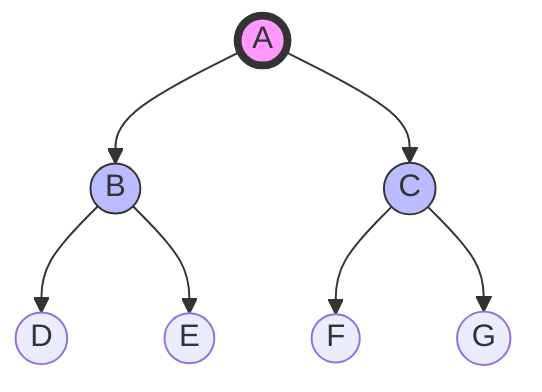

Links:

---

# Search Algorithms

## Introduction to Search

### Navigating the State Space

**Search** is the process of finding a sequence of actions that reaches a goal state.

- **Agent:** The entity solving the problem.
- **State Space:** The set of all possible configurations (e.g., every possible board position in Chess).
- **Start State:** Where we begin.
- **Goal State:** Where we want to end up.
- **Frontier (Open Set):** The set of states we have discovered but not yet explored.

### The Generic Search Algorithm

All search algorithms share the same skeleton. The only difference is **how they pick the next node** from the frontier.

```python
def generic_search(problem, strategy):
    frontier = strategy.make_frontier(problem.start_state)
    explored = set()

    while not frontier.is_empty():
        node = frontier.pop() # Selection Strategy determines the algorithm!

        if problem.is_goal(node.state):
            return node.solution()

        explored.add(node.state)

        for child in node.expand():
            if child.state not in explored and child not in frontier:
                frontier.add(child)
    return Failure
```

## Uninformed Search (Blind Search)

These algorithms have no clue how close they are to the goal. They just explore systematically.

### Breadth-First Search (BFS)

- **Strategy:** Explore the shallowest nodes first.
- **Data Structure:** **Queue (FIFO)** - First In, First Out.
- **Properties:**
  - **Complete?** Yes (if branching factor is finite).
  - **Optimal?** Yes (finds the shortest path in unweighted graphs).
  - **Complexity:** High Memory ($O(b^d)$) because it stores every layer.

**Python Implementation:**

```python
from collections import deque

def bfs(graph, start, goal):
    queue = deque([[start]]) # Queue stores paths
    visited = set()

    while queue:
        path = queue.popleft() # FIFO
        node = path[-1]

        if node == goal:
            return path

        if node not in visited:
            visited.add(node)
            for neighbor in graph[node]:
                new_path = list(path)
                new_path.append(neighbor)
                queue.append(new_path)
    return None
```

### Depth-First Search (DFS)

- **Strategy:** Explore the deepest nodes first (go down a rabbit hole).
- **Data Structure:** **Stack (LIFO)** - Last In, First Out.
- **Properties:**
  - **Complete?** No (can get stuck in infinite loops).
  - **Optimal?** No (might find a long path first).
  - **Complexity:** Low Memory ($O(b \cdot m)$) - only stores the current path.

**Python Implementation:**

```python
def dfs(graph, start, goal):
    stack = [[start]] # Stack stores paths
    visited = set()

    while stack:
        path = stack.pop() # LIFO
        node = path[-1]

        if node == goal:
            return path

        if node not in visited:
            visited.add(node)
            for neighbor in reversed(graph[node]): # Reverse to process in varied order
                new_path = list(path)
                new_path.append(neighbor)
                stack.append(new_path)
    return None
```



- **BFS Order:** A -> B -> C -> D -> E -> F -> G
- **DFS Order:** A -> B -> D -> E -> C -> F -> G

## Informed Search (Heuristic Search)

These algorithms use a **Heuristic Function $h(n)$**: an estimate of the cost from node $n$ to the goal.

- Example: In a map, $h(n)$ = Straight-line distance to destination.

### Greedy Best-First Search

**Strategy:**
Always expand the node that appears to be closest to the goal. It selects the node with the minimum heuristic value ($min(h(n))$).

- **Logic:** "It feels right to go this way."
- **Evaluation Function:** $f(n) = h(n)$

**Characteristics:**

- **Pros:** Can be incredibly fast if the heuristic is good.
- **Cons:** Not Optimal. It acts like a person in a maze who always turns towards the exit, even if there's a wall in between. It is essentially DFS with a heuristic-guided metric, making it susceptible to dead ends and infinite loops in cyclic graphs.

**Example Scenario:**
Trying to get to Bucharest. Neamt has $h(n)=234$. Iasi has $h(n)=226$. Greedy moves to Iasi immediately, even if the road from Iasi is a dead end or structurally longer overall.

### A\* Search (The King of Search)

**Strategy:**
A\* (A-Star) combines the strengths of uniform-cost search (Dijkstra) and Greedy Search. It selects the node with the lowest combined cost.

- **Evaluation Function:** $f(n) = g(n) + h(n)$
  - $g(n)$: Actual cost to reach node $n$ from the start. (Keeps path short).
  - $h(n)$: Estimated cost from $n$ to the goal. (Keeps us moving towards the goal).

**Why it works:**

- **Optimal:** It is guaranteed to find the shortest path if $h(n)$ is **Admissible**.
  - _Admissible:_ The heuristic never overestimates the true cost. (e.g., Straight line distance is admissible because you can never drive shorter than the straight line).
- **Complete:** Yes.

**Algorithm Steps:**

1.  Initialize openness with the start node, $f(start) = 0 + h(start)$.
2.  Pop the node with the **lowest f-score**.
3.  If it's the goal, return path.
4.  For each neighbor:
    - Calculate tentative $g = g(current) + distance(current, neighbor)$.
    - If this path is better than any previous path to this neighbor:
      - Update $g(neighbor)$, $f(neighbor)$.
      - Add/Update neighbor in the open set.

### Analysis: Comparison

| Algorithm | Data Structure | Optimality                     | Memory Usage       | Use Case                                                             |
| :-------- | :------------- | :----------------------------- | :----------------- | :------------------------------------------------------------------- |
| **BFS**   | Queue          | Optimal (Unweighted)           | High (Exponential) | Shortest path in unweighted graphs (e.g., Social Networks).          |
| **DFS**   | Stack          | Not Optimal                    | Low (Linear)       | Exploring vast spaces where solution is deep (e.g., Puzzle solving). |
| **A\***   | Priority Queue | Optimal (Admissible Heuristic) | Moderate           | Pathfinding in Maps (Google Maps), Games.                            |
