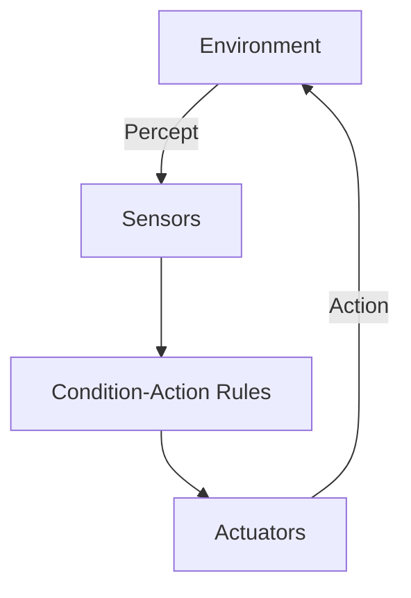
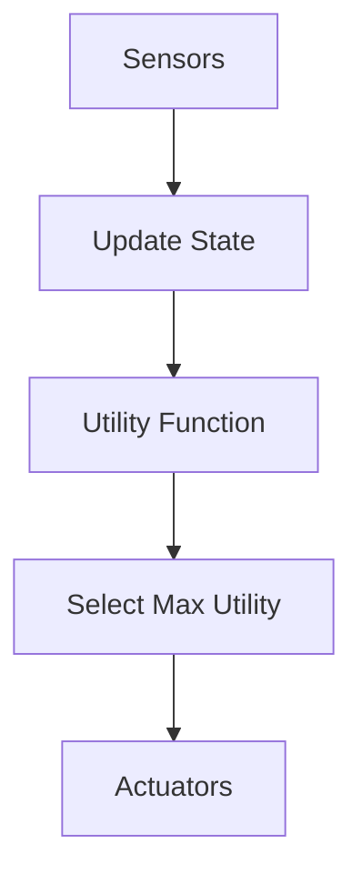

Links:
___
# Agents and Environments

## Introduction to Agents

### The Intelligent Actor

An **Agent** is anything that can be viewed as perceiving its environment through **sensors** and acting upon that environment through **actuators**.

- **Human Agent:** Eyes/Ears (Sensors) $\rightarrow$ Hands/Legs (Actuators).
- **Robotic Agent:** Cameras/Lidar (Sensors) $\rightarrow$ Motors (Actuators).
- **Software Agent:** Keystrokes/Files (Sensors) $\rightarrow$ Screen Display/File Write (Actuators).

**Agent Function:** A mathematical mapping from percept histories to actions: $f: P^* \rightarrow A$.
**Agent Program:** The concrete implementation of the agent function running on physical architecture.
$$ \text{Agent} = \text{Architecture} + \text{Program} $$

### Rationality

A **Rational Agent** is one that does the "right thing".

- **Performance Measure:** The criterion that determines how successful an agent is (e.g., amount of dirt cleaned).
- **Rationality depends on:**
  1.  The performance measure.
  2.  The agent's prior knowledge.
  3.  The actions available.
  4.  The agent's percept sequence to date.

> [!IMPORTANT] > **Rationality $\neq$ Omniscience.** Rationality maximizes _expected_ performance, while omniscience maximizes _actual_ performance (which is impossible without knowing the future).

## PEAS Description

To design an agent, we must first specify the task environment using **PEAS**.

| Agent Type       | **P**erformance Measure        | **E**nvironment             | **A**ctuators                    | **S**ensors               |
| :--------------- | :----------------------------- | :-------------------------- | :------------------------------- | :------------------------ |
| **Taxi Driver**  | Safe, Fast, Legal, Comfortable | Roads, Traffic, Pedestrians | Steering, Accelerator, Brake     | Cameras, Speedometer, GPS |
| **Medical Diag** | Healthy patient, Low cost      | Patient, Hospital           | Display questions, Prescriptions | Keyboard entry, Symptoms  |
| **Spam Filter**  | False Positives/Negatives      | Emails, Users               | Mark as Spam, Delete             | Text analysis, Metadata   |

## Types of Environments

The environment determines the difficulty of the agent's task.

1.  **Fully Observable vs. Partially Observable:**
    - _Fully:_ Sensors detect the complete state of the world (e.g., Chess).
    - _Partially:_ Noisy or missing data (e.g., Poker, Self-driving in fog).
2.  **Deterministic vs. Stochastic:**
    - _Deterministic:_ Next state is determined _only_ by current state + action (e.g., Chess).
    - _Stochastic:_ Randomness involved (e.g., Dice games, Traffic).
3.  **Episodic vs. Sequential:**
    - _Episodic:_ Current decision doesn't affect future decisions (e.g., Image Classification).
    - _Sequential:_ Current action affects future states (e.g., Chess, Driving).
4.  **Static vs. Dynamic:**
    - _Static:_ World doesn't change while agent is thinking (e.g., Crossword).
    - _Dynamic:_ World keeps moving (e.g., Taxi driving).
5.  **Discrete vs. Continuous:**
    - _Discrete:_ Finite states/actions (e.g., Chess).
    - _Continuous:_ Infinite range (e.g., Steering angle).

## Types of Agents

We can group agents by their internal complexity.

### Simple Reflex Agents

Act only on the _current_ percept. They ignore history.

- **Logic:** **If** car in front is braking **Then** brake.
- **Limitation:** Only works in fully observable environments. Infinite loops are common.



### Model-Based Reflex Agents

Maintain an **internal state** to track the world (handling partial observability).

- **Internal State:** "What the world is like now" (based on history).
- **Model:** "How the world evolves" + "How my actions affect the world".

### Goal-Based Agents

Act to achieve a specific **Goal**.

- **Logic:** "What will happen if I do action A? Will it make me happy (Goal)?"
- **Mechanism:** Search and Planning (e.g., A\* Search).

### Utility-Based Agents

Act to maximize a **Utility Function** (Happiness score).

- **Difference from Goal-Based:** Goals are binary (Success/Fail). Utility is continuous (How _efficient_ was the success?).
- **Logic:** Trade-off between conflicting goals (Speed vs. Safety).



### A Simple Reflex Agent (Python)

```python
class ReflexVacuumAgent:
    def __init__(self):
        # Rules: {Condition: Action}
        self.rules = {
            'Dirty': 'Suck',
            'Clean': 'Right' # Dumb rule: always move right if clean
        }

    def perceive(self, location, status):
        return status

    def act(self, percept):
        return self.rules.get(percept, 'NoOp')

# Simulation
agent = ReflexVacuumAgent()
percept = 'Dirty'
action = agent.act(percept)
print(f"Percept: {percept}, Action: {action}") # Action: Suck
```

### Reflex vs Goal-Based

| Feature         | Reflex Agent                   | Goal-Based Agent            |
| :-------------- | :----------------------------- | :-------------------------- |
| **Speed**       | Extremely Fast ($O(1)$ lookup) | Slow (Search/Planning)      |
| **Memory**      | Low                            | High (State Space)          |
| **Flexibility** | Rigid (Hardcoded rules)        | Flexible (Can change goals) |
| **Use Case**    | Thermostat, Toaster            | Chess, GPS Navigation       |
