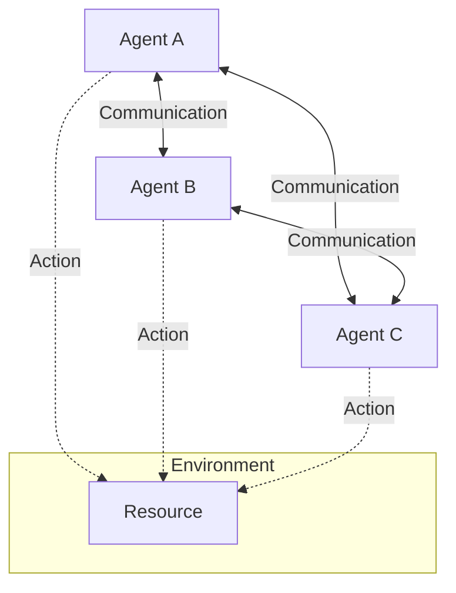

Links:

---

# Multi-Agent Systems

## Overview of Multi-Agent Systems (MAS)

### Concept: Collective Intelligence

A **Multi-Agent System (MAS)** is a computerized system composed of multiple interacting intelligent agents.

- **Single Agent:** Solves problems in isolation (e.g., Solitaire).
- **Multi-Agent:** Solves problems by interaction (e.g., Football, Traffic flow).

**Key Characteristics:**

1.  **Autonomy:** Each agent has incomplete information or capabilities for solving the problem.
2.  **Decentralization:** No single global controlling node.
3.  **Interaction:** Agents communicate and coordinate to achieve goals.

### Internals: Agent Architectures in MAS

- **Homogeneous:** All agents have the same structure/goal (e.g., Ant colony).
- **Heterogeneous:** Agents have different goals/capabilities (e.g., Stock market traders).

---

## Coordination and Communication

### Concept: Working Together

Since agents are autonomous, they need protocols to ensure their actions don't conflict (collisions) and ideally synergize (cooperation).

### Communication Languages

Agents need a standard language to "talk".

- **KQML (Knowledge Query and Manipulation Language):** An early standard.
- **FIPA-ACL (Foundation for Intelligent Physical Agents - Agent Communication Language):** The modern standard.
  - _Performatives:_ `REQUEST`, `INFORM`, `PROPOSE`, `REFUSE`.
  - _Example:_ Agent A `REQUEST`s Agent B to open a door. Agent B `INFORM`s Agent A that it is done.

### Coordination Techniques

1.  **Cooperative (Teamwork):**
    - **Joint Intentions:** "We all agree to move the piano."
    - **Plan Sharing:** Agents tell each other their future moves to avoid collisions.
2.  **Competitive (Self-Interest):**
    - **Auctions:** Agents bid for resources (e.g., Cloud computing resources).
    - **Negotiation:** Agents bargain to reach a deal (e.g., "I'll give you data X if you give me compute Y").

---

## Real-World Applications

### Smart Grids

- **Problem:** Balancing electricity supply and demand in real-time with renewable energy (solar/wind is unpredictable).
- **MAS Solution:**
  - **Home Agents:** Negotiate to buy power when cheap (e.g., run dishwasher at 2 AM).
  - **Producer Agents:** Sell excess solar power to neighbors.
  - **Result:** Decentralized stability without a massive central controller.

### Collaborative Robots (Swarm Robotics)

- **Problem:** Search and Rescue in a collapsed building.
- **MAS Solution:**
  - Send 100 small drones (agents).
  - If one finds a survivor, it broadcasts the location.
  - Others form a communication relay chain back to base.
  - **Redundancy:** If 10 drones fail, the mission continues.
