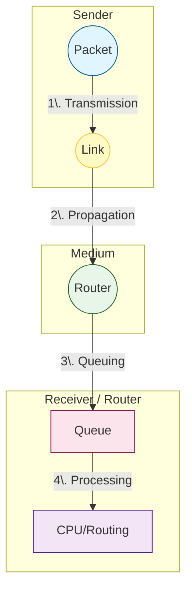

Links: [[00 Computer Networks]]
___
# Network Performance 

Network performance is measured by several core metrics that define how effectively data moves across the network.

## Bandwidth
Bandwidth refers to the **capacity** of a system—how much information we can transfer at one time.

-   **Digital Networks:** Measured in bits per second (bps) or bytes per second. It indicates the amount of data that *can* be transmitted in a fixed amount of time.
-   **Analog Networks:** Measured in Hertz (Hz) or cycles per second.

> [!WARNING] Bandwidth vs Speed
> Bandwidth means **Capacity**. Speed means **Transfer Rate**. More bandwidth does not automatically mean more speed, just a wider "pipe" for data to transfer through. 

## Latency (Delay)
Latency is the **total time taken for a complete message to arrive at its destination**. It starts when the first bit of the message leaves the source and ends when the last bit arrives at the destination.

$$ 
\begin{split}
\text{Latency} &= \text{Propagation Time} \\
&+ \text{Transmission Time} \\
&+ \text{Queuing Time} \\
&+ \text{Processing Delay} 
\end{split}
$$

### Breakdown of Delays

#### Propagation Time
The time required for a bit to travel from the source to the destination across the physical medium.

$$ \text{Propagation Time} = \frac{\text{Distance (Link Length)}}{\text{Propagation Speed}} = \frac{ [L] }{ [LT^{-1}] } = T $$

#### Transmission Time (Delay)
The time taken to push all the bits of a packet onto the transmission link.

$$ \text{Transmission Time} \propto \frac{\text{Packet Size}}{\text{Bandwidth}} $$

$$ \text{Transmission Time} = \frac{\text{Message Size (bits)}}{\text{Bandwidth (bps)}} = \frac{ [b] }{ [bT^{-1}] } = [T]$$

#### Queuing Time
The time a packet has to sit idly in the intermiediate routers' memory queues, waiting for its turn to be processed and transmitted.

#### Processing Delay
The time it takes a router or switch to figure out where to send the packet (examining headers, checking routing tables, error checking).

## Throughput
While bandwidth is the *potential* measurement of a link, **Throughput** is the *actual* measurement of how fast data can pass through a network.

-   It is the actual number of messages (or bits) successfully transmitted per unit of time.
-   Throughput is always less than or equal to the Bandwidth.

## Jitter
Jitter is the **packet delay variance**.

-   If packets arrive at the destination with different delays (e.g., Packet 1 takes 20ms, Packet 2 takes 45ms, Packet 3 takes 20ms), the uneven arrival times create jitter.
-   Jitter is highly detrimental to real-time applications like VoIP (Voice over IP) or video streaming, which require a steady, predictable stream of data.
