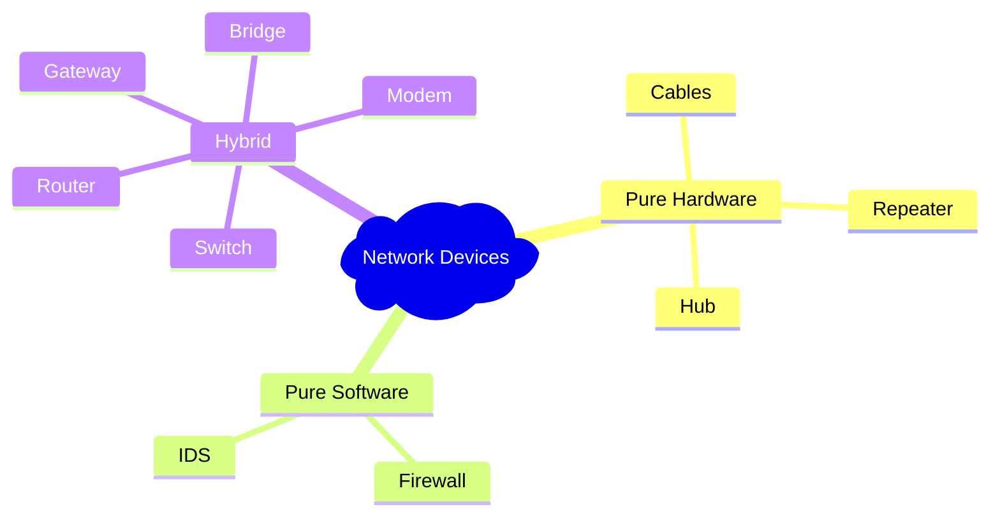

Links: 
___
# Network Devices

Network devices (intermediary nodes) connect end devices to ensure data communication.

> [!TIP] AE2 Analogy: Network Devices
> 
> - **Repeater:** **Quartz Fiber**. It connects network segments to share power, but not share channels.
> - **Hub:** **Storage Bus** on a Chest. It exposes the contents to everyone connected, without "routing" logic. It just "dumps" availability.
> - **Switch:** **ME Interface**. It knows exactly *what* is stored and where. It doesn't broadcast to the whole world; it provides specific items to specific machines on request.
> - **Router:** **Quantum Network Bridge**. Connects two physically isolated ME Networks (LANs) so they can talk to each other as if they were one.

### Signals
Data transmission occurs via signals.

- **Analog Signal:** Continuous wave that changes over time (e.g., Human voice, Radio waves).
- **Digital Signal:** Discrete signal representing data as a sequence of 0s and 1s (e.g., Computer data).

![[Pasted image 20260213094922.png]]

## Physical Layer Devices (Layer 1)

### Repeater
An electronic device that receives a signal and regenerates it to extend its range.

- **Function:** Boosts signal strength to travel longer distances for extending range (e.g., Wi-Fi extenders).
- **Intelligence:** dumb (No filtering capability).

### Hub
A "Multi-port Repeater".

- **Function:** Connects multiple wires coming from different branches.
- **Mechanism:** When a packet arrives at one port, it is copied to **all** other ports (Broadcasting).
- **Drawback:** High traffic (collision) and security risk.

## Data Link Layer Devices (Layer 2)

### Bridge
Connects two network segments (LANs).

- **Function:** Connects two separate LAN segments to make them appear as one. Filters traffic based on MAC address. Unlike a Hub, it does not broadcast if it knows where the destination is.

### Switch
A "Multi-port Bridge" or a "Smart Hub".

- **Function:** Connects devices in a LAN.
- **Mechanism:** Stores the MAC address of connected devices in a table. Sends data **only** to the specific destination port.
- **Advantage:** Dedicated bandwidth per port, Increased Efficiency (Reduced Collisions), and better security than Hub.

### Access Point (AP)
Creates a wireless local area network (WLAN).

- **Function:** Acts as a bridge between wired Ethernet and wireless (Wi-Fi) devices.

## Network Layer Devices (Layer 3)

### Router
Connects **different** networks (e.g., your LAN to the Internet).

- **Function:** Routes data packets based on IP address. Stops broadcasting and isolates networks.
- **Intelligence:** Uses routing tables/algorithms to find the best path.

### Gateway
A "Protocol Converter".

- **Function:** Connects two networks using different protocols (e.g., connecting a TCP/IP network to a legacy SNA network).
- **Layer:** Can operate at any layer (commonly Transport/Application).

## Other Devices

### Modem (Modulator-Demodulator)
- **Function:** Converts digital signals (Computer) to analog signals (Phone/Cable line) and vice-versa.

## Software Security Devices

### Firewall
A security system that monitors and controls incoming/outgoing traffic based on security rules.
- **Types:** Can be Hardware (Router) or Software (running on a server).
- **Action:** Blocks unauthorized access.

### IDS (Intrusion Detection System)
- **Function:** Monitors network traffic for suspicious activity or policy violations.
- **Action:** Alerts the admin (Passive) or takes action (Active/IPS).
