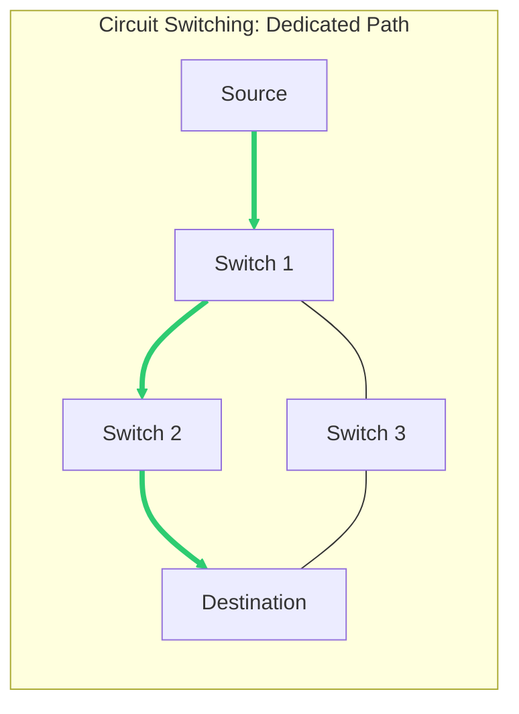
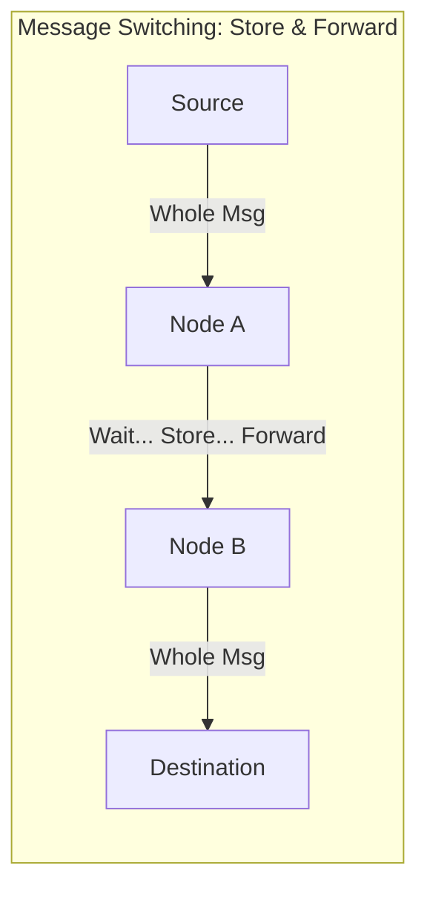
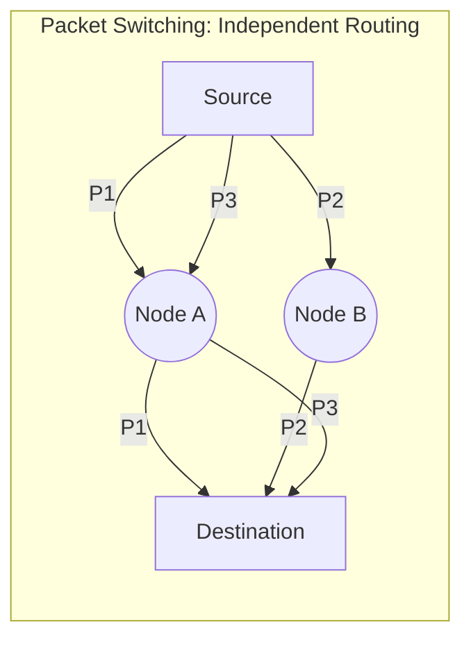

Links: [[00 Computer Networks]], [[05 OSI Model]]
___
# Network Switching

**Switching** is the mechanism used to move information between different networks or segments. It involves creating temporary connections between nodes to facilitate data transfer across the network.

## Circuit Switching
A dedicated communication path is established between two stations before data transmission begins.

### Phases
1. **Circuit Establishment:** A dedicated physical link is set up (e.g., through a series of switches).
2. **Data Transfer:** Data is sent through the dedicated path.
3. **Circuit Disconnect:** The path is released for other users.

![[Pasted image 20260223094821.png]]

> [!EXAMPLE] The [[08.1 Public Switched Telephone Network|PSTN]]
> The traditional **Telephone Network** is the classic example of circuit switching. When you make a call, a dedicated line is reserved just for your conversation.

### Characteristics
- **Dedicated Path:** Entire channel capacity is reserved.
- **Pre-defined Route:** Data follows the established path.
- **Efficiency:** Low channel utilization if the path is idle.

### Advantages and Disadvantages

| Advantages                          | Disadvantages                           |
|:----------------------------------- |:--------------------------------------- |
| No data loss (guaranteed bandwidth) | Inefficient (reserved even if not used) |
| High efficiency for continuous data | Connection overhead (delay in setup)    |
| No out-of-order packets             | Limited communication links             |

## Message Switching
A "Store and Forward" technique where the entire message is treated as a single unit and transferred through intermediate nodes.

### Mechanism
- Each node receives the **entire message**, stores it on disk, and then transmits it to the next node once resources are available.
- No dedicated path is required.

![[Pasted image 20260223094647.png]]

### Advantages and Disadvantages

| Advantages                               | Disadvantages                             |
|:---------------------------------------- |:----------------------------------------- |
| Higher efficiency than circuit switching | High latency/delay due to storage         |
| Reduces traffic congestion               | Not suitable for real-time communication  |
| Dynamic routing                          | Devices require large storage (expensive) |

## Packet Switching
The message is divided into smaller, manageable pieces called **Packets**.

### Mechanism
- Each packet contains a header with source/destination addresses and a sequence number.
- Packets can be routed independently through different paths.
- Intermediate nodes store packets in memory (RAM) rather than disk.

> [!NOTE] Layers
> Packet switching is primarily implemented at the **Network Layer** (Layer 3) by **Routers**.

![[Pasted image 20260223094507.png]]

### Advantages and Disadvantages

| Advantages                                |                     |
|:----------------------------------------- |:------------------------------- |
| Highly efficient use of bandwidth         | Complex protocols required      |
| Robust against link failures              | Packets can arrive out of order |
| Low latency compared to message switching | Overhead from headers           |
