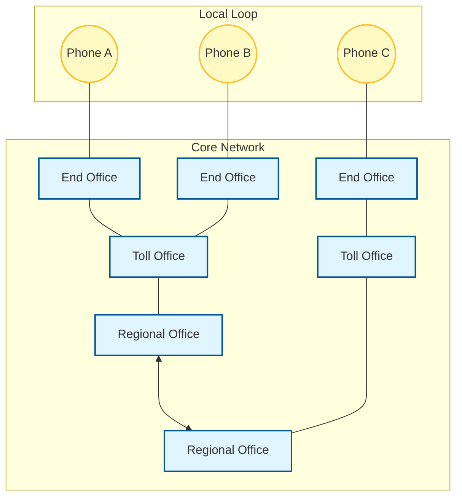

Links: [[00 Computer Networks]], [[08 Network Switching]]
___
# Public Switched Telephone Network (PSTN)

The **Public Switched Telephone Network (PSTN)** is the traditional, worldwide circuit-switched telephone network. Initially designed purely for voice communication over analog lines, it has evolved to support digital infrastructure in its core.

PSTN is the classic, textbook example of **[[08 Network Switching#Circuit Switching|Circuit Switching]]**.

## Architecture & Components
The PSTN is highly hierarchical. A typical connection involves several tiers of switching offices:

1. **Customer Premises:** Your home phone or local PBX.
2. **Local Loop:** The physical wire connecting the customer to the nearest telephone exchange.
3. **End Office (Local Exchange):** The first point of switching.
4. **Toll/Tandem Office:** Connects multiple end offices for regional calls.
5. **Primary/Regional/International Offices:** Handle long-distance and global routing.
6. **Trunks:** High-bandwidth lines connecting these various switching offices.

### Call Setup (Circuit Switching in Action)
When you dial a number:
1. The **Local Loop** signals the **End Office**.
2. Switches along the hierarchy identify an available path to the destination.
3. A **dedicated physical circuit** is established end-to-end.
4. The line rings; when answered, the conversation begins.
5. Once the call ends, the switches gracefully disconnect, releasing the resources holding the circuit open.

## Analog vs. Digital in PSTN
While we often think of "landlines" as purely analog, the modern PSTN is a hybrid system.

- **The "Last Mile" (Local Loop):** Often remains **Analog** (traditional copper wiring). This is why modems (Modulator-Demodulator) were originally required to connect a digital computer to the internet via the phone line.
- **The Core Network (Trunks & Switches):** Is almost entirely **Digital**, utilizing high-capacity fiber optic links and digital multiplexing techniques (like T1/E1 lines) to combine thousands of calls simultaneously.

## Hierarchical Structure

