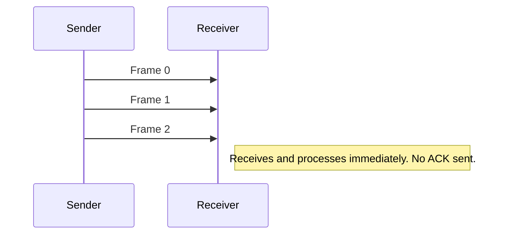
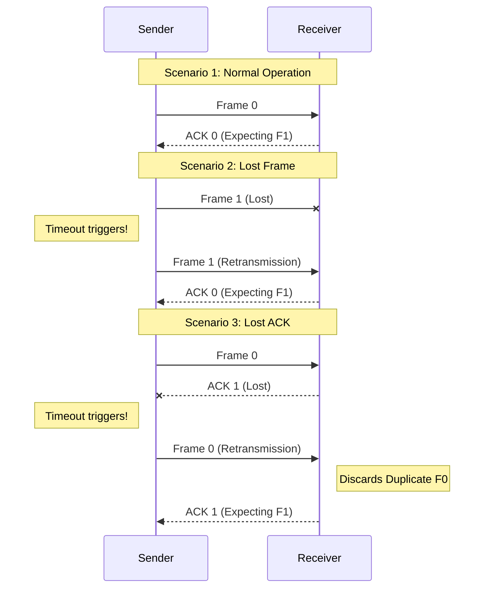
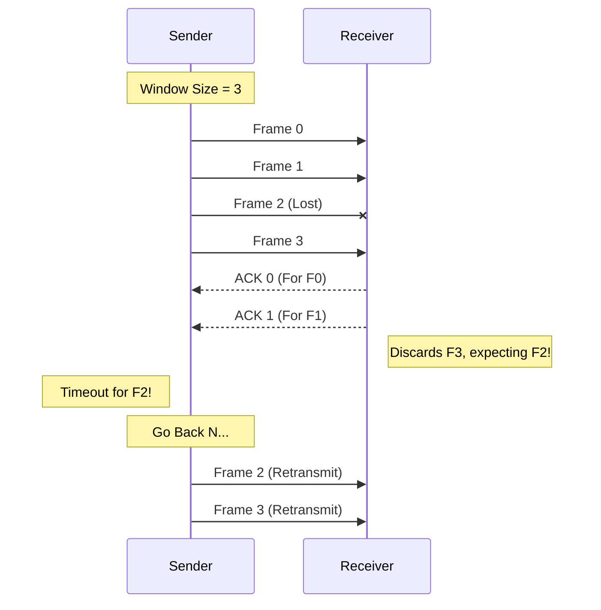
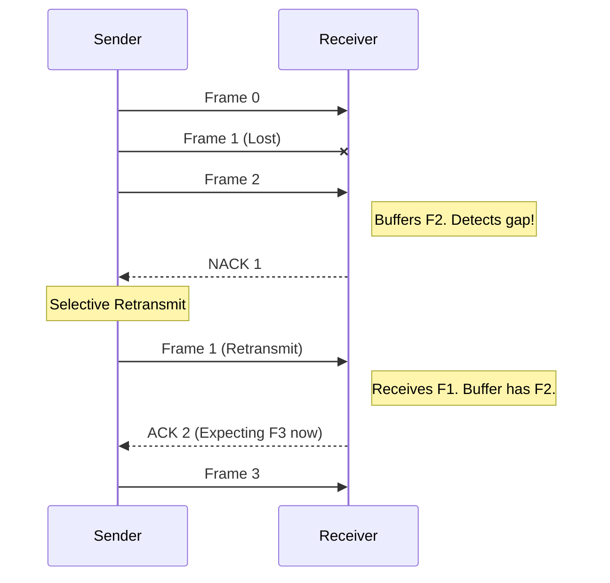
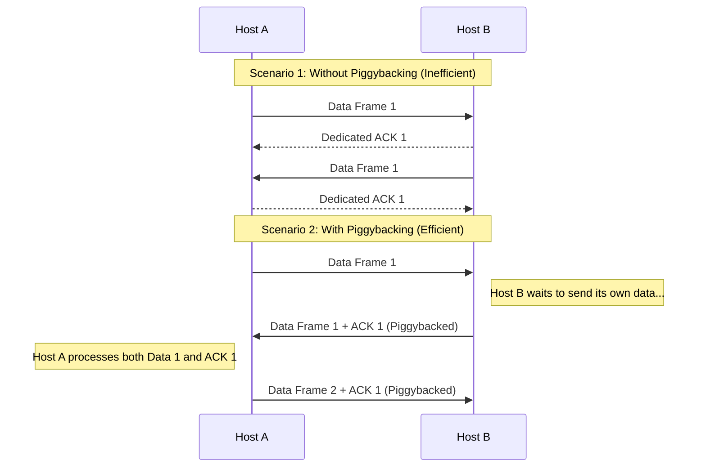

 Links: [[00 Computer Networks]], [[05 OSI Model]]
___
# Data Link Layer

The **Data Link Layer (DLL)** is responsible for hop-to-hop delivery of data. It takes packets from the Network Layer and encapsulates them into **Frames**.

## Framing
Framing is the process of dividing the bitstream into identifiable units called frames.

- **Fixed-length Framing:** All frames have the same size (e.g., ATM cells).
- **Variable-length Framing:** Frames can have different sizes. Requires delimiters to identify boundaries.

### Variable-Size Framing Structure

| Flag            | Header             | Payload (Data)     | Trailer              | Flag          |
|:--------------- |:------------------ |:------------------ |:-------------------- |:------------- |
| Start Delimiter | Src/Dest Addresses | Actual Information | Error Detection Bits | End Delimiter |

### Framing Techniques
1. **Character Count (Byte Count):** The first field in the header defines the number of characters in the frame.
2. **Byte Stuffing (Character-Oriented):** Uses special characters (Flags) to delimit frames. If the flag pattern appears in the data, an **Escape character (`\0`)** is inserted.
3. **Bit Stuffing (Bit-Oriented):** Uses a specific bit pattern (e.g., `01111110`) as a delimiter. If the pattern appears in the data, a `0` is inserted after five consecutive `1`s.

## Flow Control
Flow control is a speed-matching mechanism. It coordinates the amount of data that can be sent before receiving an acknowledgement, preventing a fast sender from overwhelming a slow receiver.

- **Window Size:** The amount of memory (buffer) allocated for sending/receiving frames.

### Protocols for Noiseless Channels
Assume ideal channels where frames are never lost, corrupted, or duplicated.

#### Simplest Protocol (Unrestricted)
The sender sends data as fast as possible, and the receiver processes it immediately. There is no flow control and no acknowledgement.

- **Sender Window:** 1
- **Receiver Window:** 1

### Protocols for Noisy Channels (ARQ)
Real-world channels have errors. These protocols use **ARQ (Automatic Repeat Request)** to handle lost or corrupted frames via Acknowledgements (ACK) and Negative Acknowledgements (NACK).

#### Stop-and-Wait ARQ
The sender sends *one* frame and waits for an ACK before sending the next one.

- **Sender Window:** 1
- **Receiver Window:** 1

**Mechanism:** If the sender doesn't receive an ACK within a specific timeout, it assumes the frame (or the ACK) was lost and retransmits the frame.

> [!ERROR] The Flaw
> Highly inefficient. The channel is idle while waiting for ACKs.

![[Pasted image 20260303142853.png]]

#### Go-Back-N ARQ (Sliding Window)
To improve efficiency, the sender can transmit multiple frames (up to a window size $N$) before needing an acknowledgement.

- **Sequence Numbers:** Determined by $n$ bits. Total sequence numbers = $2^n$.
- **Sender Window ($W_s$):** $2^n - 1$
- **Receiver Window ($W_r$):** $1$ (It can only accept frames in order).

**Mechanism:** If a frame is lost (e.g., Frame 2), the receiver discards all subsequent frames (Frame 3, 4) because it's only expecting Frame 2. The sender's timeout finishes, and it "goes back" to retransmit Frame 2 and *everything* after it.

![[Pasted image 20260303143025.png]]

#### Selective Repeat ARQ
Improves upon Go-Back-N by only retransmitting the *specific* frames that were lost, rather than the entire window.

- **Sender Window ($W_s$):** $2^{n-1}$
- **Receiver Window ($W_r$):** $2^{n-1}$ (Equal to sender window, allowing it to accept out-of-order frames).

**Mechanism:** The receiver buffers out-of-order frames and sends a **NACK (Negative Acknowledgement)** specifically for the missing frame. The sender only retransmits that single missing frame.

![[Pasted image 20260303143101.png]]

### Piggybacking
In two-way (full-duplex) communication, sending a dedicated acknowledgement packet for every single frame received is a massive waste of bandwidth, as the naked ACK packet itself requires a full header and processing power.

**Piggybacking** is a technique used to improve efficiency. When the receiver successfully gets a data frame, it does not send an ACK immediately. Instead, it waits until its own Network Layer has a new data packet ready to send back to the original source. The receiver then "piggybacks" or attaches the ACK onto this outgoing data frame.

- **Advantages:** Drastically reduces network traffic by combining data and acknowledgements into a single frame.
- **Disadvantages:** If the receiver doesn't have any actual data to send back, the ACK is artificially delayed. If this delay exceeds the sender's timer, it triggers a completely unnecessary retransmission. To prevent this, most protocols implement a small maximum wait timer before they are forced to send a naked ACK.

