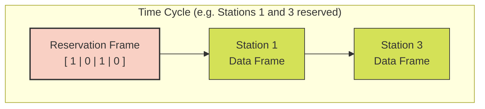
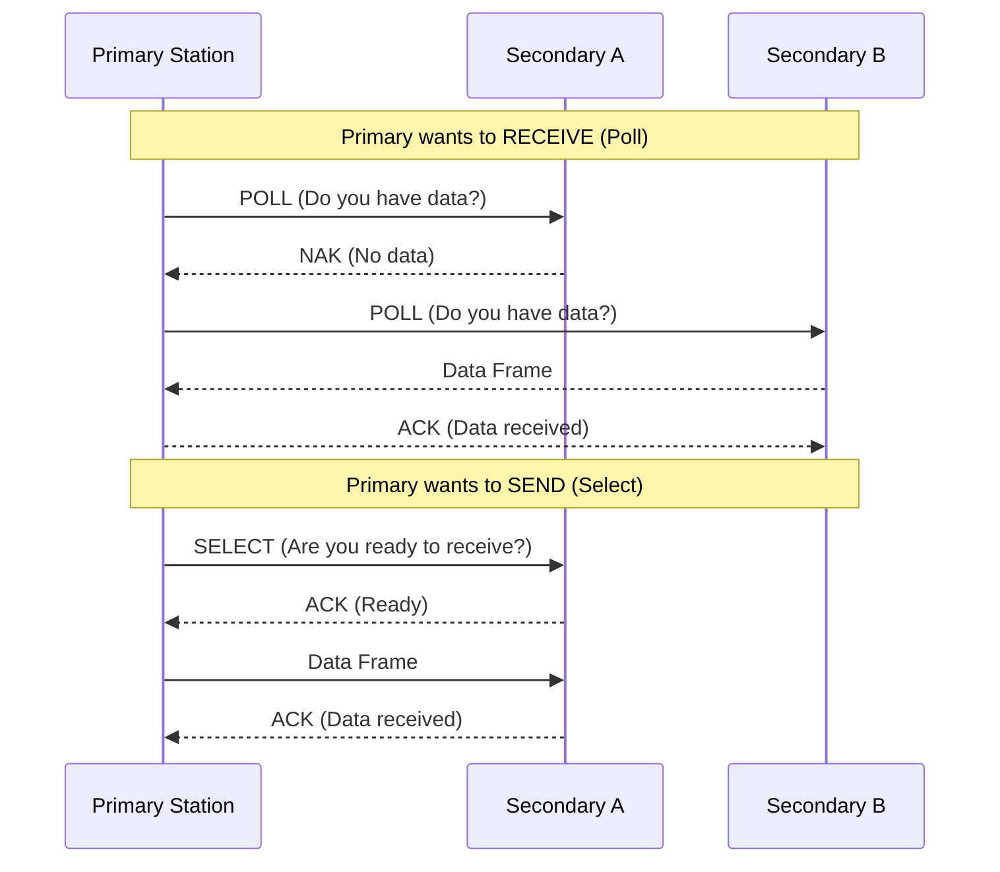
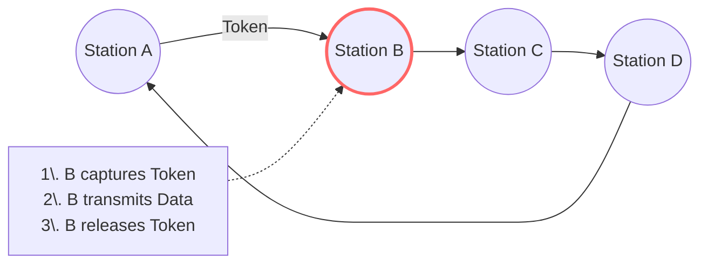

Links: [[00 Computer Networks]], [[10 Data Link Layer]]
___
# Multiple Access Protocols

The **Data Link Layer** is logically divided into two sublayers:

1.  **Data Link Control (DLC):** Focuses on framing, flow, and error control (see [[10 Data Link Layer]]).
2.  **Media Access Control (MAC):** Focuses on resolving conflicts when multiple devices share a single communication channel and want to transmit at the same time.

MAC protocols are classified into three main categories: **Random Access**, **Controlled Access**, and **Channelization**.

## [[13 Random Access Protocols|Random Access Protocols]]

## Controlled Access Protocols
Stations cannot transmit unless they have explicit permission, completely avoiding unpredictable collisions.

#### Reservation
Stations reserve time slots in advance. The cycle begins with a Reservation Frame containing mini-slots (one per station). A station transmits a "1" bit in its assigned mini-slot to reserve a position, followed by the Data Transmission Period where reserved stations send their data in order.

#### Polling
Uses a Primary-Secondary topology. A centralized controller (Primary Station) explicitly polls each node (Secondary Station) in sequence, granting permission to send or receive data.

#### Token Passing
A special, small frame called a "Token" continuously circulates among the stations in a logical ring topology. A station must capture the token to gain permission to transmit. Once finished, it releases the token back into the ring for the next device.

## Channelization Protocols
Multiplexing techniques that divide the physical medium's total capacity among multiple stations.

#### FDMA (Frequency Division Multiple Access)
In FDMA, the total available bandwidth of a channel is divided into non-overlapping frequency bands. 

Each station is permanently allocated its own specific frequency band to transmit data. To prevent stations from interfering with one another, a small buffer of unused frequency called a **Guard Band** separates each channel.

> [!TIP] Analogy: Multi-lane Highway
> Think of a highway where the total width is split into distinct, separate lanes. Each car (station) stays strictly in its own lane (frequency band). They can all drive forward simultaneously without ever hitting each other, as long as they don't cross the lines.

![[Pasted image 20260330165405.png]]

#### TDMA (Time Division Multiple Access)
In TDMA, stations share the same frequency band, but they take turns using it. 

The timeline is divided into discrete segments called **frames**, and each frame is further divided into **time slots**. Each station is assigned a specific time slot within the frame and can only transmit during its exact turn.

> [!TIP] Analogy: Shared Speaker Panel
> Imagine a debate panel sharing a single microphone. Everyone is using the exact same room and microphone (same frequency band), but they each get exactly 2 minutes to speak before passing it on. You use 100% of the channel capacity, but only for a fraction of the time.

![[Pasted image 20260330165416.png]]

#### CDMA (Code Division Multiple Access)
CDMA allows multiple stations to transmit simultaneously on the exact same frequency band at the exact same time. 

It avoids collisions by assigning a unique mathematical code (using orthogonal sequences) to each transmitting station. 

The receiver uses this exact same mathematical code to filter out all other transmissions as mere "background noise," successfully extracting the intended data.

> [!TIP] Analogy: International Cocktail Party
> Imagine a large room where everyone is talking loudly at the exact same time (same time, same frequency). Normally, this would be chaotic. However, every pair of people is speaking an entirely different language (unique code). If you are only listening for English, the Spanish, French, and Japanese conversations simply blend into background noise, allowing you to perfectly understand your English-speaking partner!

![[Pasted image 20260330165432.png]]
