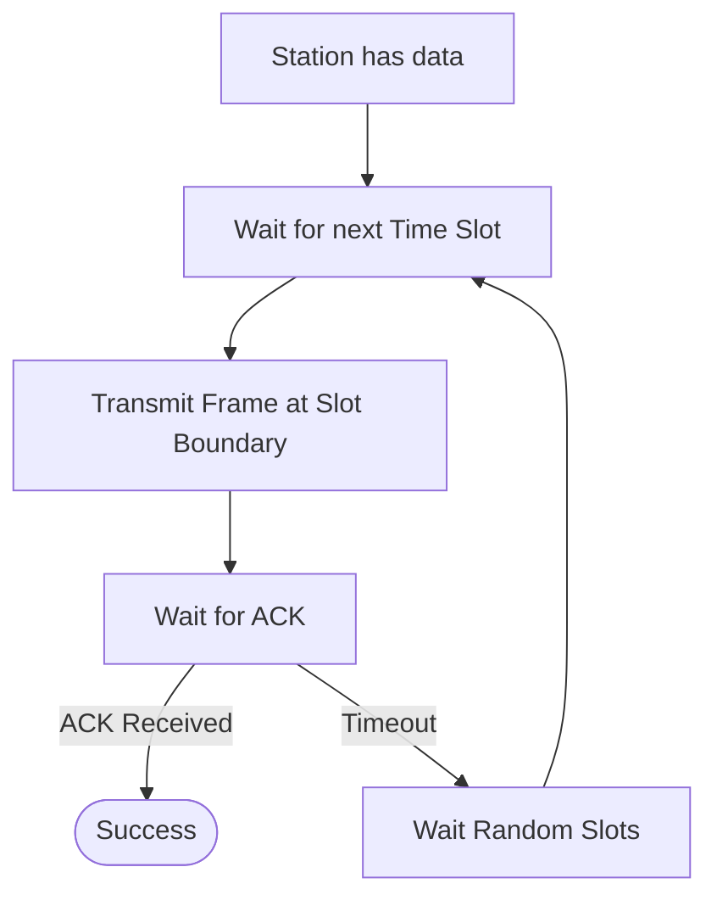
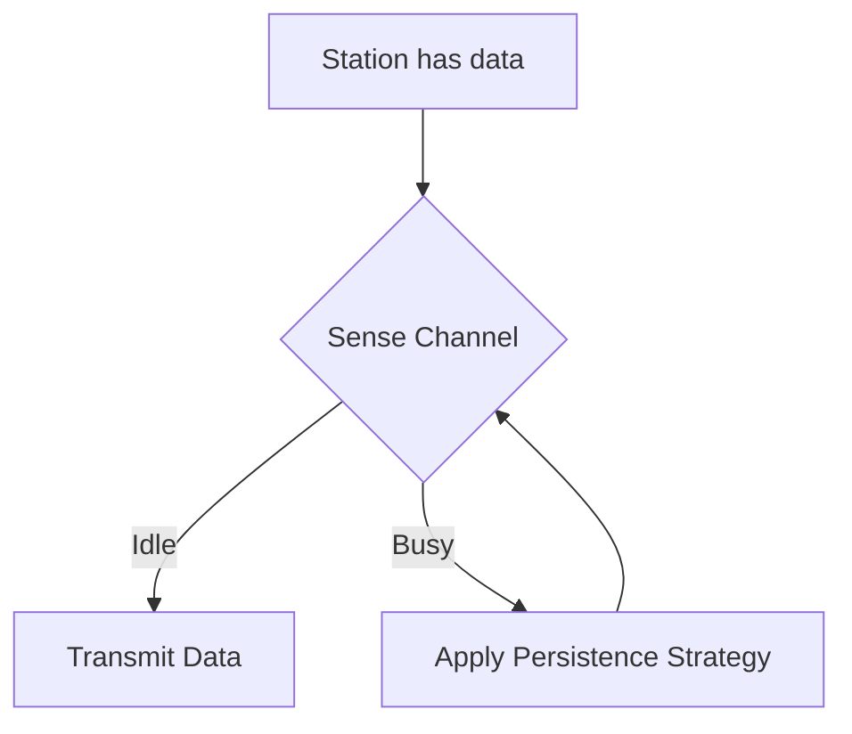
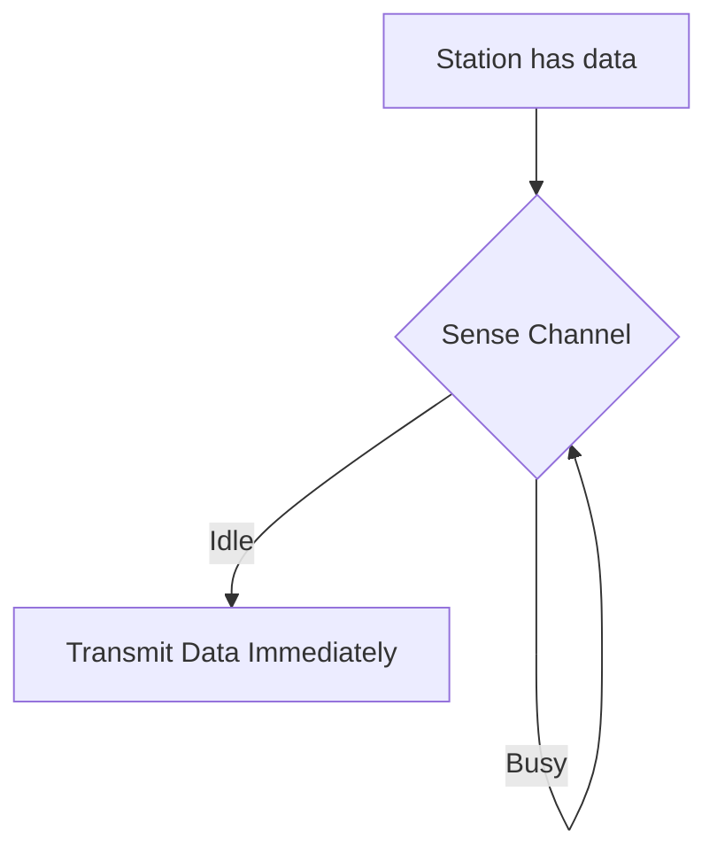
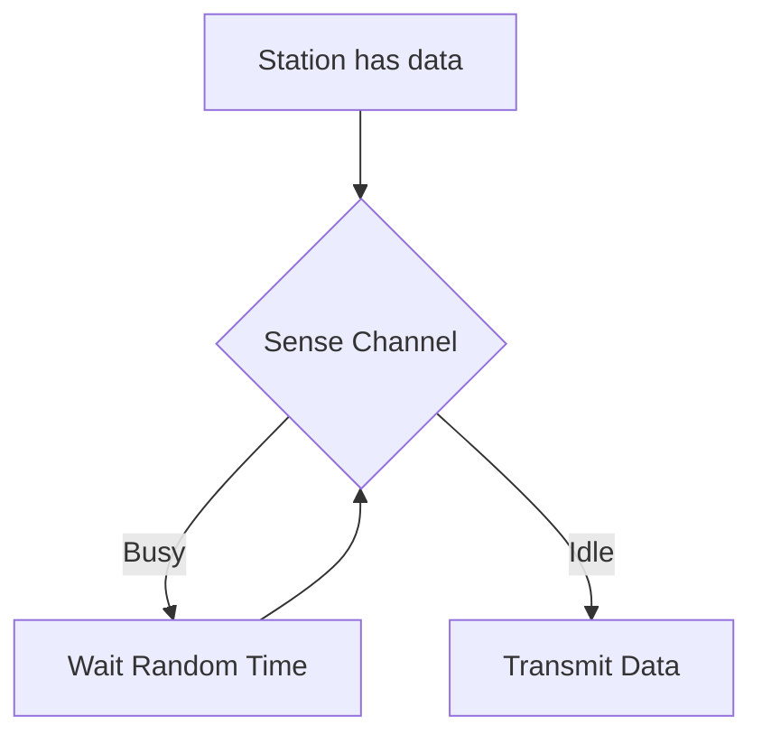
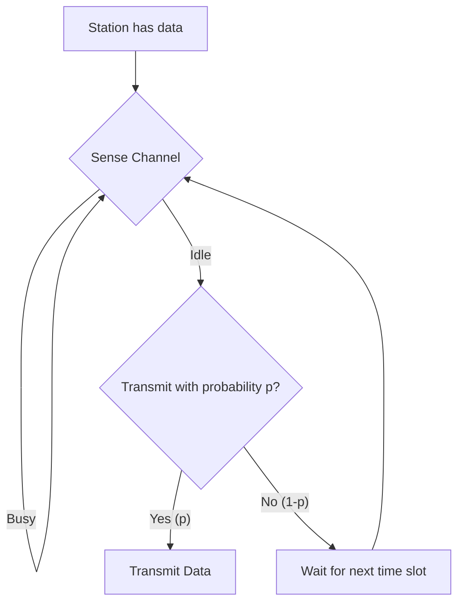
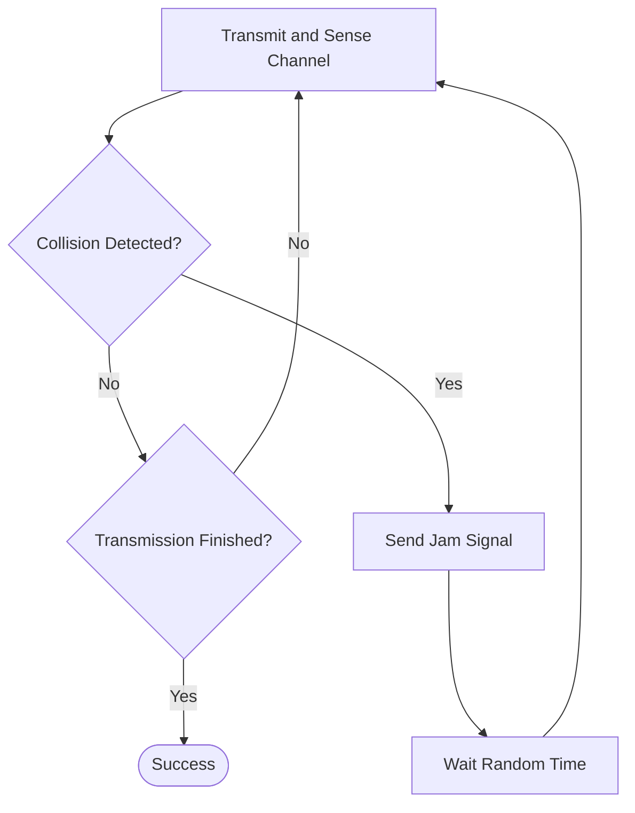
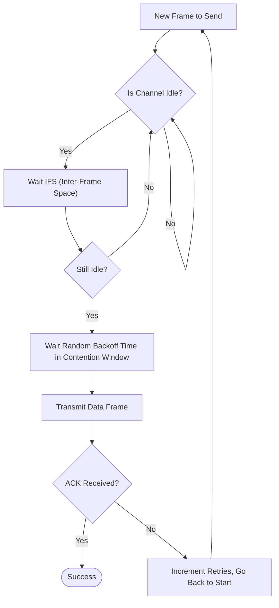

Links: 
___
# Random Access Protocols
In random access, no station is assigned control over another. A station can transmit whenever it has data, which inherently introduces the risk of **collisions**.

### ALOHA
The earliest random access method.

#### Pure ALOHA
A station transmits a frame whenever it has data. If two stations send data simultaneously, a collision occurs, and both frames are corrupted. The station will retry transmission up to 15 times.

![[Pasted image 20260330145359.png]]

> [!NOTE] Vulnerable Time
> The period during which a collision is possible. For Pure ALOHA:
> $$VT = 2 \times T_t$$
> *(where $T_{t}$ is Transmission time)* 

- **Throughput:** Calculated as:
  $$S = G \times e^{-2G}$$
  *(where G is average packets generated per packet time).*
- **Efficiency:** Maximum efficiency is very low, approximately **18.4%**.

> [!NOTE] Random Backoff
> Before retransmitting a lost frame, the sender waits a random amount of time to prevent immediate, repeated collisions.

#### Slotted ALOHA
The shared channel is divided into discrete time slots. Devices are forced to wait and can only begin transmitting at the *start* of the next slot. This halves the vulnerable time.

- **Vulnerable Time:**
	$$VT = T_t$$

- **Throughput:** Calculated as:
	$$S = G \times e^{-G}$$
- **Efficiency:** Maximum efficiency doubles to **36.8%**.

### CSMA (Carrier Sense Multiple Access)
CSMA requires a station to "listen before talking." It senses the channel to check if it is idle before sending data to minimize the chance of collision.

#### CSMA Persistence Strategies

##### 1-Persistent
The station senses the channel continuously. As soon as it becomes idle, it transmits immediately (with a probability of 1). 

> [!WARNING] Drawback
> This approach has a high chance of collision if multiple stations are waiting for the channel to become idle simultaneously.

![[Pasted image 20260330162722.png]]

##### Non-Persistent
The station senses the channel. If it is busy, the station waits for a random period of time before sensing it again. 

> [!TIP] Benefit
> This significantly reduces the chance of multiple waiting stations colliding when the channel becomes idle, though it can introduce longer delays.

![[Pasted image 20260330162802.png]]

##### p-Persistent
Primarily used in slotted channels. The station senses the channel. If it is idle, it transmits with probability $p$. With probability $(1-p)$, it defers its transmission to the next time slot and senses the channel again.

![[Pasted image 20260330162740.png]]

### CSMA/CD (Collision Detection)
Primarily used in **Wired Media** (e.g., traditional LAN/Ethernet).

- Stations can detect collisions by monitoring the energy level on the wire. If a collision occurs (energy spike), they immediately stop transmitting and send a **Jam Signal** to alert all other stations to stop.

> [!HELP] How does a station know if its own data collided?
> Imagine you are a station. You send out a packet. If someone else sends a packet at the same time, the two packets "crash" into each other on the wire. This crash creates an error signal that bounces back to you.
> 
> You can **only** detect this error if you are **still sending your packet** when the error signal reaches you. If you send a tiny packet very fast and finish before the error has time to travel back, you will simply assume everything went perfectly fine, and you'll never realize a collision even happened!
> 
> Therefore, you must keep "talking" (transmitting) for at least the amount of time it takes for a signal to go all the way to the end of the wire and come all the way back.
> 
> Mathematically, this means:
> **Transmission Time ($T_t$)** $\ge$ **Round-Trip Propagation Time ($2 \times T_p$)**

> [!TIP] Analogy: Yelling in a dark tunnel
> Imagine you are yelling a message to a friend at the other end of a long, dark tunnel. 
> - It takes **5 seconds** for sound to travel to the other end. So a round-trip takes **10 seconds** ($2 \times T_p$).
> - **Case 1 (Too short):** You yell "Hi!" (takes 2 seconds, $T_t$) and stop. Meanwhile, your friend also yells at the exact same time. The yells crash in the middle! Your friend's yell reaches you at second 5. You are quiet, so you just assume your friend is talking to you. You don't realize your words collided!
> - **Case 2 (Long enough):** You read a whole poem out loud (takes 15 seconds, $T_t$). At second 5, while you are *still yelling*, you hear your friend's voice hitting you. You immediately realize: "We are both yelling at the exact same time! Collision!"
> 
> This is why your message ($T_t$) **must** take longer to say than the round trip time ($2 \times T_p$). Otherwise, you will finish sending and stop listening for errors too early!

> [!NOTE] Minimum Packet Length
> Since:
> $$T_t = \frac{\text{Packet Length}}{\text{Bandwidth}}$$
> and:
> $$T_p = \frac{\text{Distance}}{\text{Speed}}$$
> the condition resolves to:
> $$ \frac{\text{Packet Length}}{\text{Bandwidth}} \ge 2 \times \frac{\text{Distance}}{\text{Speed}} $$
> $$ \text{Min Packet Length} = 2 \times \text{Bandwidth} \times T_p $$

> [!EXAMPLE] CSMA/CD Numerical
> **Given:**
> - **Distance ($d$):** 2.5 km (2500 m)
> - **Bandwidth ($B$):** 10 Mbps ($10^7$ bps)
> - **Propagation Speed ($v$):** $2 \times 10^8$ m/s
> 
> **Goal:** Find the Minimum Packet Length required to detect collisions.
> 
> 1. **Calculate $T_p$:** 
>    $$T_p = d / v = 2500 / (2 \times 10^8) = 12.5 \mu\text{s}$$
> 2. **Apply Condition:** 
>    $$T_t \ge 2 \times T_p = 25 \mu\text{s}$$
> 3. **Calculate Length:** 
>    $$\text{Length} = T_t \times B = (25 \times 10^{-6}) \times (10^7)$$
> 4. **Result:** 
>    $$\text{Length} = 250 \text{ bits}$$

### CSMA/CA (Collision Avoidance)
Primarily used in **Wireless Media** (e.g., Wi-Fi / IEEE 802.11).
*   In wireless networks, signal attenuation makes it nearly impossible to reliably detect collisions while transmitting. Instead, the protocol focuses on *avoiding* them entirely.

#### Working Principle

CSMA/CA uses specific wait periods (IFS, Inter Frame Space) and acknowledgments to avoid collisions.

> [!NOTE] Backoff Time Formula
> When the channel is busy, the station waits for a random number of time slots:
> $$ \text{Backoff Time} = \text{Random Number} \times \text{Slot Time} $$
> - The random number is chosen from a **Contention Window (CW)** range $[0, 2^k - 1]$, where $k$ is the number of retransmission attempts.

> [!EXAMPLE] CSMA/CA Process Walkthrough
> 1. **Initial Sense:** Station senses the medium is idle.
> 2. **DIFS:** It waits for **Distributed Inter-Frame Space (DIFS)** (e.g., 50 $\mu s$).
> 3. **Contention Window:** If still idle, it picks a random backoff (e.g., 3 slots of 20 $\mu s$ each = 60 $\mu s$).
> 4. **Transmit:** Sends the Data frame.
> 5. **SIFS:** Receiver waits for a shorter **Short Inter-Frame Space (SIFS)** (e.g., 10 $\mu s$).
> 6. **ACK:** Receiver sends ACK. If the sender receives it, the transmission is successful.

