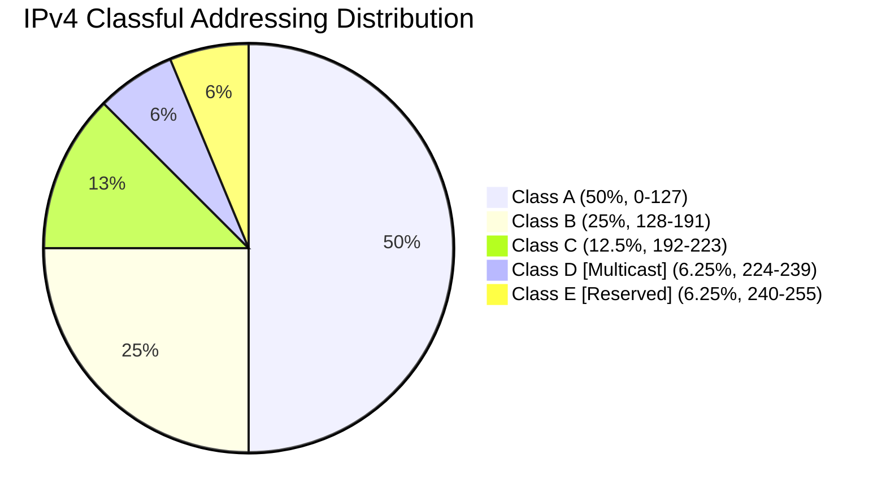

Links: [[00 Computer Networks]], [[05 OSI Model]], [[16 Subnetting and NAT]]
___
# Network Layer

The **Network Layer** (Layer 3 of the OSI model) is responsible for the delivery of individual packets from the source host to the destination host across multiple networks (end to end delivery).

> [!FAQ] What is a Host?
> A **Host** is any device connected to a network that acts as either the original source or final destination of data. Every host is assigned an IP address so it can inherently send and receive traffic. Examples include your PC, smartphone, web servers, and smart TVs. 
> 
> *Note:* While a Router connects networks together, it is usually considered an intermediate "node" rather than a true host, because its primary job is routing data along its path rather than generating it.

> [!TIP] Analogy: Terminuses vs Utilities
> In AE2, a **Host** is like an ME Terminal, a Molecular Assembler, or an ME Drive — it is the absolute start or end-point of an item's journey. The ME Smart Cables and P2P tunnels connecting them are the network infrastructure (nodes/routers), not the actual hosts.

## Core Design Issues

The Network Layer must effectively solve five primary challenges:

1.  **Addressing:** Every machine needs a unique identifier so data can reach it regardless of its physical location or the underlying topology.
2.  **Routing:** Determining the best (fastest, most reliable) path through the network to route packets from the source to the destination.
3.  **Packeting:** Encapsulating data from the Transport layer into Network Layer Protocol Data Units (PDUs) known as packets.
4.  **Internetworking:** Enabling communication across mathematically and physically different types of networks (e.g., passing data from a Fiber backbone into an Ethernet LAN and then into a Wireless access point).
5.  **Store and Forward Packet Switching:** The mechanism used by routers to temporarily store a packet before forwarding it onto the next link in its path.

## Types of Addressing

1.  **Physical Address (MAC):** Operates at the Data Link Layer. It is a 48-bit hex address hardcoded into the Network Interface Card (NIC) of the device. It is only useful for reaching devices on the *same local subnet*.
2.  **Logical Address (IP):** Operates at the Network Layer. It is a hierarchical address assigned to a device dynamically or statically by administrators. It enables devices to be reached *across different networks globally*.
    - **IPv4:** Uses 32-bit addresses. Contains structured classes (Classful IP addressing) such as Class A, B, and C to logically separate large networks from small ones.

- **IPv6:** Introduced to combat IPv4 exhaustion, using mathematically massive 128-bit addresses.

## Classless Addressing (CIDR)
In **Classful** addressing, networks are rigidly locked into Class A, B, or C boundaries — leading to massive address waste. **Classless Inter-Domain Routing (CIDR)** eliminates these fixed classes entirely. Instead, IP address blocks are assigned dynamically according to actual need.

An IP address under CIDR is written with a **prefix length** (e.g., `192.168.1.0/24`), where the number after the `/` indicates how many bits form the network portion.

### CIDR Block Rules

A valid CIDR block must satisfy three conditions:

1. All IP addresses in the block must be **contiguous** (sequential, no gaps).
2. The **size of the block** (total number of addresses) must be a power of 2 ($2^x$, where $x > 0$).
3. The **first IP address** of the block must be evenly divisible by the size of the block.

> [!EXAMPLE] Verifying Rule 3
> To verify the third rule, convert the last octet of the first IP address to binary. There must be at least $x$ trailing zeros (where $2^x$ = block size).
> 
> For example, a block of size 16 ($2^4$) starting at `192.168.1.32`:
> - Last octet: `32` → binary `00100000` → 5 trailing zeros \> 4 ✓
