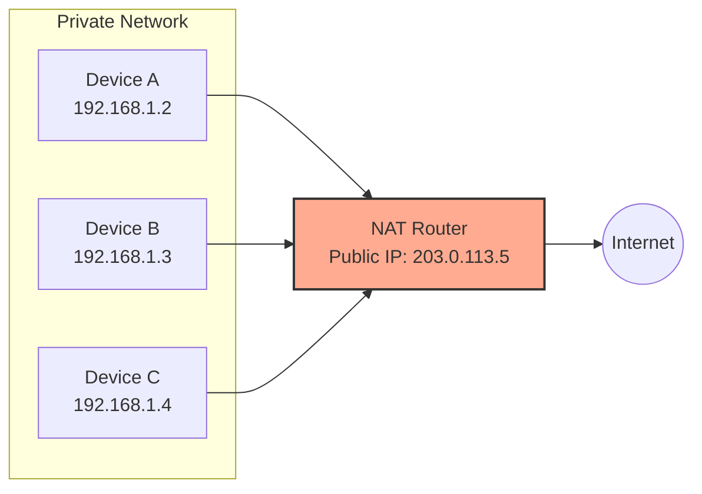

Links: [[00 Computer Networks]], [[15 Network Layer]]
___
# Subnetting and NAT

## Subnetting
**Subnetting** is the process of splitting a single large network into multiple smaller, manageable, and isolated sub-networks. This improves security and significantly reduces broad, unnecessary broadcast traffic.

> [!TIP] Analogy: AE2 Subnets
> In Applied Energistics 2, you can split your massive ME Network into smaller **subnets** using Storage Buses and Interfaces. Each subnet is isolated — devices on one subnet cannot directly see items on another. This is exactly what IP subnetting does: it partitions one large network into smaller, independent broadcast domains.

### Target Network (Subnet) Masking
A **Network Mask** (or Subnet Mask) reveals exactly which portion of an IP address refers to the "Network" and which refers to the specific "Host" device on that network.
- **Format:** A 32-bit value for IPv4 (e.g., `255.255.255.0` or `/24`).
- **Structure:** Under the hood, the mask is a sequence of **contiguous binary 1s** (denoting the Network portion) followed directly by **contiguous binary 0s** (denoting the Host portion).
- **Function:** It is heavily utilized by local devices and central routers to immediately determine if a destination IP address resides on the *local* network or if it must be handed off to a Default Gateway for remote *routing*.

> [!EXAMPLE] Determining Network ID via bitwise AND
> To find the exact Network ID that a device belongs to, the router performs a **bitwise logical AND** operation between the device's IP address and the Subnet Mask.
>
> **Example 1: Standard /24 Subnet**
> 
> |  | Decimal | Binary |
> | :--- | :--- | :--- |
> | **IP Address:** | `192.168.1.5` | `11000000.10101000.00000001.00000101` |
> | **Subnet Mask:** | `255.255.255.0` | `11111111.11111111.11111111.00000000` |
> | **AND Result:** | `192.168.1.0` | `11000000.10101000.00000001.00000000` |
> 
> **Example 2: Complex /26 Subnet**
> When the mask splits the last octet, the binary AND is crucial to find the network:
> 
> |  | Decimal | Binary |
> | :--- | :--- | :--- |
> | **IP Address:** | `192.168.1.150` | `11000000.10101000.00000001.`**`10`**`010110` |
> | **Subnet Mask:** | `255.255.255.192` | `11111111.11111111.11111111.`**`11`**`000000` |
> | **AND Result:** | `192.168.1.128` | `11000000.10101000.00000001.`**`10`**`000000` |
> 
> *The resulting `192.168.1.128` is the Network Address.*

### Host Calculation
Given a subnet mask, the number of usable hosts can be calculated by counting the number of **0-bits** (host bits) in the binary representation of the mask.

$$\text{Total Addresses} = 2^{n}$$
$$\text{Usable Hosts} = 2^{n} - 2$$

where $n$ is the number of host bits (zeros in the mask).

> [!WARNING] Reserved Addresses
> In any subnet, two addresses are always reserved and cannot be assigned to devices:
> - The **first address** (all host bits = 0) is the **Network Address** (used for identification).
> - The **last address** (all host bits = 1) is the **Broadcast Address** (used to send data to all hosts on the subnet).

> [!EXAMPLE] Finding the Last Address
> To find the last (broadcast) address of a subnet:
> 1. Convert the network address to binary.
> 2. Count the number of zeros in the subnet mask (these are host bits).
> 3. Set all those host bits to `1` in the network address.
> 4. Convert back to decimal — this is the broadcast address.
> 
> **Example:**
> - **Subnet Mask:** `255.255.255.0` (Binary: `11111111.11111111.11111111.00000000` → **8 zeros**)
> - **Network Address:** `192.168.1.0` (Binary: `11000000.10101000.00000001.00000000`)
> - **Step 3 (flip the 8 host bits to 1):** `11000000.10101000.00000001.`**`11111111`**`
> - **Step 4 (convert back):** `192.168.1.255` is the Broadcast Address.

### VLSM (Variable Length Subnet Masking)
In standard subnetting, every subnet uses the same mask, leading to wasted addresses. **VLSM** allows each subnet to have a *different* mask, tailored to the number of hosts it actually needs. This enables far more efficient utilization of the address space.

#### Numerical Example: VLSM Calculation
**Scenario:** You are given the network block `192.168.1.0/24`. You need to create subnets for:
1. **Sales Department:** 100 hosts
2. **Technical Department:** 50 hosts
3. **Accounts Department:** 20 hosts
4. **Point-to-Point Link:** 2 hosts (Router-to-Router)

**Strategy:** Always allocate the largest subnets first.

$$\symup{New Mask} = 32 - n$$

| Subnet       | Hosts Needed | Addresses Needed ($2^n$) | New Mask | Subnet Range                      |
|:------------ |:------------ |:------------------------ |:-------- |:--------------------------------- |
| **Sales**    | 100          | $2^7 = 128$              | `/25`    | `192.168.1.0` - `192.168.1.127`   |
| **Tech**     | 50           | $2^6 = 64$               | `/26`    | `192.168.1.128` - `192.168.1.191` |
| **Accounts** | 20           | $2^5 = 32$               | `/27`    | `192.168.1.192` - `192.168.1.223` |
| **P2P Link** | 2            | $2^2 = 4$                | `/30`    | `192.168.1.224` - `192.168.1.227` |

**Breakdown of Sales Subnet (/25):**
- **Network ID:** `192.168.1.0`
- **First Usable:** `192.168.1.1`
- **Last Usable:** `192.168.1.126`
- **Broadcast:** `192.168.1.127`
- **Subnet Mask:** `255.255.255.128`

## NAT (Network Address Translation)
**NAT** allows multiple devices on a private network to access the internet using a single shared public IP address. It works by translating **private (internal)** IP addresses to a **public (external)** IP address and vice versa as packets enter and leave the network.

NAT serves three critical purposes:
- **Address Conservation:** Helps conserve the limited IPv4 address space by allowing an entire private network to share a single public IP.
- **Security:** Masks internal device addresses from the outside world, making it harder for attackers to directly target individual hosts.
- **Flexibility:** Devices can be added to the private network freely without needing additional public IP addresses.

> [!TIP] Analogy: AE2 P2P Tunnels
> In AE2, a **P2P (Point-to-Point) Tunnel** takes many internal ME channels and funnels them through a single connection on a dense cable. The outside world only sees one tunnel endpoint, not the dozens of individual channels inside it. 
> 
> NAT works identically — many private IP addresses are funneled through a single public IP. The internet only sees the router's public address, not the individual devices behind it.
