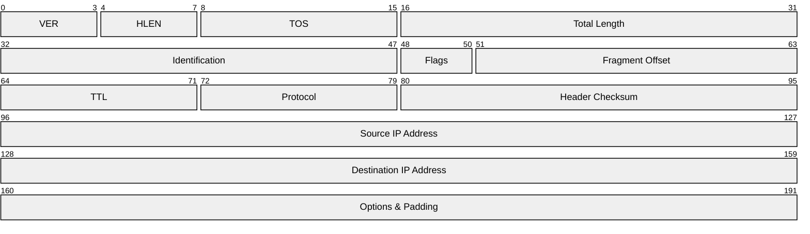
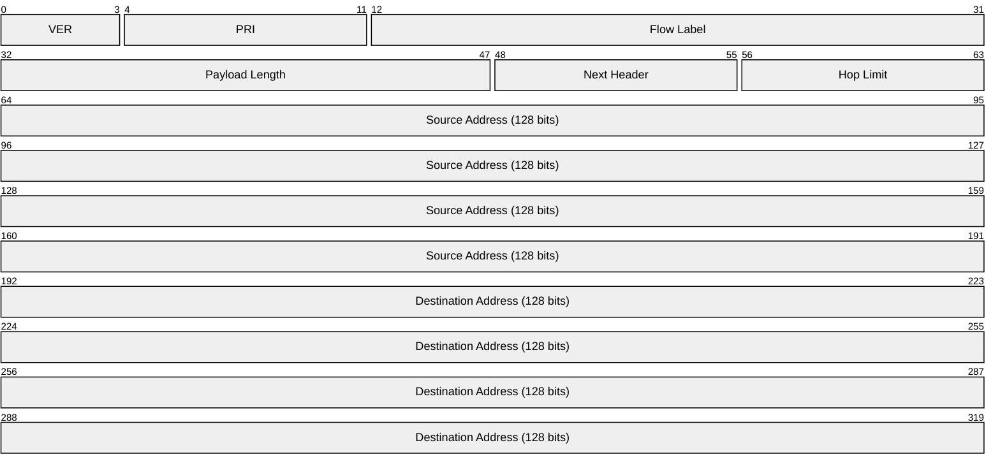

Links: [[00 Computer Networks]], [[15 Network Layer]]
___
# IPv4 and IPv6

Internet Protocol (IP) addresses form the backbone of logical addressing in the Network Layer. The two primary versions in use today are **IPv4** and **IPv6**.

> [!TIP] Analogy: AE2 Controllers vs Ad-hoc Networks
> Think of IPv4 like an Ad-hoc AE2 network (no ME Controller) — you only have a maximum of 8 channels. You hit that limit quickly and have to find creative ways to branch off or share connections. 
> 
> IPv6 is like placing an ME Controller with dense cables — you suddenly have a vastly larger, practically limitless number of channels (addresses) at your disposal, eliminating the need to carefully juggle limited resources.

## IPv4
IPv4 addresses are **32 bits** long, typically represented in decimal format separated into 4 octets (e.g., `192.168.1.1`).

- **Mathematical Limit:** The theoretical maximum number of IPv4 addresses is $2^{32}$ (roughly 4.3 billion, UINT_MAX).
- Due to the rapid global expansion of the internet, the world has effectively exhausted its pool of available IPv4 public addresses.

### IPv4 Datagram Header
The IPv4 datagram header has a minimum length of **20 bytes** and a maximum length of **60 bytes**. The header must contain a minimum of 12 fields:

![[Pasted image 20260413164132.png]]

- **VER (4 bits):** Version of the IP protocol (always `4` for IPv4).
- **HLEN (IHL) (4 bits):** Header Length. It specifies the length of the header in 32-bit words. Because it must be a multiple of 4, the minimum value is 5 ($5 \times 4 = 20$ bytes) and the max is 15 ($15 \times 4 = 60$ bytes).
- **Service (TOS) (8 bits):** Indicates the type of service requested during transfer (e.g., Low Delay, High Throughput, Reliability).
- **Total Length (16 bits):** The length of the entire datagram (Header + Data). The minimum length is 20 bytes, and the maximum is 65,535 bytes.
- **Identification (16 bits):** A unique packet ID used for fragmentation. It successfully identifies all fragments that belong to a single original datagram.
  
- **Fragmentation Offset (13 bits):** When a large packet is broken down to traverse a network with a smaller MTU (Maximum Transmission Unit), this field represents where this specific fragment belongs in relation to the original whole data payload.

- **Flags (3 bits):** Consists of 3 individual 1-bit flags:
    1. **Reserved Bit:** Always set to `0`.
    2. **Do Not Fragment (DF):** If set to `1`, the router is forbidden from fragmenting the packet.
    3. **More Fragments (MF):** If set to `1`, it means more fragments are coming following this one. If `0`, this is the final fragment.
- **Time to Live / TTL (8 bits):** The maximum number of hops a packet can take. It starts at a set number (usually 64, 128, or 255) and is reduced by 1 every time it passes through a router. 

> [!FAILURE] TTL Expiration
> If the TTL hits zero before reaching its destination, the router discards the packet completely to prevent infinite network loops, and sends back an ICMP error.

- **Protocol (8 bits):** Dictates which upper-layer protocol should receive the data once it reaches the destination (e.g., TCP is `6`, UDP is `17`).
- **Header Checksum (16 bits):** Used strictly for error checking the header during transit.
- **Source IP Address (32 bits):** The sender's logical address.
- **Destination IP Address (32 bits):** The recipient's logical address.
- **Options & Padding (Variable):** Optional routing instructions or padding to ensure the header ends on a 32-bit boundary.

## IPv6
IPv6 was created explicitly to solve the IPv4 exhaustion crisis.

- **Length:** IPv6 addresses are **128 bits** long.
- **Structure:** They are comprised of 8 groups (hextets) of 16 bits each.
- **Format:** Represented as Hexadecimal digits separated by colons. (e.g., `2001:0DB8:85A3:0000:0000:8A2E:0370:7334`).
- **Mathematical Limit:** Provides a staggeringly massive address space of $2^{128}$ possible addresses.

### Abbreviation Rules
Because writing 32 hexadecimal characters is tedious, there are strict rules for condensing IPv6 addresses:

1. **Omit Leading Zeros:** Consecutive leading zeros in any group can be removed.
   - Example: `0074` becomes `74`. `0000` becomes `0`.
2. **Zero Compression:** Contiguous groups of all zeros can be condensed entirely and replaced with a double colon `::`. 

> [!WARNING] The Double Colon Rule
> You can only use the `::` abbreviation **once** per address. Using it multiple times creates ambiguity because the system wouldn't know how many zeroes each `::` represents.

> [!EXAMPLE] Condensing an IPv6 Address
> **Original:** `EDFC:0074:0000:0000:0000:B0FF:0000:FFF0`  
> **Rule 1 (Leading Zeros):** `EDFC:74:0:0:0:B0FF:0:FFF0`  
> **Rule 2 (Double Colon):** `EDFC:74::B0FF:0:FFF0`

### IPv6 Datagram Header
Unlike the variable-length IPv4 header, the IPv6 base header has a fixed length of exactly **40 bytes**. This stream-lined design allows routers to process packets significantly faster.

![[Pasted image 20260415143756.png]]

- **VER (4 bits):** Version (always `6`).
- **PRI (4 bits):** Priority/Traffic Class of the datagram.
- **Flow Label (24 bits):** Extremely useful for multimedia streaming. Allows the source to label packets belonging to a continuous specific sequence (flow), ensuring they are treated consistently by routers.
- **Payload Length (16 bits):** Indicates the size of the payload (max 65,535 bytes).
- **Hop Limit (8 bits):** Replaces the IPv4 TTL. The maximum number of intermediate nodes a packet can traverse.
- **Next Header (8 bits):** Indicates the type of extension header following the IPv6 base header, or dictates the upper-layer protocol.

## Differences: IPv4 vs IPv6

| Feature                 | IPv4                             | IPv6                                       |
|:----------------------- |:-------------------------------- |:------------------------------------------ |
| **Size**                | 32 bits                          | 128 bits                                   |
| **Header Size**         | 20-60 bytes                      | Exactly 40 bytes                           |
| **Address Space**       | Extremely Limited                | Statistically Massive                      |
| **Fragmentation**       | Performed by senders AND routers | Performed ONLY by the original sender      |
| **Checksum Validation** | Validates Header Checksum        | Dropped entirely to speed up routing       |
| **Communication**       | Unicast, Multicast, Broadcast     | Unicast, Multicast, Anycast (No Broadcast) |
| **Subnetting**          | Uses Address Classes / VLSM      | Uses prefix-based addressing exclusively   |
