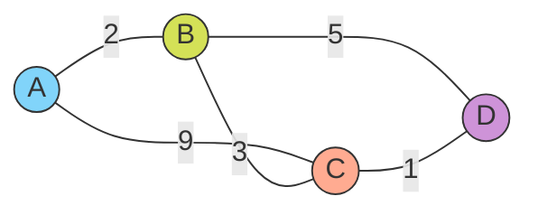

Links: [[00 Computer Networks]], [[15 Network Layer]]
___
# Routing

**Routing** controls exactly how data packets move from a source to a destination, ensuring efficient and reliable delivery across complex network typologies.

> [!TIP] Analogy: AE2 ME Controller Pathfinding
> Routing is essentially the core intelligence of an Applied Energistics 2 **ME Controller**. 
> 
> When you order a complex auto-craft, the controller must calculate the shortest, most reliable path through a massive, chaotic web of Smart Cables to reach specific Molecular Assemblers. 
> 
> If a creeper blows up a cable halfway through the base, the ME Controller must immediately recalculate a completely new route to deliver the resources.

## Routing Strategies

### Static Routing (Non-Adaptive)
In Static Routing, the routing tables are manually provided and configured by a network administrator. The table contains predefined, hard-coded routes.
- **Pros:** Low CPU overhead on routers, highly secure (no routing updates sent across the network).
- **Cons:** If a physical link goes down, the router has no ability to adapt; the route remains broken until a human manually updates the table.

### Dynamic Routing (Adaptive)
In Dynamic Routing, the routing table is automatically and continuously updated by the routers themselves whenever there is a change in the network topology (like a link failure or a new device added).
- Routers actively exchange messages with their neighbors and constantly recalculate the fastest routes.

## Routing Algorithms

### Distance Vector Routing (DVR)
DVR is a core dynamic protocol algorithm where each router maintains a table showing the calculated distance (in hops) to all other known routers. Each router routinely sends its entire distance vector to all of its immediate neighbors. 

If new information received from a neighbor reveals a shorter path, the router safely updates its own table. Updates also trigger if an existing link goes offline.

> [!NOTE] Mathematical Foundation (Bellman-Ford Algorithm)
> DVR is strictly based on the Bellman-Ford algorithm to recalculate the shortest paths:
> $$D_x(y) = \min_v \{ c(x, v) + D_v(y) \}$$
> _Where:_
> - $D_x(y)$ is the total estimated minimum cost from router $x$ to destination $y$.
> - $v$ is an immediate neighbor of router $x$.
> - $c(x, v)$ is the actual transmission cost from router $x$ to neighbor $v$.

#### Worked Example: DVR Convergence

**Network Topology:** A 4-router network where A and D have no direct link. The cheapest paths are non-obvious, requiring the algorithm to propagate information across multiple rounds before converging.

**Direct link costs ($\infty$ = no direct link):**

|       | **A** | **B** | **C** | **D** |
|:----- |:-----:|:-----:|:-----:|:-----:|
| **A** |   0   |   2   |   9   |   ∞   |
| **B** |   2   |   0   |   3   |   5   |
| **C** |   9   |   3   |   0   |   1   |
| **D** |   ∞   |   5   |   1   |   0   |

> [!WARNING] A has no direct link to D
> A cannot reach D at all in Step 0. DVR must relay information via intermediate neighbours across multiple rounds to discover a valid path: this is exactly what makes the algorithm interesting.

##### Step 0: Initial Tables (No Exchange Yet)

Each router initialises its table with only what it can directly observe. All unreachable destinations are set to $\infty$.

| Dest | A₀ | B₀ | C₀ | D₀ |
|:---- |:--:|:--:|:--:|:--:|
| A    |  0 |  2 |  9 |  ∞ |
| B    |  2 |  0 |  3 |  5 |
| C    |  9 |  3 |  0 |  1 |
| D    |  ∞ |  5 |  1 |  0 |

*(Subscript = step number. Bold = best next hop for that row.)*

##### Step 1: First Exchange

All routers broadcast their Step 0 tables to their **direct neighbours only**. Then every router independently applies:

$$D_x(y) = \min_v \{ c(x,v) + D_v(y) \}$$

---

**Router A** (neighbors: B, C)

| Check     | Calculation             | Result | vs. Current | Accept? |
|:--------- |:----------------------- |:------:|:-----------:|:-------:|
| A→C via B | $c(A,B) + D_B(C) = 2+3$ |   5    |     < 9     |    yes    |
| A→D via B | $c(A,B) + D_B(D) = 2+5$ |   7    |     < ∞     |    yes    |
| A→D via C | $c(A,C) + D_C(D) = 9+1$ |   10   |     > 7     |    no    |

**Table A₁:**

| Dest | Cost  | Via    | $\Delta$       |
|:---- |:-----:|:-------|:--------|
| A    |   0   | Self   |         |
| B    |   2   | Direct |         |
| C    | **5** | B      | ↓ was 9 |
| D    | **7** | B      | ↑ was ∞ |

---

**Router D** (neighbours: B, C)

| Check     | Calculation             | Result | vs. Current | Accept? |
|:--------- |:----------------------- |:------:|:-----------:|:-------:|
| D→A via B | $c(D,B) + D_B(A) = 5+2$ |   7    |     < ∞     |    yes    |
| D→A via C | $c(D,C) + D_C(A) = 1+9$ |   10   |     > 7     |    no    |
| D→B via C | $c(D,C) + D_C(B) = 1+3$ |   4    |     < 5     |    yes    |

**Table D₁:**

| Dest | Cost  | Via    | $\Delta$       |
|:---- |:-----:|:-------|:--------|
| A    | **7** | B      | ↑ was ∞ |
| B    | **4** | C      | ↓ was 5 |
| C    |   1   | Direct |         |
| D    |   0   | Self   |         |

---

**Routers B and C:** no neighbor's table offers a cheaper path than their own direct links. **B₁ = B₀, C₁ = C₀.**

##### Step 2: Second Exchange

Routers now share their Step 1 tables. Updated information from A and D propagates further.

**Router B** (neighbours: A, C, D) receives A₁ and D₁.

| Check     | Calculation                 | Result | vs. Current | Accept? |
|:--------- |:--------------------------- |:------:|:-----------:|:-------:|
| B→C via A | $c(B,A) + D_{A_1}(C) = 2+5$ |   7    |     > 3     |   no    |
| B→D via A | $c(B,A) + D_{A_1}(D) = 2+7$ |   9    |     > 5     |   no    |
| B→A via D | $c(B,D) + D_{D_1}(A) = 5+7$ |   12   |     > 2     |   no    |

No improvements. **B₂ = B₀.**

---

**Router C** (neighbors: A, B, D) receives D₁.

| Check     | Calculation                 | Result | vs. Current | Accept? |
|:--------- |:--------------------------- |:------:|:-----------:|:-------:|
| C→A via D | $c(C,D) + D_{D_1}(A) = 1+7$ |   8    |     < 9     |   yes   |
| C→B via D | $c(C,D) + D_{D_1}(B) = 1+4$ |   5    |     > 3     |   no    |

**Table C₂:**

| Dest | Cost  | Via    | Δ       |
|:---- |:-----:|:-------|:--------|
| A    | **8** | D      | ↓ was 9 |
| B    |   3   | Direct |         |
| C    |   0   | Self   |         |
| D    |   1   | Direct |         |

---

**Router A** (neighbours: B, C) receives C₂ (no change from B).

| Check     | Calculation           | Result | vs. Current | Accept? |
|:--------- |:--------------------- |:------:|:-----------:|:-------:|
| A→C via B | $c(A,B)+D_{B}(C)=2+3$ |   5    |     = 5     |   no    |
| A→D via B | $c(A,B)+D_{B}(D)=2+5$ |   7    |     = 7     |   no    |

No improvements. **A₂ = A₁.**

##### Step 3: Third Exchange (Convergence Verification)

All routers share their Step 2 tables. Every check must yield no improvement for the network to converge.

| Router | Neighbour Tables Received | Any Improvement Found? |
|:------ |:------------------------- |:----------------------:|
| **A**  | B₂ = B₀, C₂               |          ✗ No          |
| **B**  | A₁ = A₂, C₂, D₁           |          ✗ No          |
| **C**  | A₂, B₂, D₁                |          ✗ No          |
| **D**  | B₂, C₂                    |          ✗ No          |

**All tables are stable. The network has converged after 2 meaningful iterations.**

##### Final Converged Routing Tables

| Dest | **A** (cost / via) | **B** (cost / via) | **C** (cost / via) | **D** (cost / via) |
|:---- |:------------------:|:------------------:|:------------------:|:------------------:|
| A    | 0 / Self           | 2 / Direct         | 8 / D              | 7 / B              |
| B    | 2 / Direct         | 0 / Self           | 3 / Direct         | 4 / C              |
| C    | 5 / B              | 3 / Direct         | 0 / Self           | 1 / Direct         |
| D    | 7 / B              | 5 / Direct         | 1 / Direct         | 0 / Self           |

> [!NOTE] Key Observations
> - **A→D = 7 via B** (A→B→D), even though A→C→D = 9+1=10. DVR finds the cheaper multi-hop path.
> - **D→B = 4 via C** (D→C→B), cheaper than the direct D→B link (cost 5). DVR detects this in Step 1 when D receives C's table.
> - **C→A = 8 via D** (C→D→B→A), only discovered in Step 2 after D's updated table propagates to C. The direct C→A link (cost 9) loses.
> - **A never directly receives D's table:** D's knowledge reaches A only by propagating through B and C, demonstrating why distant nodes require multiple iterations.

#### The Count to Infinity Problem
While Distance Vector Routing is simple, it suffers from a major structural flaw known as the **Count to Infinity** problem (routing loops). This occurs when a link breaks, but routers continue gossiping outdated information to each other. 

Because DVR routers only know the *cost* to a destination, not the actual *path*, two nodes can end up relying on each other for a broken route. They will continuously bounce the distance back and forth, endlessly increasing the hop count toward infinity until the protocol forcefully times out.

##### Solutions to Routing Loops
To prevent routers from getting trapped in endless gossip about a dead link, DVR protocols implement strict broadcast rules:

1. **Split Horizon:** A router is explicitly forbidden from advertising a route back onto the exact same interface it learned that route from. If Router A learns the path to D from Router B, A will *never* broadcast its route to D back to B.
2. **Poison Reverse:** Instead of staying silent (like Split Horizon), the router actively advertises the route back to the source, but with a distance set strictly to **Infinity** (which is 16 in RIP). This forcefully tells the source: *"Do not try to route through me to get there, because my path relies entirely on you."*

### Link State Routing (LSR)
Unlike DVR (where routers only know their neighbors' limited perspectives), **Link State Routing** requires every router to independently map out the exact topology of the *entire* network. Instead of gossiping their whole routing table to their neighbors, LSR routers share *only* their direct link states, but they share them with *everyone*.

#### Phases of Link State Routing
1. **Discovery:** The router figures out exactly who its direct, physically connected neighbors are and measures the transit cost to each.
2. **Link State Packet Creation:** The router packages its identity, its neighbors, and its direct link costs into a specialized data block called a Link State Packet (LSP).
3. **Reliable Flooding:** The router broadcasts its LSP to all immediate neighbors. Those neighbors immediately copy and forward it to *their* neighbors, creating a tidal wave that rapidly "floods" the entire autonomous system. It is strictly "reliable" because routers use sequence numbers to instantly drop old or duplicate LSPs, preventing infinitely looping storms.
4. **Root Calculation (Dijkstra's Algorithm):** Once the flooding settles, every single router possesses an identical, complete map of the entire network. Every router then independently runs **Dijkstra's Shortest Path Algorithm**—treating itself as the "root" node of the graph—to calculate the absolute cheapest path to every other node in the system.
