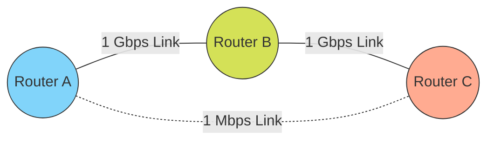
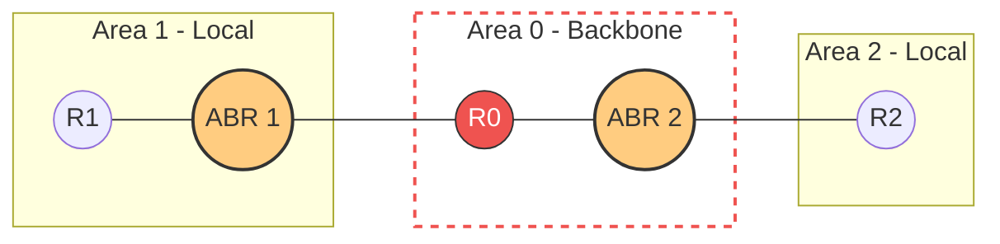
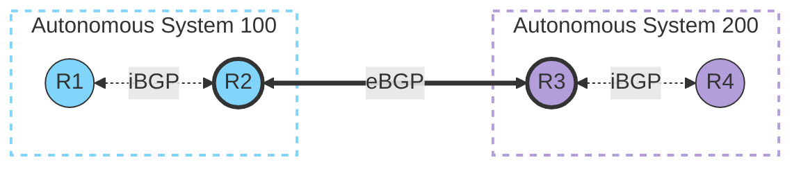

Links: [[19 Routing]]
___
# Routing Protocols & Domains
A **Domain** (or Autonomous System) is a collection of networks operating under a single unified administrative policy, able to communicate without relying on external assistance.

Depending on whether a packet is staying inside its Autonomous System or leaving to cross the global internet, different protocols take over.

> [!TIP] Analogy: The AE2 Inter-dimensional Quantum Ring
> While OSPF manages local cabling routing perfectly inside your base (Intradomain), **BGP** acts like the **Quantum Network Bridge**. 
> 
> It operates entirely outside local metrics, functioning specifically to connect massive, completely isolated autonomous networks (dimensions) together across impossibly massive gaps reliably.

### Intradomain Routing (Internal)
These protocols execute routing strictly *within* a single Autonomous System. A large domain is often chunked into multiple subdomains which communicate internally using these protocols.

#### Update Mechanisms
Intradomain protocols rely on routers communicating state changes to each other through two primary triggers:
- **Periodic Updates:** A node automatically broadcasts an update message on a strict timer (e.g., every 30 seconds), even if literally nothing in the network has changed.
- **Triggered Updates:** A node immediately broadcasts an update the precise second it notices a local link failure or receives a table-changing update from a neighbor.

#### RIP (Routing Information Protocol)
[[19 Routing#Distance Vector Routing (DVR)]]

RIP is an intradomain protocol heavily based on the **Distance Vector Routing** algorithm. Because it tracks distance strictly by "hops," it is only suitable for small networks.

> [!WARNING] The Hop-Count Flaw
> In the topology above, RIP explicitly ignores bandwidth. It will blindly choose the incredibly slow `1 Mbps` link simply because it costs 1 hop, completely ignoring the blazing fast `1 Gbps` 2-hop route through Router B!

- **Infinity Concept:** In RIP, the concept of an "unreachable" infinite distance is hardcoded as exactly **16**. Therefore, the absolute maximum number of hops a valid packet can survive is 15.
- **Update Cycle:** Advertisements are broadcast periodically every 30 seconds, or instantly in the event of a triggered update.

  > [!FAQ] What is an Advertisement?
  > An **Advertisement** (or update) is essentially the router gossiping its entire routing table to its direct neighbors. 
  > 
  > Because the DVR algorithm makes individual routers totally blind to the overall network layout, they rely exclusively on this gossip. 
  > 
  > Every 30 seconds, a router packages up its known destinations and current hop costs, and blindly broadcasts it out of all active cable interfaces. 
  > 
  > Neighbors receive it, add +1 to all the hop metrics, and use the new information to see if they can find a shorter path to any destination.

##### Header Details 
- **Command:** `1` stands for Request, `2` stands for Response.
- **Version:** The version of RIP tracking running.
- **Address Family Identifier:** Represents the underlying protocol. A value of `2` dictates standard IP protocol.
- **Metric (TTL):** The current hop count limiting the packet's lifespan.

![[Pasted image 20260415154850.png]]

#### OSPF (Open Shortest Path First)
[[19 Routing#Link State Routing (LSR)]]

OSPF is a much more robust intradomain routing protocol based strictly on the **Link State Routing** algorithm. 

- It logically divides massive autonomous systems down into hierarchical **Areas** to segment traffic. Area 0 is always the designated "Backbone", and specialized Area Border Routers (ABRs) connect local leaf areas back to it.
- **Trigger-Only Updates:** Unlike RIP, OSPF does *not* blindly send periodic updates. It relies entirely on triggered updates.
- Under heavy loads, OSPF is significantly faster, far more scalable, and exponentially more bandwidth-efficient than RIP.

##### Header Details
- **Version:** The version of OSPF running (e.g., version 2 for IPv4, version 3 for IPv6).
- **Type:** Defines the specific OSPF packet function (e.g., `1` = Hello packet, `4` = Link State Update).
- **Message Length:** The total length of the OSPF packet configuration in bytes.
- **Source Router IP:** The unique router ID (usually the highest loopback IP) generating the packet.
- **Area ID:** The 32-bit identifier of the specific OSPF Area this packet belongs to (Backbone is `0.0.0.0`).
- **Checksum:** Standard mechanism to verify packet payload integrity.
- **Authentication:** Contains an Authentication Type (None, Simple Password, or Cryptographic) and the corresponding security data to prevent rogue routers from hijacking the routing tables.

![[Pasted image 20260415155629.png]]

### Interdomain Routing (External)
These protocols handle routing massive traffic loads *between* two completely different autonomous domains across the wider internet.

#### BGP (Border Gateway Protocol)
BGP is the foundational protocol that makes the public internet function. It is based strictly on the **Path Vector Routing** algorithm. 

Unlike Distance Vector which just shares a raw "distance", BGP routers share the *entire explicit path* (the exact list of domains) a packet must take to reach its destination, organically preventing global routing loops.

Rather than managing individual IP addresses, BGP views the internet macroscopically as a sprawling web of interconnected Autonomous Systems (AS). It enforces sweeping network policies, allowing entire ISPs to dictate exactly how massive volumes of traffic enter and exit their borders.

##### Key Architecture
To manage traffic leaping between entirely different domains, BGP designates specific roles:
- **Border Router:** A massive, high-throughput router physically sitting at the absolute edge of an Autonomous System, directly connected to foreign networks.
- **BGP Speaker:** A router explicitly configured to broadcast its own domain's reachability rules out into the global internet. 

##### The Two Flavors of BGP
Because BGP operates across such massive scales, it is divided into two distinct components:

1. **External BGP (eBGP):** Handles the "interdomain" connections. This runs exclusively on Border Routers to actively exchange routing tables *between* completely different, unaffiliated autonomous systems across the globe.
2. **Internal BGP (iBGP):** Handles the inward propagation. Once an edge router learns a new global internet path via eBGP, it uses iBGP to broadcast that external knowledge inward to all the other standard routers operating *inside* its own autonomous system.

*(**eBGP** handles external routing between different domains; **iBGP** handles internal routing updates within the same domain).*

## Protocol Comparison

Here is a high-level overview of the functional differences between the three major routing protocols:

| Feature                 | RIP (Routing Information Protocol) | OSPF (Open Shortest Path First) | BGP (Border Gateway Protocol)        |
|:----------------------- |:---------------------------------- |:------------------------------- |:------------------------------------ |
| **Domain Scope**        | Intradomain (Internal)             | Intradomain (Internal)          | Interdomain (External)               |
| **Algorithm**           | Distance Vector Routing            | Link State Routing              | Path Vector Routing                  |
| **Metric**              | Hop Count (Max 15)                 | Link Cost (Bandwidth)           | Path attributes, Policies            |
| **Updates**             | Periodic (every 30s) & Triggered   | Triggered only                  | Triggered only                       |
| **Network Size**        | Small network designs              | Enterprise-scale                | Global scale (The Internet)          |
| **Hierarchy Structure** | Flat                               | Hierarchical (Areas & Backbone) | Hierarchical (Autonomous Systems)    |
| **Speed to Converge**   | Slow (vulnerable to routing loops) | Very Fast                       | Slow (due to massive internet scale) |