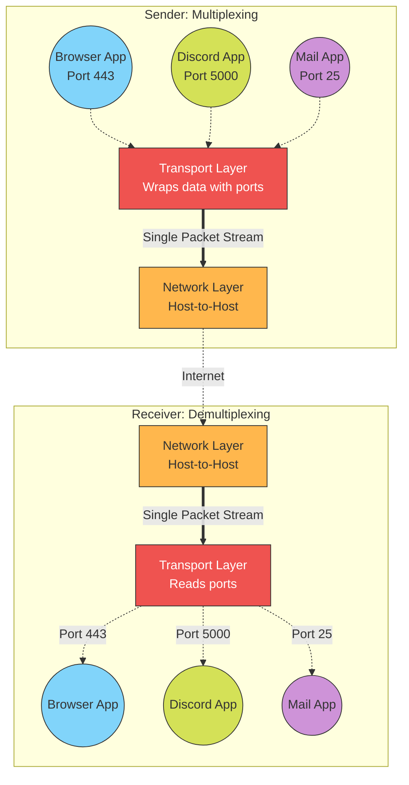

Links: [[00 Computer Networks]]
___
# Transport Layer

The **Transport Layer** (Layer 4 of the OSI Model) acts as the critical bridge between the hardware-oriented lower network layers and the software-oriented upper application layers. 

Its primary responsibility is to provide **Process-to-Process Delivery**. It ensures that massive streams of data arrive completely, accurately, and in perfect order—not just at the correct destination computer, but explicitly at the correct *application* running on that hardware.

## Core Functions of the Transport Layer

### Process-to-Process Delivery
While the Network Layer handles *Host-to-Host* delivery (getting a packet from one machine to another via IP Addresses), the Transport Layer uses **Port Numbers** to deliver the data directly to the intended software process (e.g., ensuring a web request goes to your browser on port 443, while a Discord message goes to the Discord app).

> [!TIP] Analogy: ME Interface Patterns
> - **Network Layer (IP address):** Finding the exact physical `ME Interface` block positioned somewhere in your massive base.
> - **Transport Layer (Port number):** The specific `Crafting Pattern` slotted physically inside that interface. Merely getting the raw materials to the machine isn't enough; the network must know exactly which specific pattern (software process) is supposed to handle and interpret those materials!

### Connection Establishment (End-to-End)
Before any sensitive data is transferred, the Transport Layer can establish, strictly maintain, and gracefully terminate a logical, continuous connection between both remote devices (like the classic TCP 3-way handshake).

### Multiplexing and Demultiplexing
Because modern computers run dozens of internet-connected apps simultaneously, the Transport layer must actively manage these streams.

> [!TIP] Analogy: ME Dense Cables
> - **Multiplexing (Sender):** Multiple different chests and machines all simultaneously dumping entirely different items into various Import Buses, which cleanly funnels the chaos down into a single ME Dense Cable stream.
> - **Demultiplexing (Receiver):** That single chaotic stream of items arriving at your main storage hub, where the ME system instantly reads their item IDs (Port Numbers) and accurately sorts them back out into their specific, separate Storage Drives.

- **Multiplexing (Many-to-One):** The Transport Layer gathers data payloads from multiple different applications at once, wraps them in layer-specific headers (stamping them with source port numbers), and funnels them all down to the single Network Layer link.
- **Demultiplexing (One-to-Many):** Upon receiving a unified, chaotic stream of packets from the Network Layer, the Transport Layer reads those stamped port numbers and successfully sorts the data back out into the correct application pipelines.

### Congestion Control
If the deep network infrastructure is becoming unexpectedly swamped with too much heavy traffic, the Transport layer actively throttles the transmission rate of the sender to prevent intermediate routers from violently dropping packets due to buffer overflows.

> [!FAQ] Congestion Control vs. Flow Control
> It is extremely easy to confuse Congestion Control with the **Flow Control** mechanisms found at the Data Link Layer, but they solve two fundamentally different problems:
> - **Flow Control (Data Link Layer):** Protects the *Receiver*. It prevents a fast sender from completely overwhelming a slower receiver's limited buffer capacity. It is strictly a point-to-point concern between two specific devices.
> - **Congestion Control (Transport Layer):** Protects the *Network*. It prevents a sender from overwhelming the intermediate routers and cables in the middle. 
>   
>   The literal receiver might be a hyper-fast data center capable of handling infinite data, but if a router halfway between you and the server is choking on heavy traffic from other users, Congestion Control must step in and forcibly throttle the sender.

> [!TIP] Analogy: Furnace Overflows vs Channel Limits
> - **Flow Control:** You slap a Redstone Card on an ME Export Bus pointing into a vanilla furnace. As soon as the furnace's internal UI (buffer) is full, the system explicitly stops sending resources so they don't explosively spill out. This protects the furnace (Receiver).
> - **Congestion Control:** The furnace is upgraded to have infinite space, but your actual ME Cable network is suffocating because you've overloaded the 32-channel limit. The system completely freezes up. To fix it, you have to throttle the source (the Import Buses) to stop overwhelming the cable infrastructure (Network).

### Error Correction and Data Integrity
The Transport Layer handles the heavy lifting of completely reliable data transmission. It actively runs checksums to detect damaged or corrupted packets, tracks missing sequence numbers for entirely lost packets, and will silently and automatically request retransmission to guarantee the destination app receives perfectly flawless data.
