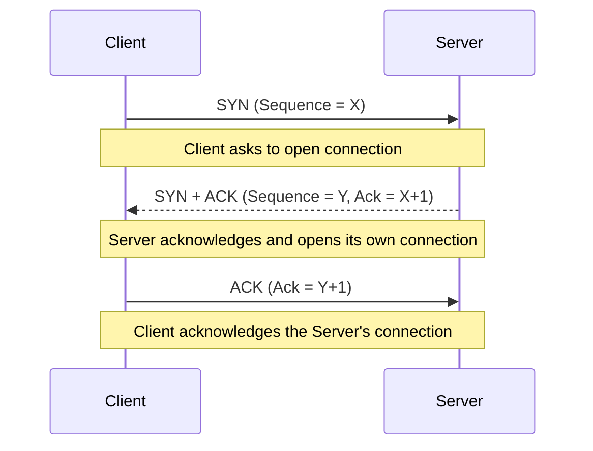
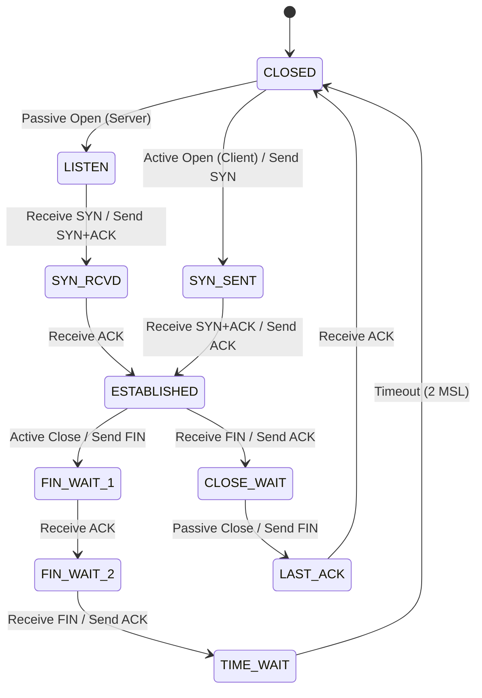

Links: [[21 Transport Layer]], [[00 Computer Networks]], [[22.5 SCTP]]
___
# Transport Layer Protocols (TCP & UDP)

The Transport Layer relies on several core protocols to manage the delivery of data between application processes.

## Port Numbers
A **Port Number** is a 16-bit unique identification number assigned to specific software processes running on a host. They act as the final destination address for data arriving from the network.
- They are integers ranging from **0 to 65535**.

### Common Port Assignments

| Port       | Protocol | Usage                         |
| ---------- | -------- | ----------------------------- |
| **20, 21** | FTP      | File Transfer Protocol        |
| **22**     | SSH      | Secure Shell                  |
| **25**     | SMTP     | Simple Mail Transfer Protocol |
| **53**     | DNS      | Domain Name System            |
| **80**     | HTTP     | Unencrypted Web Traffic       |
| **443**    | HTTPS    | Encrypted Web Traffic         |

## UDP (User Datagram Protocol)
UDP is an incredibly lightweight, **connectionless**, and **unreliable** protocol. It sends data blindly without establishing a prior connection and without checking if the receiver is ready.

> [!NOTE] Use Cases
> UDP is ideal for applications where speed is more important than absolute accuracy, and where minor data loss is acceptable: Live Video Streaming, Online Gaming, and DNS queries.

### Core Features
- **No Error/Flow Control:** It does not guarantee delivery, order, or congestion control. If a packet drops, it is gone forever.
- **Low Overhead:** Because it skips the heavy connection handshakes and tracking, it is extremely fast.
- **Fixed Header:** The UDP header is always exactly **8 bytes**, consisting of just 4 fields (Source Port, Destination Port, Total Length, Checksum).
- **Packet Math:** 

$$\text{Total Length of UDP Datagram} = \text{Header Length} + \text{Data Length}$$

### UDP Header Format
The UDP Header is extremely simple, consisting of four 16-bit (2-byte) fields.

![[Pasted image 20260514170240.png]]

## TCP (Transmission Control Protocol)
TCP is the workhorse of the internet. It is a **connection-oriented**, **reliable**, and **full-duplex** byte stream protocol. It guarantees the in-order, flawless delivery of data. A packet in TCP is explicitly called a **Segment**.

### Core Services
- **Stream Delivery:** Delivers data as a continuous stream of bytes rather than discrete packets.
- **Reliability:** Actively tracks sequence numbers. If a segment is lost, TCP automatically requests a retransmission.
- **Flow & Congestion Control:** TCP dynamically adjusts its "Window Size" based on network traffic to prevent overwhelming the receiver and the intermediate routers.

### The TCP Segment Format
The TCP segment consists of a complex header ranging from **20 to 60 bytes**.
- **20 Bytes:** Standard header without options.
- **Up to 60 Bytes:** Expanded header if optional padding/flags are included.

#### TCP Header Structure
The standard 20-byte TCP header contains several critical fields that manage its reliability and connection states.

![[Pasted image 20260514170309.png]]

- **Sequence Number (32-bit):** Assigns a specific byte number to the first byte of data in the segment. It allows the receiver to perfectly reassemble out-of-order packets.
- **Acknowledgment Number (32-bit):** If the `ACK` flag is set, this explicitly tells the sender what Sequence Number the receiver expects to get *next*.
- **HLEN (DO) (4-bit):** Header Length. Indicates where the actual data payload begins.
- **Flags (6-bit Control Bits):**
  - `URG (U)`: Urgent Pointer is valid.
  - `ACK (A)`: Acknowledgment number is valid.
  - `PSH (P)`: Push the data to the receiving application immediately.
  - `RST (R)`: Reset the connection (used for fatal errors).
  - `SYN (S)`: Synchronize sequence numbers (used to open a connection).
  - `FIN (F)`: Finish. Sender has no more data to send (used to close a connection).
- **Window Size (16-bit):** Used for **Flow Control**. The receiver sets this value to dictate exactly how many bytes the sender is currently allowed to transmit before waiting for an ACK.

### Connection Management
TCP strictly manages the lifecycle of a connection.

#### Connection Establishment (3-Way Handshake)
Before any data is sent, TCP requires both hosts to synchronize.

#### Connection Termination
TCP usually tears down a connection gracefully using a 4-way handshake involving `FIN` and `ACK` packets.

#### TCP State Transition Diagram
The lifecycle of a TCP connection is governed by a strict state machine. Both the Client and the Server transition through these states as flags (`SYN`, `ACK`, `FIN`) are sent and received.

### TCP vs UDP
| Feature             | TCP (Transmission Control)                | UDP (User Datagram)             |
| ------------------- | ----------------------------------------- | ------------------------------- |
| **Connection Type** | Connection-oriented                       | Connectionless                  |
| **Reliability**     | Highly Reliable (Retransmits lost data)   | Unreliable (No retransmissions) |
| **Speed**           | Slower (Heavy overhead)                   | Faster (Lightweight)            |
| **Ordering**        | Guarantees in-order delivery              | No guaranteed order             |
| **Header Size**     | 20 to 60 Bytes                            | 8 Bytes                         |
| **Primary Use**     | Web Browsing (HTTP), Email, File Transfer | Streaming, VoIP, Gaming, DNS    |

