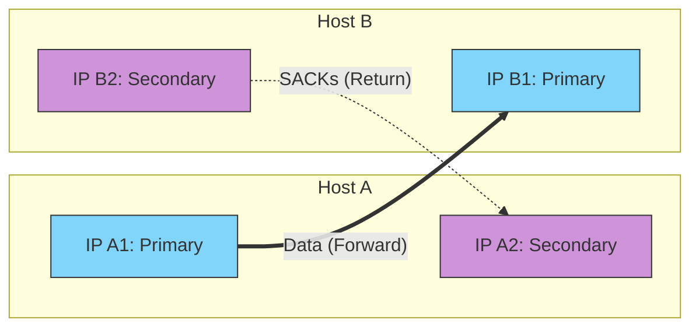

Links: [[21 Transport Layer]], [[00 Computer Networks]]
___
# Stream Control Transmission Protocol (SCTP)

SCTP is a modern transport layer protocol originally developed for transmitting telephony signaling messages over IP networks. It brilliantly combines the best features of both TCP and UDP, providing a highly resilient, message-oriented delivery system.

Unlike a TCP "connection", an SCTP connection is officially called an **Association**.

## Key Features
- **Message-Oriented:** Like UDP, SCTP preserves the exact message boundaries defined by the application. (If the sender sends a 100-byte message and a 50-byte message, the receiver gets exactly two distinct messages of 100 and 50 bytes, rather than a continuous 150-byte TCP stream).
- **Reliable Data Transfer:** Like TCP, it guarantees delivery, ordering, and actively manages congestion.
- **Multi-Streaming:** A single SCTP association can contain multiple independent streams of data. If a packet is lost in Stream A, only Stream A is blocked waiting for retransmission. Stream B and Stream C continue flowing completely uninterrupted (eliminating TCP's "Head-of-Line Blocking" problem).

## Multi-homing and Asymmetric Routing
One of the most powerful features of SCTP is **Multi-homing**. A single SCTP association can span *multiple* IP addresses at the exact same time. 

If a server has two network interface cards (NICs) connected to different ISPs, SCTP is aware of both paths. One path is designated as the **Primary Path** for normal data transmission, while the other acts as a **Backup Path**.

### Fault Tolerance
If the primary network link physically fails or becomes unreachable, SCTP will detect this (via failed `HEARTBEAT` chunks) and seamlessly shift traffic to the secondary IP *without* dropping the connection or requiring the application to reconnect. 

### Asymmetric Multi-homing (Asymmetric Routing)
SCTP fully supports **Asymmetric Routing**. Because SCTP tracks endpoints rather than strict point-to-point IP links (like TCP does), data can flow asymmetrically between the multi-homed interfaces.

- **The Forward Path:** Data packets sent from Host A to Host B might travel out of Host A's *Primary IP* and arrive at Host B's *Primary IP*.
- **The Return Path:** The SACK (Acknowledgments) sent from Host B back to Host A might leave Host B's *Secondary IP* and arrive at Host A's *Secondary IP*.

This flexibility allows network administrators to balance loads across ISPs or handle strange routing topologies where upload and download paths take entirely different physical routes. TCP strictly struggles with this, as it expects responses on the exact same IP socket pair.

## The SCTP Packet Format
Unlike TCP which sends "Segments", SCTP sends **Packets**. Each packet consists of a **Common Header** followed by one or more **Chunks**.

### Common Header (12 Bytes)
Every SCTP packet begins with a mandatory 12-byte header.

![[Pasted image 20260514023524.png]]

- **Verification Tag:** A 32-bit random number generated during the handshake. It validates that the packet belongs to the current active association, offering strong protection against "blind" spoofing attacks.

### Chunks
The actual payload and control information in SCTP are carried in distinct blocks called **Chunks**. Multiple chunks can be bundled together inside a single SCTP packet. 

There are two primary categories: **Data Chunks** (which carry user payloads) and **Control Chunks** (which manage the network association).

#### Common SCTP Chunk Types
| Chunk Type        | Description                                                                                                                      |
| ----------------- | -------------------------------------------------------------------------------------------------------------------------------- |
| **DATA**          | Carries the actual user data payload.                                                                                            |
| **INIT**          | Initiates an association (similar to a TCP SYN).                                                                                 |
| **INIT ACK**      | Acknowledges the INIT and provides the State Cookie.                                                                             |
| **SACK**          | Selective Acknowledgment. Informs the sender about successfully received data and explicitly highlights any gaps (lost packets). |
| **HEARTBEAT**     | Periodically probes a destination IP to check if it is still reachable (crucial for maintaining Multi-homing links).             |
| **HEARTBEAT ACK** | Acknowledges the heartbeat probe.                                                                                                |
| **SHUTDOWN**      | Gracefully initiates the termination of the association.                                                                         |
| **ABORT**         | Violently and immediately terminates the association due to a fatal error.                                                       |

## Association Setup (4-Way Handshake)
To prevent "SYN Flooding" (a classic TCP DoS attack where a server's memory is exhausted by thousands of half-open connections), SCTP requires a **4-Way Handshake** using a cryptographic "Cookie".

1. **INIT:** Client sends an `INIT` chunk.
2. **INIT ACK:** Server responds with an `INIT ACK` containing a **State Cookie**. *(Crucially, the server does NOT allocate any memory or resources yet).*
3. **COOKIE ECHO:** Client bounces the exact Cookie back to the server.
4. **COOKIE ACK:** Server validates the Cookie. Only now does the server allocate memory and officially establish the Association.
