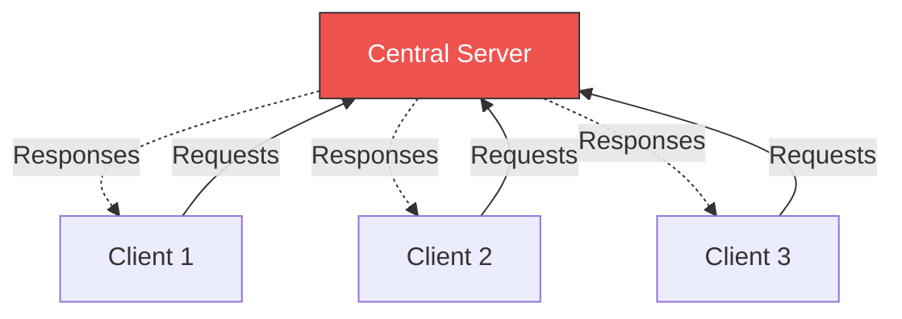
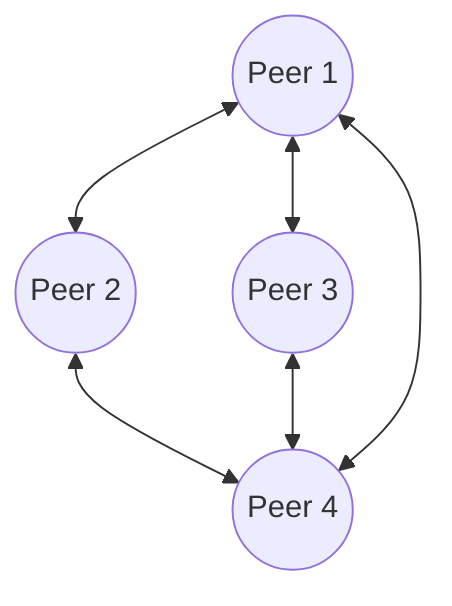

Links: [[05 OSI Model]], [[00 Computer Networks]]
___
# Application Layer

The **Application Layer** (Layer 7 of the OSI Model) is the highest layer in the network stack. It serves as the direct interface between the user's software applications (like a web browser or email client) and the underlying network.

It does *not* refer to the application software itself (e.g., Mozilla Firefox is not the Application Layer), but rather the **protocols** that the software uses to communicate over the network (e.g., HTTP).

> [!TIP] Analogy: The ME Terminal (GUI)
> The Application Layer is the **ME Terminal** screen itself. 
> 
> When you open an ME Terminal, you aren't interacting with the cables or the storage cells directly; you are interacting with a **User Interface (UI)** that lets you request items. 
> 
> The Application Layer protocols (like HTTP or FTP) are the specific "buttons" or "search bars" on that terminal. They translate your high-level human actions (like "Get 64 Iron Ingots") into specific network requests that the rest of the system can understand and fulfill.

## Core Functions
- **Network Virtual Terminal:** Allows a user to log onto a remote host.
- **File Transfer, Access, and Management (FTAM):** Allows users to access, retrieve, and manage files on a remote computer.
- **Mail Services:** Provides the basis for email forwarding and storage.
- **Directory Services:** Provides distributed database sources and access for global information about various objects and services (like DNS).

## Network Architectures
The Application Layer generally relies on two primary architectural models to structure how devices interact.

### Client-Server Architecture
The most common model on the internet.

- **Server:** A powerful, always-on host with a permanent, known IP address. It actively waits for incoming requests.
- **Client:** A user's device (phone, laptop) that initiates contact with the server. Clients do not usually communicate directly with other clients.
- **Examples:** Web browsing (HTTP), Email retrieval (IMAP), Video Streaming.

### Peer-to-Peer (P2P) Architecture
A decentralized model with minimal or no reliance on dedicated servers.
- **Peers:** Every device (node) on the network acts as *both* a client and a server simultaneously.
- **Self-Scalability:** As more peers join the network to download a file, they also bring more upload capacity, naturally scaling the network's power.
- **Examples:** BitTorrent, Blockchain networks, Skype (historically).

