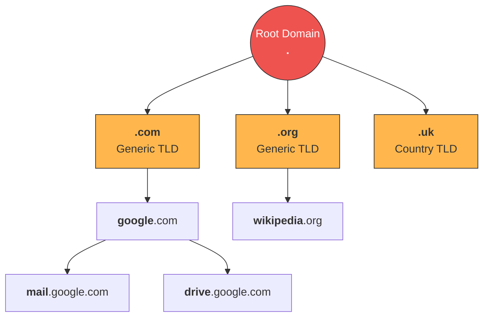
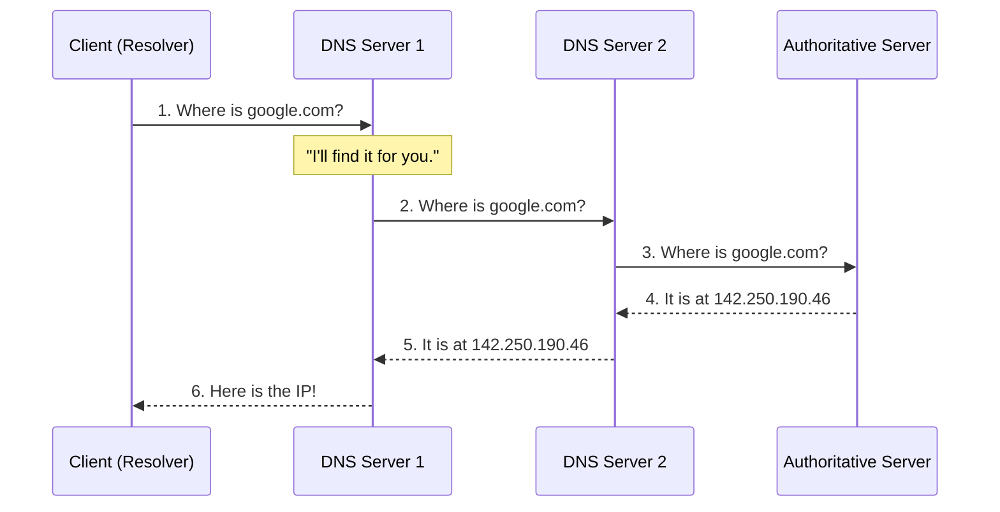
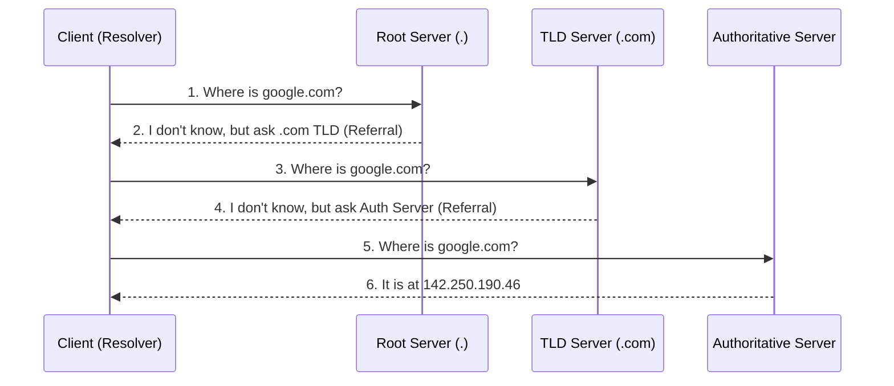
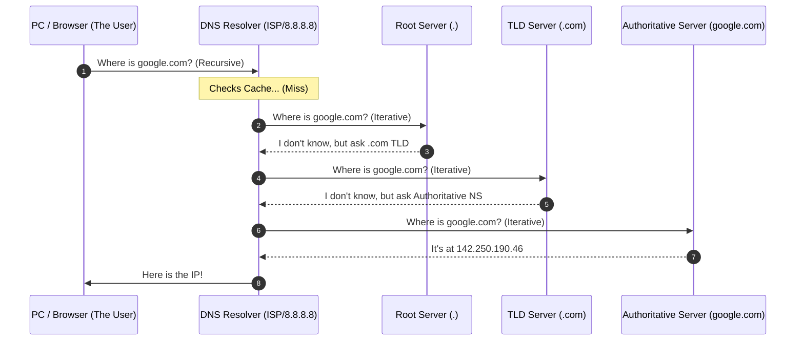

Links: [[27 Application Layer]], [[00 Computer Networks]]
___
# DNS and Web Protocols

## Domain Name System (DNS)
To identify an entity on the internet, IP addresses are used. However, humans are incredibly bad at remembering raw 32-bit (IPv4) or 128-bit (IPv6) numbers. The **Domain Name System (DNS)** acts as the "phonebook" of the internet, mapping human-readable names (like `google.com`) to numerical IP addresses.

### Name Space
The names assigned to machines must be strictly unique.
- **Flat Name Space:** A simple list of unique names (e.g., `Host1`, `Host2`). It cannot scale globally because names will eventually collide, and it is impossible to manage centrally.
- **Hierarchical Name Space:** The internet uses a hierarchical structure to guarantee uniqueness. Names are divided into multiple parts, separated by dots (e.g., `mail.google.com`).

#### The Hierarchical DNS Tree
The DNS system is structured as an inverted tree, theoretically limited to 128 levels.

(TLD = Top Level Domains)

### How DNS Works (Step-by-Step Resolution)

When you type a URL into your browser, a complex sequence of requests occurs across the global DNS hierarchy to resolve the name into a numerical IP address.

#### Recursive vs. Iterative Resolution

##### Recursive Resolution
In recursive resolution, the client (or resolver) delegates the entire task to a DNS server. That server is now responsible for finding the answer. If it doesn't have the IP in its cache, it contacts other servers on behalf of the client, acting as a middleman until it can return the final IP or an error.

##### Iterative Resolution
In iterative resolution, the DNS server does not perform the search for the client. Instead, if it doesn't know the answer, it provides a **Referral** (a "hint" pointing to the next authoritative server down the tree). The client (resolver) must then take that hint and manually contact the next server itself. This process repeats until the client reaches the Authoritative Server.

#### The Resolution Path
A standard real-world DNS lookup typically uses a **hybrid** approach:

1. **The User** performs a **Recursive Query** to the **DNS Resolver** (ISP/Google).
2. **The Resolver** then performs a series of **Iterative Queries** to the Root, TLD, and Authoritative servers to find the answer.
3. Once found, the Resolver caches the result and returns it to the User.

### DNS Spoofing (Cache Poisoning)
A severe cyberattack where an attacker feeds fake DNS data into a DNS resolver's cache. If a user asks for `facebook.com`, the poisoned DNS server maliciously redirects them to a fake IP address controlled by the hacker, entirely without the user's knowledge.

#### Prevention Methods
Modern networks employ several strict defenses against cache poisoning:
##### DNSSEC (DNS Security Extensions) 

The definitive solution. DNSSEC adds cryptographic digital signatures to DNS records. 

When a resolver receives an IP address, it verifies the signature using a public key to guarantee the data actually came from the authoritative server and wasn't altered in transit.

##### Port Randomization
Older DNS resolvers always used UDP Port 53 to send queries, making it easy for attackers to guess where to inject the fake response. 

Modern resolvers randomize the source port for every single query. This forces the attacker to guess both the 16-bit Transaction ID *and* the 16-bit Source Port, which is computationally infeasible before the real response arrives.

##### HTTPS / TLS 

While not a DNS-level fix, HTTPS serves as a crucial safety net. Even if a user is successfully spoofed and sent to a fake `facebook.com` IP address, the attacker's server will not possess the genuine cryptographic SSL/TLS certificate for Facebook. 

The victim's browser will immediately detect the mismatch and throw a massive security warning, blocking the connection.