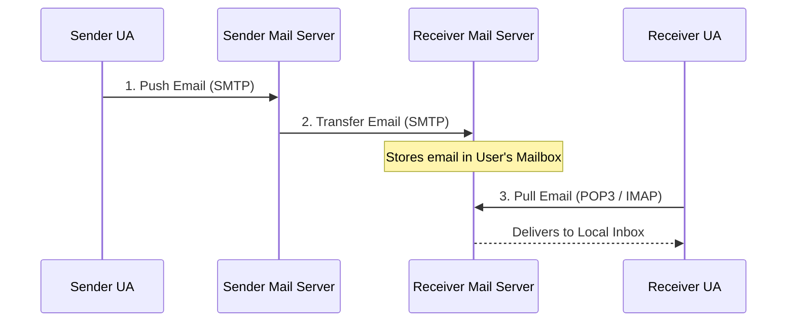

Links: [[27 Application Layer]], [[00 Computer Networks]]
___
# Email and File Transfer

## Electronic Mail (Email)
Email is one of the oldest and most widely used internet services. It relies on a combination of different Application Layer protocols to send, store, and retrieve messages.

> [!TIP] Analogy: AE2 ME Interfaces & Chests
> - **MTA / SMTP (The Push):** Think of an **ME Interface** set to "Push" items. You throw a message into the interface, and the system (MTA) is responsible for pushing it through the network until it reaches the destination storage.
> - **MAA / IMAP (The Sync):** Think of an **ME Terminal** connected to a distant **ME Chest**. You can see all the items (emails) inside the chest without actually pulling them out into your own inventory. You can even move them around or delete them remotely.
> - **MAA / POP3 (The Pull):** Think of an **Import Bus** set to pull everything into a local, isolated chest. Once the items are imported locally, they are gone from the main network forever.

### The Email Architecture

1. **User Agent (UA):** The actual software you use to read and send email (e.g., Outlook, Apple Mail, Gmail Web Interface).
2. **MTA (Message Transfer Agent):** The servers that physically push the email across the internet (using SMTP).
3. **MAA (Message Access Agent):** The protocols used by the receiver to pull the email from the server to their local device (using POP3 (Post Office Protocol) or IMAP (Internet Message Access Protocol)).

### Core Email Protocols

#### SMTP (Simple Mail Transfer Protocol)

SMTP is strictly a **Push** protocol. It is used exclusively to *send* emails from a client to a server, or to relay emails between servers. It cannot be used to "pull" or retrieve emails.

#### MIME (Multipurpose Internet Mail Extensions)

Historically, SMTP could only send raw 7-bit ASCII text. **MIME** is an extension that allows emails to support non-text attachments (images, PDFs, videos) and non-English character sets by encoding them into ASCII before sending.

#### POP3 vs IMAP4 (The Pull Protocols)

Once an email arrives at the destination server, the user needs a way to retrieve it.

| Feature                  | POP3 (Post Office Protocol v3)                                                                                     | IMAP4 (Internet Message Access Protocol v4)                                                                                                                   |
| ------------------------ | ------------------------------------------------------------------------------------------------------------------ | ------------------------------------------------------------------------------------------------------------------------------------------------------------- |
| **Primary Function**     | Download and Delete.                                                                                               | Sync and Keep on Server.                                                                                                                                      |
| **Storage**              | Emails are downloaded to a single local device and then permanently deleted from the server.                       | Emails are kept securely on the server. The client only downloads a temporary copy to view.                                                                   |
| **Multi-Device Support** | Very poor. If you download an email on your laptop, it is gone from the server and cannot be viewed on your phone. | Excellent. Changes made on your phone (like deleting an email or moving it to a folder) are instantly synced back to the server and reflected on your laptop. |
| **Complexity**           | Simple and lightweight.                                                                                            | Complex and requires more server storage.                                                                                                                     |

## File Transfer

### FTP vs TFTP
When transferring files over a network, administrators choose between standard FTP and the much lighter TFTP depending on the security and reliability requirements.

| Feature | FTP (File Transfer Protocol) | TFTP (Trivial File Transfer Protocol) |
|---|---|---|
| **Transport Protocol** | **TCP** (Reliable, Connection-Oriented) | **UDP** (Unreliable, Connectionless) |
| **Ports Used** | Port 20 (Data) & Port 21 (Control/Commands) | Port 69 |
| **Authentication** | Supports passwords and secure logins. | No authentication at all. Open access. |
| **Features** | Complex. Can list directories, rename files, and delete files. | Extremely basic. Can only read and write individual files. |
| **Use Case** | Standard internet file sharing where reliability and security are needed. | Local network tasks like booting diskless workstations or transferring configuration files to routers where speed is key and security isn't a concern. |
