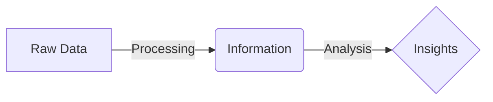
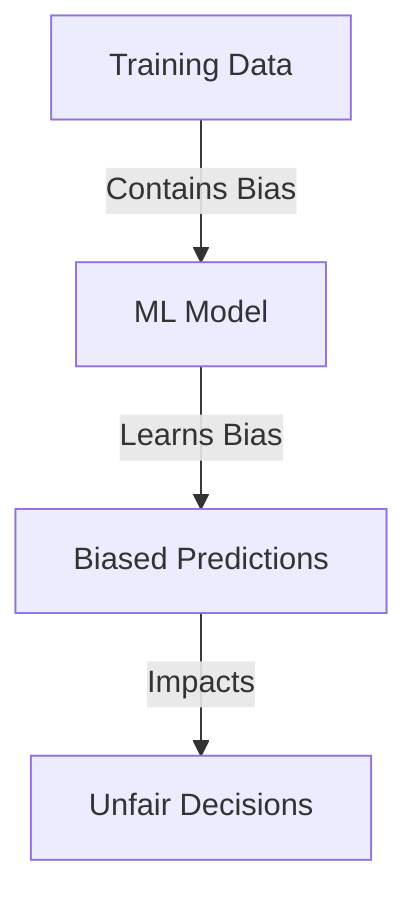
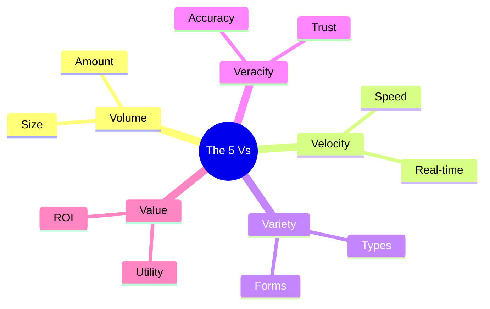

Links: 
___
# Data Analytics

## What is Data?
**Data** consists of raw facts, figures, and symbols. In its raw form, it often lacks context and meaning.
- **Nature:** It comes in diverse formats (numbers, text, images, etc.).
- **Requirement:** It needs **processing** to become useful **Information**.

> [!TIP] Data vs. Information
> **Data** is the input (e.g., "38").
> **Information** is the processed output that gives it meaning (e.g., "The temperature is 38°C").

### The Data Processing Cycle
[[00 Foundations of AI and ML#How Machine Learning Works]]

The transformation of data follows a logical flow:

## Why Does It Matter?
Data Analytics involves transforming raw data into actionable insights.

- **Decision Making:** Analytics converts data into insights that help organizations make informed decisions rather than guessing.
- **Foundation for AI/ML:**
    - Data is the fuel for **Artificial Intelligence (AI)** and **Machine Learning (ML)** models.
    - Without data, these models cannot learn or function.

> [!TIP] Crude Oil
> Think of **Data** like **Crude Oil**.
> It has immense potential value, but you can't pump it directly into your car. It must use a refinery (**Processing**) to turn it into Fuel (**Information**) that powers the engine (**Decision Making/AI**).

## Role of Data in AI and ML

Data is the lifeblood of modern artificial intelligence.

#### Foundation of AI Models
AI and Machine Learning models are not "smart" on their own; they learn patterns from data.
- **Training:** Models are trained on historical data.
- **Dependence:** Their reliability depends entirely on the **relevance** and **appropriateness** of that training data.

#### Quality and Accuracy
The performance of a model is directly proportional to the quality of the data it is fed.
- **Noise:** Poor data contains errors that confuse the model.
- **Consequence:** Incorrect data leads to incorrect predictions.

> [!FAILURE] GIGO Principle
> **Garbage In, Garbage Out**: If you feed a perfect algorithm poor quality data, it will produce poor quality results.

#### Bias and Fairness
One of the most critical ethical aspects of Data Analytics.
- **Mechanism:** If the training data reflects historical biases (e.g., hiring data that favored men), the model will replicate and reinforce those biases.
- **Result:** The model will make unfair or discriminatory predictions.

> [!WARNING] Bias vs. Error
> **Bias** is not just an error; it is a systematic skew in the data. Removing the "name" column might not fix gender bias if other correlated features (like "school usually attended by girls") remain.

## Characteristics of Data (The 5 Vs)

Big Data and modern analytics are often described by the **5 Vs**.

> [!TIP] 5 Vs Mnemonic
> Remember the 5 Vs using this sentence:
> "**Vol**ume and **Vel**ocity bring a **Var**iety of data, but without **Ver**acity, there is no **Val**ue."

#### Volume
- **Definition:** The sheer **amount** of data generated and stored.
- **Scale:** From Megabytes (MB) to Zettabytes (ZB).
- **Example:** The sum of all tweets sent in a day, or hours of video uploaded to YouTube every minute.

#### Velocity
- **Definition:** The **speed** at which data is generated, collected, and processed.
- **Necessity:** High velocity requires real-time processing capabilities.
- **Example:** Stock market ticker data, sensor data from a self-driving car.

#### Variety
- **Definition:** The **diversity** of data forms.
- **Forms:** Structured (Tables), Unstructured (Images, Audio), Semi-structured (Logs).
- **Challenge:** Integrating these diverse types into a single analysis.

#### Veracity
- **Definition:** The **quality, accuracy, and trustworthiness** of the data.
- **Issue:** Data often contains "noise", errors, or missing values.
- **Impact:** Low veracity leads to unreliable insights.
- **Action:** Creating pipelines to clean and verify data is crucial.

#### Value
- **Definition:** The **usefulness** of the data to the business or problem at hand.
- **Goal:** Having petabytes of data (Volume) is useless if it yields no value (Insights).
