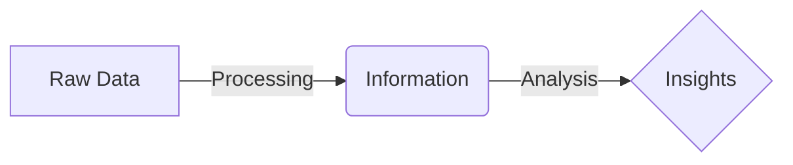
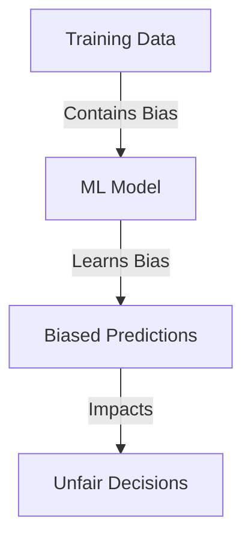
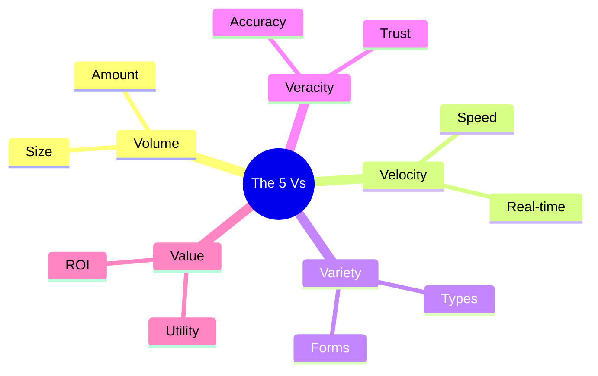

Links: 
___
# Data Analytics

## What is Data?
**Data** consists of raw facts, figures, and symbols. In its raw form, it often lacks context and meaning.
- **Nature:** It comes in diverse formats (numbers, text, images, etc.).
- **Requirement:** It needs **processing** to become useful **Information**.

> [!TIP] Data vs. Information
> **Data** is the input (e.g., "38").
> **Information** is the processed output that gives it meaning (e.g., "The temperature is 38°C").

### The Data Processing Cycle
[[00 Foundations of AI and ML#How Machine Learning Works]]

The transformation of data follows a logical flow:

## What is Data Analytics?
**Data Analytics** is the science of analyzing raw data to make conclusions about that information. It involves the process of **Collecting, Organizing, Analyzing, and Interpreting** data.

### Data Analytics vs. Reporting
It is crucial to understand the difference between simply reporting facts and actually performing analytics:

- **Reporting (The "What"):** Organizing data into informational summaries. It tells you *what* happened (Descriptive). Example: "We sold 500 units yesterday."
- **Analytics (The "Why" & "What's Next"):** Exploring data to extract meaningful insights. It tells you *why* it happened and *what* we should do next (Diagnostic, Predictive, Prescriptive). Example: "We sold 500 units because our competitor raised prices; we should increase our inventory by 20% next week."

### Components
1.  **Data Types:** Understanding the nature of data (Quantitative vs Qualitative).
2.  **Primary Outcomes:** The goal (Descriptive, Diagnostic, Predictive, Prescriptive).
3.  **Related Domains:** Overlaps with Statistics, Computer Science, and Business Intelligence.

### General Lifecycle
1.  **Collect:** Gather raw data from sources.
2.  **Store:** Securely save data (Database/Cloud).
3.  **Prepare:** Clean and transform (ETL).
4.  **Analyze:** Apply statistical methods.
5.  **Communicate & Act:** Visualize results and make decisions.

## Why Does It Matter?
Data Analytics involves transforming raw data into actionable insights.

- **Explosion of Data:** We are generating unprecedented amounts of data daily. Analytics is necessary simply to manage and make sense of this massive influx.
- **Decision Making (Faster & Better):** Analytics converts data into insights that help organizations make informed decisions rather than guessing.
    - *Example:* Netflix uses viewing history and pause/rewind data to mathematically determine which Original Series to greenlight (e.g., *Stranger Things*).
- **Cost Optimization:** By analyzing operational data, companies can identify inefficiencies and reduce unnecessary expenses.
- **Personalization of Service:** Analytics allows businesses to tailor experiences to individual users (e.g., personalized Spotify playlists or Amazon product recommendations).
- **Risk Management & Fraud Detection:** Financial institutions use analytics to spot unusual patterns in real-time to prevent credit card fraud.
- **Predicting the Future:** Using historical data to forecast trends, demand, and potential issues before they occur.
- **Solving Global Challenges:** Analytics is used in everything from predicting weather patterns to modeling the spread of diseases and optimizing power grids.
- **Foundation for AI/ML:**
    - Data is the fuel for **Artificial Intelligence (AI)** and **Machine Learning (ML)** models; without it, they cannot learn.
    - *Example:* Tesla's "Autopilot" AI algorithm requires millions of miles of video *data* to learn what a stop sign looks like.

> [!TIP] Crude Oil
> Think of **Data** like **Crude Oil**.
> It has immense potential value, but you can't pump it directly into your car. It must use a refinery (**Processing**) to turn it into Fuel (**Information**) that powers the engine (**Decision Making/AI**).

## Application Areas
Data Analytics is applied across almost every modern industry:

1.  **Healthcare:** Predicting patient admissions, discovering new drugs faster, and tracking disease outbreaks.
2.  **Finance:** Algorithmic stock trading, credit risk scoring, and real-time fraud detection.
3.  **Retail & E-commerce:** Inventory optimization, personalized product recommendations, and targeted marketing campaigns.
4.  **Logistics & Supply Chain:** Optimizing delivery routes (e.g., UPS's left-turn avoidance system) and predicting shipping delays.
5.  **Smart Cities:** Managing traffic lights dynamically based on flow, predicting power grid demands, and optimizing waste collection.
6.  **Entertainment:** Content recommendation engines (Netflix/Spotify) and analyzing audience engagement to design better games.

## Role of Data in AI and ML

Data is the lifeblood of modern artificial intelligence.

#### Foundation of AI Models
AI and Machine Learning models are not "smart" on their own; they learn patterns from data.
- **Training:** Models are trained on historical data.
- **Dependence:** Their reliability depends entirely on the **relevance** and **appropriateness** of that training data.

#### Quality and Accuracy
The performance of a model is directly proportional to the quality of the data it is fed.
- **Noise:** Poor data contains errors that confuse the model.
- **Consequence:** Incorrect data leads to incorrect predictions.

> [!ERROR] GIGO Principle
> **Garbage In, Garbage Out**: If you feed a perfect algorithm poor quality data, it will produce poor quality results.

#### Bias and Fairness
One of the most critical ethical aspects of Data Analytics.
- **Mechanism:** If the training data reflects historical biases (e.g., hiring data that favored men), the model will replicate and reinforce those biases.
- **Result:** The model will make unfair or discriminatory predictions.

> [!WARNING] Bias vs. Error
> **Bias** is not just an error; it is a systematic skew in the data. Removing the "name" column might not fix gender bias if other correlated features (like "school usually attended by girls") remain.

## Characteristics of Data (The 5 Vs)

Big Data and modern analytics are often described by the **5 Vs**.

> [!TIP] 5 Vs Mnemonic
> Remember the 5 Vs using this sentence:
> "**Vol**ume and **Vel**ocity bring a **Var**iety of data, but without **Ver**acity, there is no **Val**ue."

#### Volume
The sheer **amount** of data generated and stored.

- **Scale:** From Megabytes (MB) to Zettabytes (ZB).
- **Example:** The sum of all tweets sent in a day, or hours of video uploaded to YouTube every minute.

#### Velocity
The **speed** at which data is generated, collected, and processed.

- **Necessity:** High velocity requires real-time processing capabilities.
- **Example:** Stock market ticker data, sensor data from a self-driving car.

#### Variety
 The **diversity** of data forms.

- **Forms:** Structured (Tables), Unstructured (Images, Audio), Semi-structured (Logs).
- **Challenge:** Integrating these diverse types into a single analysis.

#### Veracity
The **quality, accuracy, and trustworthiness** of the data.

- **Issue:** Data often contains "noise", errors, or missing values.
- **Impact:** Low veracity leads to unreliable insights.
- **Action:** Creating pipelines to clean and verify data is crucial.

#### Value
The **usefulness** of the data to the business or problem at hand.

- **Goal:** Having petabytes of data (Volume) is useless if it yields no value (Insights).

## Analytic Scalability
As **Volume** and **Velocity** increase drastically (Big Data), traditional databases and single-computer algorithms fail. **Analytic Scalability** is the ability of an analytical platform to handle growing amounts of data and concurrent users without a drop in performance.

- **Vertical Scaling (Scaling Up):** Adding more power (CPU, RAM) to an existing machine. *Limitation:* Expensive and has a physical hard limit.
- **Horizontal Scaling (Scaling Out):** Adding more networked machines to a distributed cluster (e.g., Hadoop, Spark). *Advantage:* Nearly limitless scalability, ideal for Big Data Analytics.

## Challenges with Working with Data
Despite its value, implementing data analytics involves significant hurdles:

1.  **Data Quality (Veracity):** Real-world data is messy. Dealing with missing values, extreme outliers, and noise takes up to 80% of a data professional's time (Data Wrangling).
2.  **Data Security & Privacy:** Storing massive amounts of user data makes companies prime targets for cyberattacks. Organizations must comply with strict regulations (like GDPR) or face heavy fines.
3.  **Data Integration (Data Silos):** In large companies, marketing might use one database and sales another. Combining these disparate data sources into a single "source of truth" is technically complex.
4.  **Scalability Costs:** As the 5 Vs increase, the infrastructure required (Cloud storage, distributed computing clusters) becomes extremely expensive to maintain.
5.  **The Skill Gap:** Building robust data pipelines and ML models requires highly specialized talent (Data Engineers, Data Scientists) which is often scarce and expensive.
