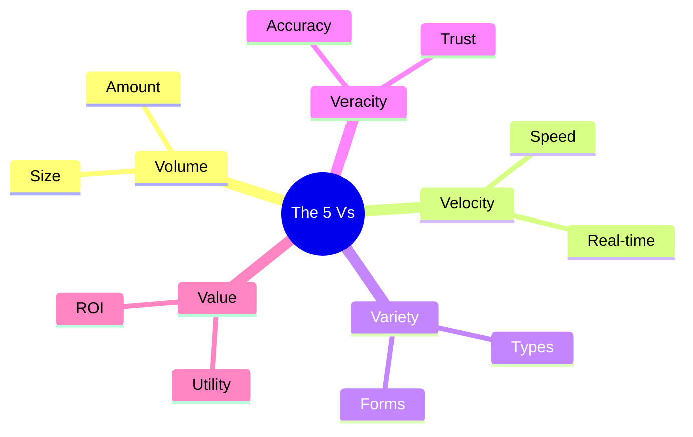

Links: [[00 Data Analytics]]
___
# Big Data and Analytics Ecosystem

## Characteristics of Data (The 5 Vs)

Big Data and modern analytics are often described by the **5 Vs**.

> [!TIP] 5 Vs Mnemonic
> Remember the 5 Vs using this sentence:
> "**Vol**ume and **Vel**ocity bring a **Var**iety of data, but without **Ver**acity, there is no **Val**ue."

#### Volume
The sheer **amount** of data generated and stored.

- **Scale:** From Megabytes (MB) to Zettabytes (ZB).
- **Example:** The sum of all tweets sent in a day, or hours of video uploaded to YouTube every minute.

#### Velocity
The **speed** at which data is generated, collected, and processed.

- **Necessity:** High velocity requires real-time processing capabilities.
- **Example:** Stock market ticker data, sensor data from a self-driving car.

#### Variety
 The **diversity** of data forms.

- **Forms:** Structured (Tables), Unstructured (Images, Audio), Semi-structured (Logs).
- **Challenge:** Integrating these diverse types into a single analysis.

#### Veracity
The **quality, accuracy, and trustworthiness** of the data.

- **Issue:** Data often contains "noise", errors, or missing values.
- **Impact:** Low veracity leads to unreliable insights.
- **Action:** Creating pipelines to clean and verify data is crucial.

#### Value
The **usefulness** of the data to the business or problem at hand.

- **Goal:** Having petabytes of data (Volume) is useless if it yields no value (Insights).

## Analytic Scalability
As **Volume** and **Velocity** increase drastically (Big Data), traditional databases and single-computer algorithms fail. **Analytic Scalability** is the ability of an analytical platform to handle growing amounts of data and concurrent users without a drop in performance.

- **Vertical Scaling (Scaling Up):** Adding more power (CPU, RAM) to an existing machine. *Limitation:* Expensive and has a physical hard limit.
- **Horizontal Scaling (Scaling Out):** Adding more networked machines to a distributed cluster (e.g., Hadoop, Spark). *Advantage:* Nearly limitless scalability, ideal for Big Data Analytics.

## Challenges with Working with Data
Despite its value, implementing data analytics involves significant hurdles:

1.  **Data Quality (Veracity):** Real-world data is messy. Dealing with missing values, extreme outliers, and noise takes up to 80% of a data professional's time (Data Wrangling).
2.  **Data Security & Privacy:** Storing massive amounts of user data makes companies prime targets for cyberattacks. Organizations must comply with strict regulations (like GDPR) or face heavy fines.
3.  **Data Integration (Data Silos):** In large companies, marketing might use one database and sales another. Combining these disparate data sources into a single "source of truth" is technically complex.
4.  **Scalability Costs:** As the 5 Vs increase, the infrastructure required (Cloud storage, distributed computing clusters) becomes extremely expensive to maintain.
5.  **The Skill Gap:** Building robust data pipelines and ML models requires highly specialized talent (Data Engineers, Data Scientists) which is often scarce and expensive.

## Big Data

### Importance
Big Data allows organizations to uncover hidden patterns and correlations that are invisible at smaller scales. By analyzing massive datasets, businesses can identify market trends, understand customer preferences deeply, and make mathematically backed decisions rather than relying on intuition.

### Challenges
Working with Big Data involves significant technical hurdles beyond just storing it.
- **Processing Power:** Analyzing Zettabytes of data requires massive distributed computing power, which scales exponentially in cost.
- **Data Complexity:** The "Variety" of Big Data means combining structured SQL databases with unstructured social media text, images, and sensor logs into a cohesive analytical pipeline.
- **Rapid Change:** The "Velocity" means models must constantly be updated to reflect the newest data, or they will quickly become obsolete.

## Key Roles for Successful Analytic Projects
Executing a large-scale data project requires a collaborative team of specialized roles:

1. **Data Engineer:** The builder. They design, construct, and maintain the data pipelines and infrastructure (ETL processes). They ensure data flows securely and reliably from the raw source to the database.
2. **Data Analyst:** The interpreter. They query the structured databases, build dashboards, and create descriptive and diagnostic reports to answer specific business questions.
3. **Data Scientist:** The predictor. They use advanced statistics and machine learning to build predictive models, analyzing the data provided by the engineers to forecast future trends.

## Modern Data Analytics Tools
Depending on the role, professionals rely on specialized software:
- **Programming Languages:** Python, R, SQL.
- **Data Visualization:** Tableau, PowerBI, Matplotlib/Seaborn.
- **Big Data Processing:** Apache Hadoop, Apache Spark.
- **Cloud Data Warehouses:** Snowflake, Google BigQuery, Amazon Redshift.
