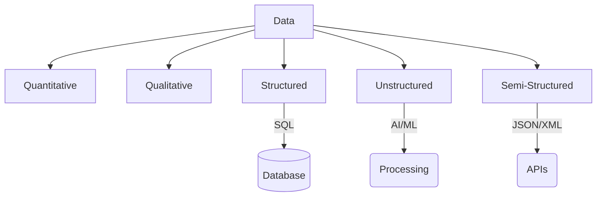

Links: 
___
# Types of Data

Data can be categorized based on its nature and structure.

## Quantitative vs. Qualitative

| Type             | Definition                                           | Characteristics                        | Examples                                                               |
|:---------------- |:---------------------------------------------------- |:-------------------------------------- |:---------------------------------------------------------------------- |
| **Quantitative** | Numeric information that can be measured or counted. | Can be analyzed statistically (Maths).        | Height of students (175 cm), Temperature (30°C), Sales revenue ($500). |
| **Qualitative**  | Descriptive, non-numeric information.                | Explains qualities or characteristics. | The apple is red, Customer satisfaction feedback (Happy/Sad).          |

## Structural Classification

Data is also classified by how organized it is.

> [!NOTE] The Need for Conversion
> Before applying most traditional algorithms, we often need to convert **Unstructured** and **Semi-structured** data into **Structured** data (Feature Engineering).

> [!CAUTION] Qualitative vs. Unstructured
> Don't confuse **Qualitative** data with **Unstructured** data. Qualitative data *can* be structured (e.g., a "Color" column in a table with values "Red", "Blue").

### Structured Data
Highly organized data that fits into predefined formats.

- **Format:** Rows and tables (Relational Databases).
- **Pros:** Easily searchable and analyzable.
- **Examples:** Excel spreadsheets, SQL Databases.

### Unstructured Data
Information with no predefined format or organization.

- **Format:** Text, images, audio, video.
- **Challenge:** Cannot be processed by standard algorithms effortlessly. Requires **AI/ML** to process.
- **Examples:** PDF documents, YouTube videos, Email body text.

### Semi-Structured Data
Data that doesn't reside in a rigid database but contains some organizational properties like tags or markers.

- **Format:** Hierarchical or key-value pairs.
- **Examples:** JSON (JavaScript Object Notation), XML, NoSQL databases (MongoDB).
