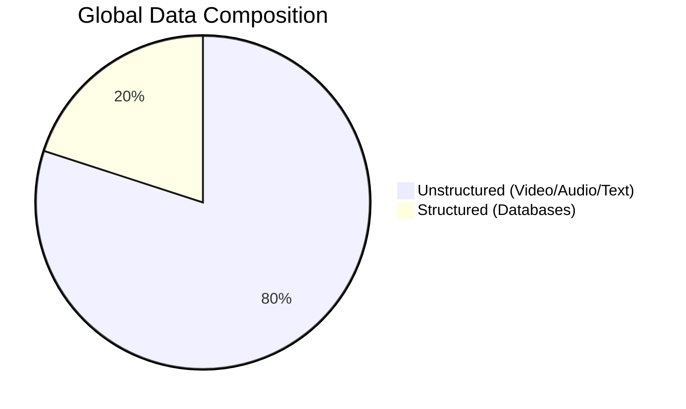

Links: 
___
# Types of Data

Data can be categorized based on its nature and structure.

```mermaid
mindmap
  root((Data))
    Quantitative
      Discrete
      Continuous
    Qualitative
      Nominal
      Ordinal
    Structure
      Structured
      Unstructured
      Semi-Structured
```

## Quantitative vs. Qualitative

| Type             | Definition                                           | Characteristics                        | Examples                                                               |
|:---------------- |:---------------------------------------------------- |:-------------------------------------- |:---------------------------------------------------------------------- |
| **Quantitative** | Numeric information that can be measured or counted. | Can be analyzed statistically (Maths).        | Height of students (175 cm), Temperature (30°C), Sales revenue ($500). |
| **Qualitative**  | Descriptive, non-numeric information.                | Explains qualities or characteristics. | The apple is red, Customer satisfaction feedback (Happy/Sad).          |

## Data Sources

Data can also be classified by how it is obtained.

> [!EXAMPLE] Energy Drink Launch
> - **Primary:** You construct a taste-test booth on a local college campus to see which of your 3 new flavors students prefer. (Collected yourself for this exact purpose).
> - **Secondary:** You buy a market research report detailing "General Energy Drink Consumption Trends in 2023" to estimate market size. (Collected by someone else for general use).

### Primary Data
Data collected first-hand for a specific research purpose.
- **Characteristics:** Original, highly relevant, but costly and time-consuming to collect.
- **Examples:** Surveys, Interviews, Experiments, Observations.

### Secondary Data
Data that has already been collected by someone else for another purpose.
- **Characteristics:** Easy to obtain, cheaper, but may not perfectly fit your specific need or might be outdated.
- **Examples:** Public databases (Census), Company records, Published research papers, Web scraping.

## Structural Classification

Data is also classified by how organized it is.

> [!NOTE] The Need for Conversion
> Before applying most traditional algorithms, we often need to convert **Unstructured** and **Semi-structured** data into **Structured** data (Feature Engineering).

> [!CAUTION] Qualitative vs. Unstructured
> Don't confuse **Qualitative** data with **Unstructured** data. Qualitative data *can* be structured (e.g., a "Color" column in a table with values "Red", "Blue").

### Structured Data
Highly organized data that fits into predefined formats.

- **Format:** Rows and tables (Relational Databases).
- **Pros:** Easily searchable and analyzable.
- **Examples:** Excel spreadsheets, SQL Databases.

### Unstructured Data
Information with no predefined format or organization.

- **Format:** Text, images, audio, video.
- **Challenge:** Cannot be processed by standard algorithms effortlessly. Requires **AI/ML** to process.
- **Examples:** PDF documents, YouTube videos, Email body text.

### Semi-Structured Data
Data that doesn't reside in a rigid database but contains some organizational properties like tags or markers.

- **Format:** Hierarchical or key-value pairs.
- **Examples:** JSON (JavaScript Object Notation), XML, NoSQL databases (MongoDB).
