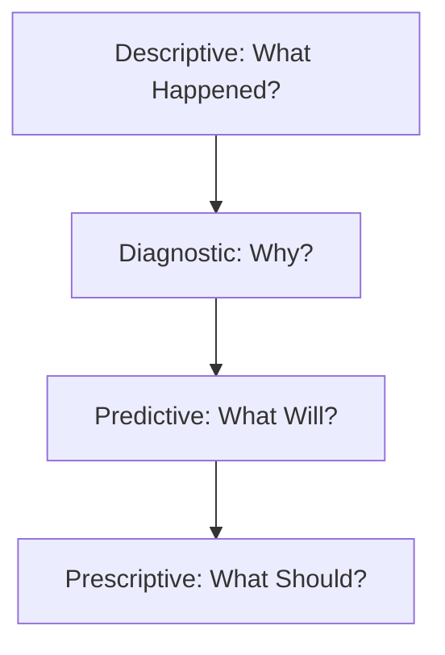

Links: [[00 Data Analytics]]
___
# Types of Data Analytics

Data Analytics is generally classified into four stages, moving from hindsight to foresight.

> [!TIP] The Value Chain
> As you move from Descriptive to Prescriptive:
> - **Complexity Increases** (Harder to do).
> - **Value Increases** (More useful to the business).

## Descriptive Analytics
**"What happened?"**

Focuses on summarizing past data to understand what has already occurred.
- **Goal:** To visualize "Current Status".
- **Tools:** Dashboards, Reports, KPIs.
- **Methods:** Charts, Graphs, Averages and Percentages.
- **Example:** Company Revenue Summary (Total Sales last month).

> [!EXAMPLE] Example: Monthly Sales Report
> Let's say a retail company runs a descriptive analysis on November sales. The resulting dashboard might show:
> - **Total Revenue:** $1.2 Million (A single KPI).
> - **Top-Selling Item:** "Winter Jackets" (Aggregated data).
> - **Sales by Region:** A pie chart showing North 40%, South 30%, East 20%, West 10%.
> This report simply tells management *what* the sales looked like, without explaining *why* the North region sold the most.

## Diagnostic Analytics
**"Why did it happen?"**

Digs deeper into descriptive data to find root causes.
- **Goal:** To identify correlations and anomalies.
- **Tools:** Drill-down, Data Discovery, Correlations, Root cause analysis.
- **Example:** "Why did revenue fall?" (Analysis shows a drop in sales in the North region due to a snowstorm).

> [!EXAMPLE] Example: Sales Drop Investigation
> Continuing the retail scenario, management asks *why* the West region only accounted for 10% of sales. 
> Analysts dig into the data (web traffic, marketing spend, and weather logs) and discover a correlation: a major heatwave hit the West in November, drastically reducing demand for winter jackets, while simultaneously, a technical glitch on the website caused checkout errors for users in that specific region.

## Predictive Analytics
**"What will happen?"**

Uses historical data and statistical models to forecast future outcomes.
- **Goal:** To predict future likelihoods.
- **Tools:** Regression Analysis, Forecasting, Machine Learning.
- **Example:** "How will revenue change next month?" (Predicting a 10% rebound).

> [!EXAMPLE] Example: Next Month's Forecast
> Using historical data, upcoming weather forecasts, and current economic indicators, a machine learning model builds a forecast. It predicts that December sales for winter boots will surge by 25% in the North due to an impending cold front, but overall company revenue might dip by 5% because of anticipated global supply chain delays affecting jacket inventory.

## Prescriptive Analytics
**"What should we do?"**

Suggests a course of action to achieve a desired outcome. The most advanced stage.
- **Goal:** To optimize decision making.
- **Tools:** Optimization, Simulation, Game Theory.
- **Example:** "What should we do to increase revenue?" (Launch a marketing campaign in the South region to offset North losses).

> [!EXAMPLE] Example: Strategy Optimization
> Based on the prediction of supply chain delays and the high demand for winter boots, the prescriptive model uses optimization algorithms to suggest concrete actions:
> 1.  **Logistics:** Reroute excess winter boot inventory from Western warehouses to Northern fulfillment centers *before* the cold front hits.
> 2.  **Marketing:** Launch an automated, targeted email campaign offering a 10% discount on delayed jacket pre-orders to retain customers who might otherwise buy from competitors.

