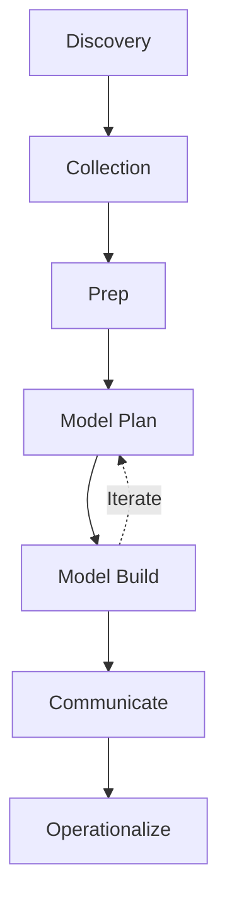

Links: [[00 Data Analytics]]
___
# Data Analytics Life Cycle (DALC)

The DALC is an iterative process used to generate insights from data.

## Phase 1: Discovery
**Goal:** Define the problem, learn the business domain, and assess resources.
- **Activities:** 
    - Formulate the business hypothesis.
    - Identify key stakeholders and project sponsors.
    - Assess available resources (computing power, human experts, and time limit).
    - Frame the analytical problem and define "Success Criteria".
- **Example:** A Bank wants to predict which customers are likely to leave (**Churn Prediction**).
    - *Hypothesis:* "Customers with low account balances are more likely to exit."

## Phase 2: Data Collection
**Goal:** Gather raw data from various sources and move it to a working environment.
- **Activities:** 
    - Establish data pipelines (SQL queries, API calls, web scraping).
    - Perform initial sanity checks to ensure data is accessible and relevant to the hypothesis.
- **Example:** Extract customer transaction history, demographic details, and support logs from the Bank's SQL Database.

## Phase 3: Data Preparation (ETL)
**ETL** stands for **Extract, Transform, Load**.

It is a three-step process used to combine data from multiple sources into a single, clean database or data warehouse. While we group it under "Phase 3: Data Preparation," it actually spans across a few phases of the lifecycle:

1. **Extract (Phase 2):** Pulling the raw data out of its original source (like SQL databases, APIs, or scraping a website).
2. **Transform (Phase 3):** This is the heavy lifting of Data Preparation. It involves cleaning the data (handling missing values, removing outliers), formatting it (making sure dates are all YYYY-MM-DD), and **Feature Engineering** (creating new variables).
3. **Load (Phase 3/4):** Writing the newly cleaned, transformed data into the final environment (like a Pandas DataFrame or a specialized Data Warehouse) where the actual model building and analysis will happen.

In modern data analytics, you might also hear about **ELT** (Extract, Load, Transform), where massive amounts of raw data are loaded into a cloud warehouse first, and then transformed on-demand using the cloud's computing power.

**Goal:** Clean and transform data into a usable format. *This is consistently the longest phase (80% of project time) because real-world data is messy.*
- **Activities:** 
    - **Data Conditioning:** Handling missing values, removing outliers, and normalizing data to eliminate bias.
    - **Feature Engineering:** Creating new, more useful variables from existing ones (e.g., calculating "Days since last purchase" from a date string).
- **Example:** 
    - Filling missing "Age" values with the median.
    - Converting "Male/Female" text to "0/1" (Encoding).

## Phase 4: Model Planning
**Goal:** Select the methods and algorithms to use.
- **Activities:** 
    - **Exploratory Data Analysis (EDA):** Finding correlations and understanding relationships between variables.
    - **Feature Selection:** Choosing the most impactful predictors.
    - Choosing candidate machine learning models (e.g., Regression vs Random Forest).
- **Example:** The team decides to use **Logistic Regression** because the output is binary (Churn/No Churn).

## Phase 5: Model Building
**Goal:** Execute the model on training data.
- **Activities:** 
    - Split data into **Training** (to teach the model), **Validation** (to tune it), and **Testing** (to evaluate it) sets.
    - Execute the chosen models to find the best fit and measure accuracy.
- **Example:** 
    - Train the model on 70% of the data.
    - Result: The model achieves **85% Accuracy** in predicting churners.

## Phase 6: Communicate Results
**Goal:** Present findings to stakeholders (Data Storytelling).
- **Activities:** 
    - Determine if the results meet the "Success Criteria" defined in Phase 1.
    - Create dashboards and summarize insights in business terms (avoiding complex code/math).
- **Example:** "We identified that customers attempting to transfer >$5000 in one go are high-risk. We suggest offering them a special retention interest rate."

## Phase 7: Operationalize
**Goal:** Deploy the model into production for real-world use.
- **Activities:** 
    - Deliver final reports and documentation.
    - Integrate the algorithm code into the company's app/website.
    - Set up **Continuous Monitoring** to watch for "Model Drift" (where accuracy degrades over time as real-world behaviors change).
- **Example:** The model is integrated into the Bank's CRM. When a high-risk customer calls, a "Churn Alert" pops up for the support agent.

# Case Study: Video Game Balancing (Nerfing a Weapon)
*Scenario:* Players in a popular shooter game (e.g., Valorant/COD) are complaining that the "Sniper Rifle" is unbalanced and overpowered (OP).

## Discovery (Problem Definition)
**Goal:** Determine if the weapon is actually overpowered or if it's just player perception.
- **Problem Statement:** "The Sniper Rifle's 'One-Shot Kill' mechanic feels unfair to 70% of the player base."
- **Hypothesis:** "Players using the Sniper Rifle have a Win Rate > 60%, which is significantly higher than the ideal 50%."
- **Stakeholders:** Game Designers, Community Managers, Pro Players.

## Collection (Telemetery)
**Goal:** Capture granular match data from game servers.
- **Data Sources:** 
    - **Match Logs:** Kills, Deaths, Assists, Weapon Used, Map played.
    - **Heatmaps:** XYZ coordinates of where every death occurs on the map.
    - **Player Surveys:** Reddit threads and official forum polls on weapon satisfaction.
    - **Pro Play Stats:** Tournament data (where skill ceilings are highest).

## Preparation (Cleaning)
**Goal:** Filter out noise to ensure fair analysis.
- **Filtering:** Removing matches with "AFK" players or cheaters (aimbots) to prevent skewed stats.
- **Segmentation:** Separating data by Rank (Iron vs Radiant). A gun might be OP in low elo but useless in pro play.
- **Normalization:** Calculating "Kills per Minute" to account for different match lengths.

## Model Planning (Analysis Strategy)
**Goal:** Identify the key metric that proves imbalance.
- **EDA:** Plotting "Pick Rate" vs "Win Rate". If a gun has 100% Pick Rate and 55% Win Rate, it's a must-pick issue.
- **Technique:** 
    - **T-Test:** Comparing the average K/D Ratio of Sniper users vs Rifle users.
    - **Time-Series Analysis:** Checking if the win rate spiked after the last patch.

## Model Building (Simulation)
**Goal:** Test potential fixes before releasing them.
- **Simulation:** Running bots with slightly altered weapon stats (e.g., increased reload time).
- **A/B Testing (PTR):** Launching a "Public Test Realm" where Group A plays the current version and Group B plays the "Nerfed" version (lower damage).
- **Result:** The data shows that increasing the "Scope-in Time" by 0.2s reduces the Win Rate to a healthy 51%.

## Communicate Results (Patch Notes)
**Goal:** Justify the change to the angry community.
- **Visualization:** Creating a blog post showing "Before vs After" graphs of the weapon's dominance.
- **Narrative:** "We heard you. The Sniper was accounting for 40% of all kills. This change promotes diverse playstyles."
- **Deliverable:** Official Patch Notes v2.05.

## Operationalize (Deployment)
**Goal:** Push the update and monitor stability.
- **Deployment:** Rolling out the patch to global servers (PC/Console).
- **Monitoring:** Real-time dashboards tracking "Player Retention" (did people rage quit after the nerf?) and ensuring no new bugs (e.g., gun stuck in wall).