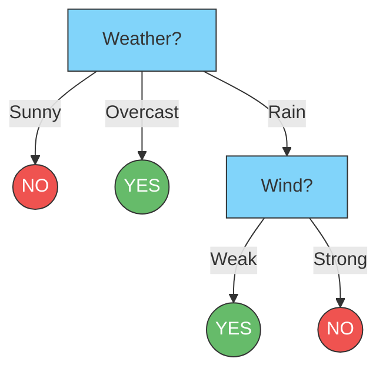

Links: [[00 Data Analytics]], [[07 Regression Analysis]]
___
# Classification

**Classification** is a foundational branch of **Supervised Learning** where the algorithm predicts the categorical class labels of new instances based on past observations. Unlike Regression (which predicts continuous numerical values), Classification predicts discrete categories (e.g., "Spam" vs "Not Spam", or "Dog" vs "Cat").

## Decision Trees
A Decision Tree is a flowchart-like supervised algorithm that splits data into continuously smaller groups based on feature thresholds until it reaches a final prediction leaf.

### Entropy
Entropy mathematically defines the level of *uncertainty* or *impurity* in a given dataset. It is driven by outliers, noise, and mixed classes in the data.
- **High Entropy:** A perfectly mixed, highly unpredictable dataset.
- **Low Entropy:** A very pure, unbalanced dataset (e.g., almost all examples belong to one specific class).
- In a pure binary classification, the minimum entropy is `0` (perfectly pure) and the maximum is `1` (perfectly split 50/50).

**Formula:**
$$E(S) = \sum_{i=1}^{c} -p_{i} \log_{2}p_{i}$$
Where:
- $c$ is the total number of classes.
- $p_{i}$ is the probability of an element belonging to class $i$.

### Information Gain
When building a Decision Tree, the algorithm must decide which feature to split the data on first. It chooses the feature that provides the highest **Information Gain** (the split that most drastically reduces the Entropy of the dataset).

**Formula:**
$$\symup{Information Gain = E(Parent) - (Weighted Average) \times E(Children)}$$

#### Example: Calculating Information Gain
Imagine we want to build a Decision Tree to predict whether we should play outside based on a 5-day historical dataset:

| Day | Weather  | Wind   | Play? (Target) |
|:--- |:-------- |:------ |:-------------- |
| 1   | Sunny    | Weak   | No             |
| 2   | Sunny    | Strong | No             |
| 3   | Overcast | Weak   | Yes            |
| 4   | Rain     | Weak   | Yes            |
| 5   | Rain     | Strong | No             |

**Step 1: Calculate the Entropy of the Parent (The whole dataset)**
We have 5 total days: **2 "Yes"** and **3 "No"**.
$$E(Parent) = - \left(\frac{2}{5} \log_2 \frac{2}{5}\right) - \left(\frac{3}{5} \log_2 \frac{3}{5}\right) = 0.971$$
*(The dataset is highly mixed, so the initial entropy is very close to 1).*

**Step 2: Test Splitting on "Weather"**
If we split the data by the 3 weather conditions, we get 3 new "Children" branches:
- **Sunny (2 days):** Both are "No". Because it's perfectly pure, $E(\text{Sunny}) = 0$.
- **Overcast (1 day):** It is "Yes". Perfectly pure, $E(\text{Overcast}) = 0$.
- **Rain (2 days):** 1 "Yes", 1 "No". A perfect 50/50 split, so $E(\text{Rain}) = 1$.

Now, calculate the weighted average of these children:
$$\text{Weighted } E(\text{Weather}) = \left(\frac{2}{5} \times 0\right) + \left(\frac{1}{5} \times 0\right) + \left(\frac{2}{5} \times 1\right) = 0.400$$

**Step 3: Test Splitting on "Wind"**
If we split the data by the 2 wind conditions:
- **Weak (3 days):** 2 "Yes", 1 "No". $E(\text{Weak}) \approx 0.918$.
- **Strong (2 days):** Both are "No". Pure, $E(\text{Strong}) = 0$.

Calculate the weighted average for Wind:
$$\text{Weighted } E(\text{Wind}) = \left(\frac{3}{5} \times 0.918\right) + \left(\frac{2}{5} \times 0\right) \approx 0.551$$

**Step 4: Calculate Information Gain and Choose the Split**
$$\symup{IG(Weather)} = 0.971 - 0.400 = \textbf{0.571}$$
$$\symup{IG(Wind)} = 0.971 - 0.551 = 0.420$$

> [!NOTE] The Decision
> Because `Weather` provides a significantly higher Information Gain (it removes much more uncertainty from the data than `Wind` does), the algorithm officially selects **Weather** as the very first root node of the Decision Tree!

**Step 5: Continue Splitting Impure Branches**
Now the algorithm evaluates the branches created by the `Weather` split:
- **Sunny Branch:** Only contains "No" answers. It is perfectly pure ($E=0$). The algorithm creates a final **Leaf Node (NO)** and stops.
- **Overcast Branch:** Only contains "Yes" answers. It is perfectly pure ($E=0$). The algorithm creates a final **Leaf Node (YES)** and stops.
- **Rain Branch:** Contains 1 "Yes" and 1 "No". It is *impure* ($E=1$). The algorithm must split this specific branch further.

Looking *only* at the 2 rainy days, the algorithm tests the only remaining feature: `Wind`.
- If Wind is **Weak**, the result is "Yes" (Pure).
- If Wind is **Strong**, the result is "No" (Pure).

Both sub-branches are now pure, so the algorithm stops entirely!

**Step 6: The Final Decision Tree**
The fully trained model can now be elegantly visualized:

## k-Nearest Neighbors (k-NN)
k-NN is a simplistic, distance-based algorithm. When given a new, unclassified data point, k-NN looks at the $k$ closest data points in the training set (its "neighbors") and predicts the class based on a majority vote.

- **Non-Parametric:** It makes absolutely no mathematical assumptions about the underlying data distribution.
- **Lazy Learner:** It doesn't actually "train" a model upfront; it simply memorizes the training dataset and does all the heavy mathematical lifting at the exact moment a prediction is requested.
- **Distance Metrics:** Usually relies on Euclidean or Manhattan distance to determine which neighbors are truly the "nearest".

## Naive Bayes Classifier
Naive Bayes is a probabilistic classifier based squarely on **Bayes' Theorem**. It is called "naive" because it makes a massive assumption: that every single feature being evaluated is *completely independent* of every other feature (which is rarely true in the real world, but the math still works incredibly well).

$$P(y|x_1x_2x_3\dots) = \frac{ P(y) \times P((x_1x_2x_3\dots)|y) }{ P(x_1x_2x_3\dots) }$$
Where:
- $y$ is the target class we are predicting.
- $x_1x_2x_3\dots$ are the independent features we are observing.

#### Worked Example: Predicting with Multiple Features
Imagine we have an 8-day dataset predicting if we should play outside based on two independent features: `Weather` ($x_1$) and `Wind` ($x_2$).

| Day | Weather ($x_1$) | Wind ($x_2$) | Play? ($y$) |
|:--- |:--------------- |:------------ |:----------- |
| 1   | Sunny           | Weak         | No          |
| 2   | Sunny           | Strong       | No          |
| 3   | Overcast        | Weak         | Yes         |
| 4   | Rain            | Weak         | Yes         |
| 5   | Rain            | Strong       | No          |
| 6   | Overcast        | Strong       | Yes         |
| 7   | Sunny           | Weak         | Yes         |
| 8   | Rain            | Weak         | Yes         |

**The Goal:** Predict the outcome for a new day where the Weather is **Sunny** and the Wind is **Strong**.

**Step 1: Calculate Prior Probabilities ($P(y)$)**
Out of 8 total days:
- $P(\text{Yes}) = 5/8 = 0.625$
- $P(\text{No}) = 3/8 = 0.375$

**Step 2: Calculate Conditional Probabilities ($P(x_n|y)$)**
We isolate the specific features for our target day (`Sunny` and `Strong`) and see how often they occurred in the "Yes" days vs the "No" days.

*For the 5 "Yes" days:*
- $P(\text{Sunny}|\text{Yes}) = 1/5 = 0.20$
- $P(\text{Strong}|\text{Yes}) = 1/5 = 0.20$

*For the 3 "No" days:*
- $P(\text{Sunny}|\text{No}) = 2/3 \approx 0.667$
- $P(\text{Strong}|\text{No}) = 2/3 \approx 0.667$

**Step 3: Apply the "Naive" Independence Assumption**
Because Naive Bayes assumes features are strictly independent, we simply multiply their conditional probabilities together alongside the Prior. *(Note: The denominator $P(x_1x_2)$ is exactly the same for both equations, so we can ignore it and just compare the raw numerators).*

$$\symup{Score\ for\ Yes} = P(\text{Sunny}|\text{Yes}) \times P(\text{Strong}|\text{Yes}) \times P(\text{Yes})$$
$$\symup{Score\ for\ Yes} = 0.20 \times 0.20 \times 0.625 = \textbf{0.025}$$

$$\symup{Score\ for\ No} = P(\text{Sunny}|\text{No}) \times P(\text{Strong}|\text{No}) \times P(\text{No})$$
$$\symup{Score\ for\ No} = 0.667 \times 0.667 \times 0.375 \approx \textbf{0.166}$$

> [!NOTE] The Prediction
> Because the calculated likelihood for "No" (0.166) is significantly larger than "Yes" (0.025), the Naive Bayes algorithm formally predicts that we will **NOT play** on a Sunny, Strong-wind day.

### Variations of Naive Bayes
Depending on the specific type of data being analyzed, Data Scientists use different variations of the algorithm:
1. **Gaussian Naive Bayes:** Used when the continuous features are assumed to follow a normal (Gaussian) distribution.
2. **Multinomial Naive Bayes:** Used heavily for discrete counts, such as text classification (e.g., counting how many times the word "Win" appears to detect spam).
3. **Bernoulli Naive Bayes:** Used for strictly binary/boolean features (e.g., a word is either present `1` or absent `0`).
