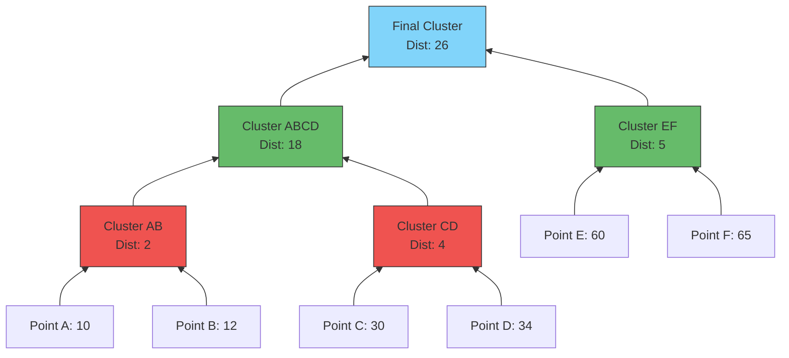

Links: [[00 Data Analytics]], [[08 Classification]]
___
# Clustering

**Clustering** is a fundamental technique in **Unsupervised Learning**. Unlike Classification (which relies on pre-labeled target variables), Unsupervised Learning algorithms are given raw, unlabeled data and asked to discover hidden structures or patterns on their own.

Clustering specifically groups data points together so that objects in the same group (a "cluster") are more similar to each other than to those in other groups. It is heavily used for data exploration, pattern discovery, and customer segmentation.

## K-Means Clustering
K-Means is a popular partitioning method that divides the dataset into exactly $K$ distinct, non-overlapping clusters.

### How it Works
1. **Initialization:** The user explicitly defines the target number of clusters ($K$). The algorithm randomly drops $K$ "Centroids" into the data space.
2. **Assignment:** Every single data point calculates its distance (usually Euclidean) to each centroid and assigns itself to the closest one.
3. **Update:** Once all points are assigned, the algorithm recalculates the true center of each newly formed cluster, and moves the Centroid to that exact center coordinate.
4. **Iteration:** Steps 2 and 3 repeat endlessly until the centroids stop moving (convergence).

#### Example: K-Means Iteration
You are given a dataset of 4 points in a 2D space. The algorithm is initialized with $K=2$, and randomly selects points A and D as the starting centroids ($C_{1}$ and $C_{2}$). Perform one full iteration to mathematically update the centroids.

**The Dataset:**

| Point | $X$ | $Y$ |
| ----- | --- | --- |
| **A** | 2   | 2   |
| **B** | 3   | 2   |
| **C** | 8   | 8   |
| **D** | 9   | 8   |

- Initial **$C_{1}$** = $(2, 2)$
- Initial **$C_{2}$** = $(9, 8)$

**Step 1: Calculate Euclidean Distances**
The Euclidean formula is $d = \sqrt{(x_2 - x_1)^2 + (y_2 - y_1)^2}$. We calculate the distance from every point to both $C_{1}$ and $C_{2}$:

*Distance to $C_{1}(2,2)$:*
$$ \text{Dist}(A, C_{1}) = \sqrt{(2-2)^2 + (2-2)^2} = \sqrt{0} = \mathbf{0} $$
$$ \text{Dist}(B, C_{1}) = \sqrt{(3-2)^2 + (2-2)^2} = \sqrt{1^2 + 0} = \mathbf{1} $$
$$ \text{Dist}(C, C_{1}) = \sqrt{(8-2)^2 + (8-2)^2} = \sqrt{6^2 + 6^2} = \sqrt{72} \approx \mathbf{8.49} $$
$$ \text{Dist}(D, C_{1}) = \sqrt{(9-2)^2 + (8-2)^2} = \sqrt{7^2 + 6^2} = \sqrt{85} \approx \mathbf{9.22} $$

*Distance to $C_{2}(9,8)$:*
$$ \text{Dist}(A, C_{2}) = \sqrt{(2-9)^2 + (2-8)^2} = \sqrt{(-7)^2 + (-6)^2} = \sqrt{85} \approx \mathbf{9.22} $$
$$ \text{Dist}(B, C_{2}) = \sqrt{(3-9)^2 + (2-8)^2} = \sqrt{(-6)^2 + (-6)^2} = \sqrt{72} \approx \mathbf{8.49} $$
$$ \text{Dist}(C, C_{2}) = \sqrt{(8-9)^2 + (8-8)^2} = \sqrt{(-1)^2 + 0} = \sqrt{1} = \mathbf{1} $$
$$ \text{Dist}(D, C_{2}) = \sqrt{(9-9)^2 + (8-8)^2} = \sqrt{0} = \mathbf{0} $$

**Step 2: Assign Points to Closest Centroid**
Comparing the distances calculated above, we assign each point to whichever Centroid has the smaller value:
- **A** goes to **C1** ($0 < 9.22$)
- **B** goes to **C1** ($1 < 8.49$)
- **C** goes to **C2** ($1 < 8.49$)
- **D** goes to **C2** ($0 < 9.22$)

*Cluster 1 = {A, B}*
*Cluster 2 = {C, D}*

**Step 3: Update Centroids (Calculate the Mean)**
We find the true center of our new clusters by averaging the $X$ and $Y$ coordinates of their assigned points:

$$ \text{New } C_{1x} = \frac{A_x + B_x}{2} = \frac{2 + 3}{2} = \mathbf{2.5} $$
$$ \text{New } C_{1y} = \frac{A_y + B_y}{2} = \frac{2 + 2}{2} = \mathbf{2.0} $$
*(The new Centroid 1 moves to coordinate **(2.5, 2.0)**)*

$$ \text{New } C_{2x} = \frac{C_x + D_x}{2} = \frac{8 + 9}{2} = \mathbf{8.5} $$
$$ \text{New } C_{2y} = \frac{C_y + D_y}{2} = \frac{8 + 8}{2} = \mathbf{8.0} $$
*(The new Centroid 2 moves to coordinate **(8.5, 8.0)**)*

> [!NOTE] End of Iteration 1
> For Iteration 2, the algorithm would simply repeat Step 1, calculating Euclidean distances from all points to these *new* $(2.5, 2.0)$ and $(8.5, 8.0)$ coordinates until the assignments stop changing.

## Hierarchical Clustering
Unlike K-Means, **Hierarchical Clustering** does *not* require you to predefine the number of clusters ($K$) upfront. Instead, it builds a massive tree-like structure of nested clusters.

### Approaches
- **Agglomerative (Bottom-Up):** The most common approach. Every single data point starts as its own individual cluster. The algorithm iteratively finds the two closest clusters and merges them together, repeating this until all points are merged into one single giant cluster.
- **Divisive (Top-Down):** The exact opposite. All data points start in one giant cluster, and the algorithm recursively splits them down until each point is isolated.

### Linkage Criteria
When merging two clusters that contain multiple points, how does the algorithm define the "distance" between those clusters? It relies on Linkage Criteria:
- **Single Linkage:** The distance between the *closest* two points of the clusters.
- **Complete Linkage:** The distance between the *furthest* two points of the clusters.
- **Average Linkage:** The average distance between *all* points in both clusters.

#### Example: Agglomerative Clustering
Imagine we have 6 data points distributed across a 1-Dimensional line. We will use the **Agglomerative (Bottom-Up)** approach and the **Single Linkage** criteria to build our clusters.

**The Dataset (1D Coordinates):**
`A = 10`, `B = 12`, `C = 30`, `D = 34`, `E = 60`, `F = 65`

**Step 1: Calculate Initial Distances & Merge**
Initially, we have 6 distinct clusters. We find the two points that are mathematically closest to each other.
- Distance between `A` and `B` = `|10 - 12| = 2`.
- Because 2 is the absolute smallest distance in the dataset, we merge them into our first cluster: **(AB)**.

**Step 2: Continue Merging Closest Neighbors**
We look at the remaining isolated points and find the next closest pairs:
- `C` (30) and `D` (34) have a distance of 4. We merge them: **(CD)**.
- `E` (60) and `F` (65) have a distance of 5. We merge them: **(EF)**.
We now have three distinct clusters: `(AB)`, `(CD)`, and `(EF)`.

**Step 3: Merge the Clusters (Single Linkage)**
Now we must merge the clusters themselves. Using Single Linkage, we look at the distance between the *closest* points in each cluster:
- Distance from `(AB)` to `(CD)` is the distance from `B(12)` to `C(30)` = **18**.
- Distance from `(CD)` to `(EF)` is the distance from `D(34)` to `E(60)` = **26**.
Because 18 is smaller than 26, we merge `(AB)` and `(CD)` together into a massive **(ABCD)** cluster.

**Step 4: The Final Merge**
Finally, we merge the remaining `(ABCD)` cluster with the `(EF)` cluster to form a single, all-encompassing root cluster.

### The Final Dendrogram
A **Dendrogram** is a visual tree diagram that maps exactly how the clusters were merged step-by-step. Reading from the bottom-up, you can see exactly which points grouped together first!

#### Choosing the Threshold

To determine the final number of clusters to use in your model, you visually inspect the Dendrogram to find a "Threshold Value".

1. Look for the tallest vertical line that has *no horizontal lines* passing through it. In our example, there is a massive vertical jump between Distance 5 (Cluster EF) and Distance 18 (Cluster ABCD).
2. Draw a horizontal "cut" line straight through that tall vertical section (e.g., at Distance = 10).
3. The number of vertical lines that your horizontal cut intersects is the optimal number of clusters for your dataset. Cutting at 10 would intersect 3 vertical lines, leaving us with exactly 3 optimized clusters: `(AB)`, `(CD)`, and `(EF)`.
