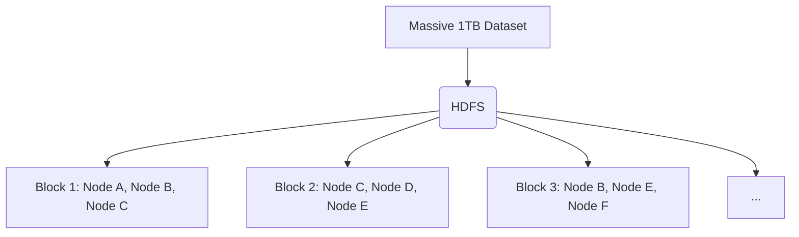

Links: [[00.1 Big Data and Analytics Ecosystem]]
___
# Big Data

Handling the massive volume, velocity, and variety of Big Data requires highly specialized infrastructure. Traditional SQL databases running on single machines simply cannot scale to meet these demands.

## The Big Data Architecture Ecosystem
A robust big data architecture is composed of several specialized platforms working together in a pipeline:

- **Data Ingestion Platform:** The entry point. It captures massive streams of unstructured or semi-structured data from thousands of sources in real-time (e.g., Apache Kafka capturing millions of website clicks per second).
- **Data Catalog Platform:** Acts as a massive, searchable index. Because data lakes are so vast, the catalog maintains metadata so data scientists can actually find the specific datasets they need.
- **ETL/Data Transformation Platform:** **E**xtract, **T**ransform, **L**oad. This platform takes the raw, chaotic data from the ingestion layer, cleans it, formats it, and loads it into a structured warehouse ready for analysis.
- **IoT Analytics Platform:** Specialized platforms designed specifically to handle the endless, high-velocity stream of sensor data generated by the Internet of Things (e.g., factory machines, smart cars).

## Hadoop
**Apache Hadoop** is the foundational framework that made modern Big Data possible. It is an open-source software framework used for distributed storage and processing of massive datasets using the MapReduce programming model.

Instead of buying one massive, expensive supercomputer (Vertical Scaling), Hadoop allows you to link thousands of cheap, standard computers together into a "Cluster" (Horizontal Scaling).

### Hadoop Distributed File System (HDFS)
The core of Hadoop is HDFS. When you upload a massive 1 Terabyte file to Hadoop, it does not store it on a single hard drive. 

Instead, HDFS chops that file up into smaller "blocks" (typically 128MB each) and distributes them across hundreds of different computers in the cluster. It also automatically replicates each block (usually 3 times) across multiple computers so that if one computer's hardware unexpectedly fails, no data is ever lost.

### The MapReduce Model
Because the data is physically split across hundreds of computers, you cannot process it the traditional way. 
- **Map:** The master node sends the analytical query (the "code") directly to the individual computers where the data blocks actually reside. Each computer locally processes its own small chunk of data.
- **Reduce:** The master node collects all the individual answers from the cluster and aggregates them into one final result to give to the user.

## The Extended Hadoop Ecosystem

While HDFS handles distributed storage and MapReduce handles distributed processing, a massive ecosystem of specialized tools has been built around Hadoop to handle every aspect of modern Big Data:

### YARN (Yet Another Resource Negotiator)
The "Operating System" of Hadoop. YARN is the central cluster management technology responsible for dynamically allocating system resources (CPU, Memory) to the various applications running on the cluster and scheduling tasks. It officially separated resource management from the MapReduce engine in Hadoop 2.0.

### Apache Spark
A lightning-fast, highly advanced unified analytics engine designed to replace traditional MapReduce for many complex tasks. While MapReduce constantly writes intermediate data back to physical hard drives (which is incredibly slow), **Spark processes data entirely in RAM (In-Memory Processing)**, making it up to 100x faster for workloads like machine learning, interactive queries, and real-time streaming.

### Apache Hive
A data warehouse infrastructure built directly on top of Hadoop. It allows analysts who are deeply familiar with traditional databases to query the massive, unstructured data living in HDFS using a SQL-like language called **HiveQL**. Hive then automatically translates these queries into complex MapReduce jobs behind the scenes.

### Apache Pig
A high-level scripting platform used for analyzing large data sets. It uses a language called **Pig Latin**, which is significantly easier and faster to write than raw Java MapReduce code. It is heavily used by data engineers to build complex ETL (Extract, Transform, Load) data pipelines.

### Apache HBase
A non-relational (NoSQL), distributed, and strictly column-oriented database that runs perfectly on top of HDFS. While HDFS is built for sequential scanning of massive files (batch processing), HBase provides real-time, random read/write access to billions of rows and millions of columns of data. It is heavily modeled after Google's BigTable.

### Apache Sqoop
A highly specialized utility tool designed entirely to bridge the gap between traditional databases and Hadoop. Sqoop ("SQL-to-Hadoop") efficiently and automatically transfers massive amounts of bulk data between Apache Hadoop and structured relational databases (like MySQL, Oracle, or Postgres).
