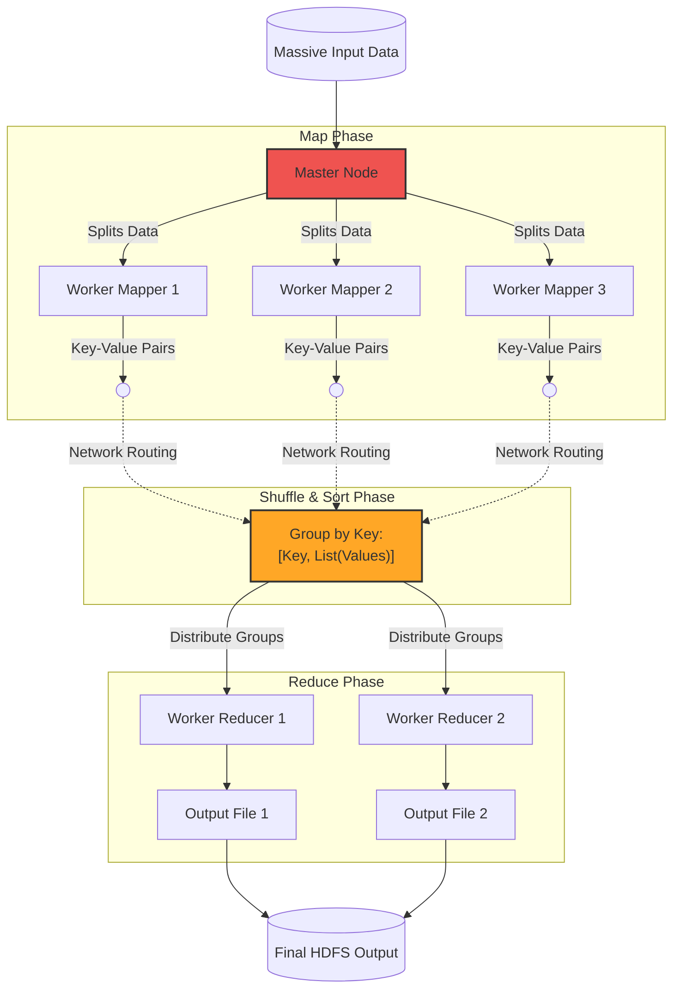

Links: [[00 Data Analytics]], [[13 Big Data]]
___
# MapReduce and Matrix Operations

While Hadoop Distributed File System (HDFS) provides the raw storage for Big Data, **MapReduce** provides the computational paradigm. It is a highly scalable programming model designed specifically to process massive datasets across thousands of commodity computers in parallel.

## The MapReduce Paradigm

The true genius of MapReduce is that it moves the *computation to the data*, rather than moving the data to the computation. If a massive file is split across 100 computers, the Master Node sends the code directly to those 100 computers so they can all process their chunk of the data simultaneously.

The algorithm forces developers to break their logic down into two distinct functions: **Map** and **Reduce**, with a critical "Shuffle" phase happening automatically in between.

### Map Phase
The Master node distributes the `Map()` function to the "Worker" nodes. 
- Each Worker reads its assigned chunk of the raw data.
- The `Map` function processes this raw data and converts it into intermediate **Key-Value pairs** `(Key, Value)`.

### Shuffle and Sort Phase
This phase is handled automatically by the Hadoop framework. 
- It intercepts all of the intermediate Key-Value pairs generated by the Mappers across the entire cluster.
- It completely reorganizes the data, grouping all Values that share the exact same Key into a single list: `(Key, [Value1, Value2, Value3...])`.
- It physically routes these grouped lists across the network to the appropriate Reducer nodes.

### Reduce Phase
The Reducer nodes receive the grouped lists.
- The `Reduce()` function iterates through the list of values for each key, aggregating them (e.g., summing them up, finding the average, finding the max).
- It emits the final, condensed result.

### Worked Example: Classic Word Count
To truly understand the paradigm, let's look at the "Hello World" of MapReduce: the Word Count algorithm. Imagine we want to count the exact frequency of words across two text files (which could represent billions of web pages).

**The Input:**
- **File 1:** "Data Analytics is fun"
- **File 2:** "Learning Data Analytics is also fun"

**Step 1: The Map Phase**
Two separate Worker nodes process the files in parallel. The Mapper's logic is simple: for every word it sees, emit a Key-Value pair of `(Word, 1)`.
- **Worker 1 Output:** `(Data, 1)`, `(Analytics, 1)`, `(is, 1)`, `(fun, 1)`
- **Worker 2 Output:** `(Learning, 1)`, `(Data, 1)`, `(Analytics, 1)`, `(is, 1)`, `(also, 1)`, `(fun, 1)`

**Step 2: The Shuffle and Sort Phase**
Hadoop automatically intercepts all these scattered outputs over the network and rigidly groups them strictly by Key (alphabetically).
- `(also, [1])`
- `(Analytics, [1, 1])`
- `(Data, [1, 1])`
- `(fun, [1, 1])`
- `(is, [1, 1])`
- `(Learning, [1])`

**Step 3: The Reduce Phase**
The Reducers receive these grouped lists and apply their logic: simply sum the list of 1s together.
- `(also, 1)`
- `(Analytics, 2)`
- `(Data, 2)`
- `(fun, 2)`
- `(is, 2)`
- `(Learning, 1)`

*Result:* The cluster successfully calculated the aggregate word frequencies by completely splitting the workload!

## Matrix-Vector Multiplication using MapReduce
MapReduce is not just for word counts; it is heavily used for massive linear algebra computations, such as PageRank (which requires calculating eigenvectors over billion-row matrices).

Imagine we have a massive Matrix $M$ (size $m \times n$) and we want to multiply it by a Vector $v$ (size $n \times 1$) to produce a final resulting Vector $x$ (size $m \times 1$).

$$x_i = \sum_{j=1}^{n} (m_{ij} \times v_j)$$

### The MapReduce Strategy
Because the Vector $v$ is usually small enough to fit in RAM, it is distributed to every single Worker node. The massive Matrix $M$, however, is stored across HDFS as individual coordinate points: `(Row, Column, Value)`.

- **The Mapper:** Reads a single element of the matrix `(i, j, m_ij)`. It looks up $v_j$ from the Vector in its RAM, multiplies them together, and emits the Key-Value pair:
  - **Key:** `i` (The Row ID)
  - **Value:** `m_ij * v_j` (The partial product)
- **The Reducer:** Receives all the partial products for a specific Row `i`. It simply adds them all together to produce the final $x_i$ value for the resulting vector!

### Comprehensive Numerical Walkthrough
We want to multiply a $2 \times 3$ Matrix ($M$) by a $3 \times 1$ Vector ($v$). 

**The Goal:**
If you did this on a piece of paper, you would multiply each row of the matrix by the vector to get the final answers:
- **Row 1:** $(1 \times 7) + (2 \times 8) + (3 \times 9) = \mathbf{50}$
- **Row 2:** $(4 \times 7) + (5 \times 8) + (6 \times 9) = \mathbf{122}$

The final answer is $x = \begin{bmatrix} 50 \\ 122 \end{bmatrix}$. Now, let's see how MapReduce accomplishes this exact same math across multiple independent computers!

**The Dataset:**
Matrix 
$$M = \begin{bmatrix} 1 & 2 & 3 \\ 4 & 5 & 6 \end{bmatrix}$$
Vector 
$$v = \begin{bmatrix} 7 \\ 8 \\ 9 \end{bmatrix}$$

**Step 1: How Data is Stored**
Hadoop cannot store a 2D grid. It breaks the matrix down into a simple table of coordinates: `(Row, Column, Value)`. 
At the same time, the tiny Vector $v$ is copied directly into the RAM of every Worker node so they can all see it: $v_1=7, v_2=8, v_3=9$.

| Row (i) | Col (j) | Matrix Value | Vector Value ($v_j$) |
| :--- | :--- | :--- | :--- |
| **1** | 1 | 1 | $v_1 = 7$ |
| **1** | 2 | 2 | $v_2 = 8$ |
| **1** | 3 | 3 | $v_3 = 9$ |
| **2** | 1 | 4 | $v_1 = 7$ |
| **2** | 2 | 5 | $v_2 = 8$ |
| **2** | 3 | 6 | $v_3 = 9$ |

**Step 2: The Map Phase (Parallel Multiplication)**
The Master node assigns **Row 1** to **Worker A** and **Row 2** to **Worker B**.
The Mapper's logic is extremely simple: Multiply the `Matrix Value` by the `Vector Value`, and **Emit** the result tagged with the `Row`.

*Worker A (Processing Row 1):*
- Coordinate `(1, 1, 1)` $\to$ Emits `(Row 1, 1*7)` $\to$ **`Emit(1, 7)`**
- Coordinate `(1, 2, 2)` $\to$ Emits `(Row 1, 2*8)` $\to$ **`Emit(1, 16)`**
- Coordinate `(1, 3, 3)` $\to$ Emits `(Row 1, 3*9)` $\to$ **`Emit(1, 27)`**

*Worker B (Processing Row 2):*
- Coordinate `(2, 1, 4)` $\to$ Emits `(Row 2, 4*7)` $\to$ **`Emit(2, 28)`**
- Coordinate `(2, 2, 5)` $\to$ Emits `(Row 2, 5*8)` $\to$ **`Emit(2, 40)`**
- Coordinate `(2, 3, 6)` $\to$ Emits `(Row 2, 6*9)` $\to$ **`Emit(2, 54)`**

**Step 3: The Shuffle and Sort Phase**
Right now, we just have 6 scattered numbers floating across the network. The Hadoop framework intercepts these numbers and neatly groups them into lists based solely on their **Key (Row)**.
- **Key 1 (Row 1):** `(1, [7, 16, 27])`
- **Key 2 (Row 2):** `(2, [28, 40, 54])`

**Step 4: The Reduce Phase (Final Addition)**
The Reducer nodes receive these grouped lists. Their logic is just as simple: **Add all the numbers in the list together.**
- **Reducer for Row 1:** Sums `7 + 16 + 27`. Outputs final answer: **`50`**
- **Reducer for Row 2:** Sums `28 + 40 + 54`. Outputs final answer: **`122`**

> [!NOTE] The Final Result
> The cluster successfully worked together to output $x_1=50$ and $x_2=122$. The genius of this paradigm is that if the matrix had a billion rows, you could just assign a billion Worker nodes to do the exact same simple multiplications simultaneously!
