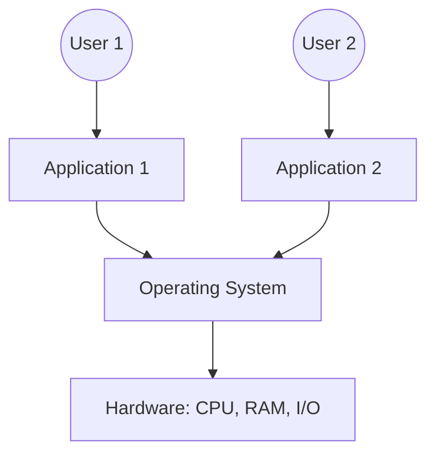

Links:
___
# Operating System (OS)

An **Operating System (OS)** is a system software that acts as an **intermediary** or interface between the computer hardware and the user.

Its primary goal is to provide an environment in which a user can execute programs in a **convenient** and **efficient** manner.

An OS is a **resource manager**. It manages all the computer's resources, including:

- CPU (Central Processing Unit)
- Memory
- File storage
- I/O devices (keyboard, mouse, printer)

> [!TIP] > Analogy: The Operating System as a Government
>
> - **Resources (CPU/RAM)** = **Land & Infrastructure**.
> - **Programs (Apps)** = **Citizens**.
> - **OS** = **The Government**.
>
> The Government doesn't produce anything itself (it doesn't grow food or build cars). Instead, it provides the **environment** (roads, laws, police) where citizens can do their work safely and efficiently. It allocates resources (land) and ensures no single citizen hogs everything (fairness).

Examples: Windows, macOS, Linux, Android, iOS.

### OS Placement Diagram

### Operating System Services

These are the functions and services that an OS provides to users and programs to make the system easier to use.

- **User Interface (UI):** Provides a way for the user to interact with the system.
  - **Command-Line Interface (CLI):** User types commands (e.g., Terminal, Command Prompt).
  - **Graphical User Interface (GUI):** User interacts with visual elements like icons, windows, and menus.
- **Program Execution:** The OS must be able to load a program into memory, create a process for it, and run it. It must also handle the termination of that process.
- **I/O Operations:** A program cannot access I/O devices directly. The OS must provide a simplified interface (an abstraction) to read from and write to devices.
- **File System Manipulation:** Programs need to read, write, create, and delete files and directories. The OS manages this, including access control and permissions.
- **Communication:** The OS manages communication between processes.
  - **Inter-Process Communication (IPC):** For processes on the _same_ computer.
  - **Networking:** For processes on _different_ computers (e.g., managing the TCP/IP stack).
- **Error Detection:** The OS constantly checks for errors in the CPU, memory, I/O devices, or user programs. It takes appropriate action to ensure correct and stable operation.
- **Resource Allocation:** When multiple users or programs run at the same time, the OS must allocate resources (CPU time, memory, storage) fairly and efficiently.
- **Protection and Security:**
  - **Protection:** An internal mechanism that controls the access of processes or users to the resources defined by the OS.
  - **Security:** An external mechanism that defends the system from outside threats (e.g., user authentication, password management).

### Operating System Components

These are the core internal modules of the OS, each responsible for managing a specific part of the system.

- **Process Management**
  - A **process** is a program in execution.
  - The OS is responsible for:
    - Creating and deleting processes.
    - Suspending and resuming processes.
    - **Scheduling** processes (deciding which process gets the CPU next).
    - Providing mechanisms for process synchronization and communication.
- **Memory Management**
  - Manages the main memory (RAM).
  - It keeps track of which parts of memory are currently being used and by whom.
  - It **allocates** memory space to processes when they need it and **deallocates** it when they are done.
  - Manages **virtual memory**, a technique that allows the execution of processes that are not completely in memory.
- **File System Management**
  - The OS provides a uniform, logical view of information storage. It abstracts from the physical properties of storage devices.
  - It is responsible for:
    - Creating and deleting files and directories.
    - Mapping files onto secondary storage (HDDs, SSDs).
    - Backing up files.
- **I/O (Device) Management**
  - Manages all the hardware devices.
  - It uses **device drivers** (specific software for each device) to provide a simple, standard interface for programs.
  - Manages buffering, caching, and spooling to improve performance.
- **Secondary Storage Management**
  - Manages secondary storage (like hard disks).
  - This includes:
    - **Free-space management:** Keeping track of unused blocks.
    - **Storage allocation:** Deciding where new files are stored.
    - **Disk scheduling:** Ordering I/O requests to the disk for maximum efficiency.
