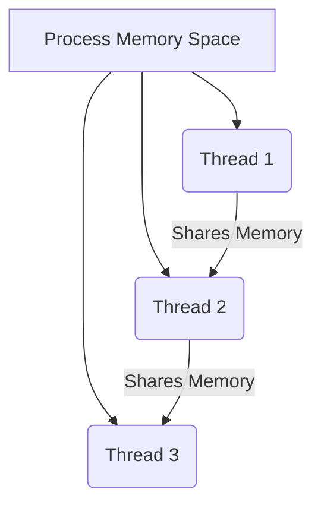

Links: [[00 Operating System]]
___
# Classification of Operating Systems
Operating systems are classified based on how they manage information, hardware, and users. The architecture and goals of the OS determine its category.

### Batch Operating System
This is one of the earliest types of OS, designed for maximum **CPU utilization** in an era where computers were extremely expensive.

- Users did **not** interact with the computer directly.
- They prepared their jobs (programs, data, and control information) on an offline device like punch cards.
- These jobs were submitted to a computer operator.
- The operator would collect jobs with similar needs (e.g., all FORTRAN programs) and group them together into **batches**.
- The computer ran the batch sequentially, processing one job, and then immediately starting the next.

**Advantages:**
- Ideal for large, repetitive, non-interactive tasks (e.g., payroll, scientific calculations).
- Maximizes CPU utilization for these specific tasks, as it moves from one job to the next without waiting for slow user input.

**Disadvantages:**
- **Lack of interaction:** No user interaction with the program while it is executing.
- **High Turnaround Time:** The time from submitting a job to getting the result could be hours or days.
- **Hard to debug:** If a job failed, the user had to wait for the entire batch to finish, get the error printout, fix the bug, and resubmit the entire job, waiting for the next batch.

### Multiprogramming Operating System
This is an evolution of the batch system, designed to keep the CPU and I/O devices busy by overlapping their operations.

- The OS keeps several jobs in memory (in a "job pool") at once.
- The CPU starts executing one job.
- When that job has to wait for an I/O operation (which is much slower than the CPU), the OS **does not sit idle**.
- It **switches** the CPU to another job that is in memory and ready to run.
- When the first job's I/O is complete, it gets back in the queue for the CPU.

**Goal:** To maximize **CPU utilization** and overall system throughput.

**Key Concept:** This introduced the need for **CPU Scheduling** (deciding which job to run next).

### Time-Sharing Operating System
aka **Multitasking OS**

This is a logical extension of multiprogramming, designed to allow users to interact with the system.

- The CPU switches between tasks (processes) very frequently. This rapid switching is called **context switching**.
- **Time Quantum:** Each task is given a specific, short amount of time (time slice) to execute.
- When the time is up, the OS switches to the next task, even if the first one isn't finished or waiting for I/O.

**Goal:** To minimize **Response Time**.

**Result:** The switching is so fast (milliseconds) that it gives each user the illusion that they have exclusive control of the computer. This is the foundation for all modern, interactive operating systems (Windows, macOS, Linux).

### Real-Time Operating System (RTOS)
An OS intended to serve real-time applications where data processing must happen within strict, defined time constraints. Failure to meet the deadline is considered a system failure.

- **Hard Real-Time:**
    - Critical tasks *must* be completed on time, every time.
    - Missing a deadline causes total system failure.
    - *E.g., Airbag deployment, missile guidance, medical pacemakers, industrial control systems.*
- **Soft Real-Time:**
    - Missing a deadline results in degraded performance but not total failure. The task continues, but the result is less useful.
    - *E.g., Video streaming (a few dropped frames), online gaming (lag).*

### Network Operating System (NOS)
An OS that runs on a server and is designed to manage network resources such as files, printers, security, and user access.

- **Mechanism:** It features a local OS on each client machine and a powerful NOS on the server. The NOS provides services to the clients over the network.
- **Key Feature:** Users are **aware** that they are accessing resources on a different, remote machine (e.g., accessing a "network drive").
- It is a **tightly coupled** system at the OS level, meaning the networking is deeply integrated.

*E.g., Windows Server, Red Hat Enterprise Linux, Novell NetWare.*

### Distributed Operating System
A distributed OS manages a group of independent, networked computers and makes them *appear to be* a single, coherent system.

- **Mechanism:** The OS hides the fact that there are multiple, separate computers (called nodes). When a user runs a job, the OS may split it and run parts of it on different nodes for efficiency and load balancing.
- **Goal:** To provide **transparency**. The user is (ideally) unaware that multiple computers are involved. It looks and feels like one big computer.
- It is a **loosely coupled** system (each computer has its own memory and clock).
- **Advantages:** 
	- High fault tolerance
	- High Scalability
	- High Computational power.

### Multiprocessor Systems (Parallel Systems)
Also known as **Tightly Coupled Systems**. These systems have two or more processors (CPUs) in close communication, sharing the computer bus, clock, and memory.

- **Symmetric Multiprocessing (SMP):** All processors are peers; any processor can run any task, including OS tasks. This is the common modern design.
- **Asymmetric Multiprocessing (AMP):** Master-slave relationship. The master processor schedules tasks and manages the system; slave processors only execute user code.

**Advantages:**
- **Increased Throughput:** More work done in less time by running tasks in parallel.
- **Economy of Scale:** Cheaper than multiple separate systems because they share peripherals, power, and memory.
- **Reliability (Fault Tolerance):** If one processor fails, the others can pick up the workload. This is called **graceful degradation**.

**Disadvantages:**
- **Increased Complexity:** The OS is much more complex, as it must manage multiple CPUs, handle synchronization, and prevent deadlocks.
- **Communication Overhead:** Processors need to communicate with each other, which adds overhead and can become a bottleneck.
- **Large Main Memory Required:** All processors share memory, so a larger pool of fast memory is needed.

### Multiuser Systems
An operating system that allows multiple, distinct users to access a single computer system at the same time.

- **Mechanism:** This is typically implemented using **Time-Sharing** to divide CPU time among users.
- **Key Feature:** The OS *must* handle **protection** and **security**. It must prevent one user from accessing, modifying, or interfering with another user's files or processes.

*E.g., Unix, Linux, and server versions of Windows.*

### Multiprocess Systems
(Note: Often synonymous with Multiprocessing, but focuses on the software capability).
It refers to the OS's ability to support the execution of multiple processes concurrently or in parallel.

* It allows a program to be broken into multiple processes that can run at the same time.
* Requires complex **Process Synchronization** mechanisms (Semaphores, Mutex) to prevent data inconsistency when processes share data.

### Multithreaded Systems
A **thread** is a lightweight sub-process; it is the smallest unit of processing that the OS can schedule.
A multithreaded OS allows different parts of a *single program* (process) to run concurrently.

- **Key Feature:** Threads within the same process share the same address space (memory), code, and open files.
- **Advantage:** **Context Switching** between threads is much faster than between processes because the OS doesn't need to change the memory map. This is ideal for tasks that need to share a lot of data, like a web server handling multiple requests.

