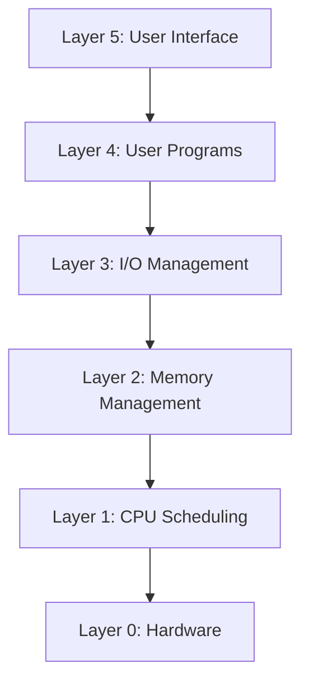

Links:
___
# Operating System Structure

This defines how the components of an OS are organized and interconnected. A good structure is crucial for efficiency, security, maintainability, and scalability.

The OS reserves a section of RAM for itself. This section contains the **Kernel**, which is the core of the operating system.

- **Resident Area:** This holds the kernel, which must be loaded in memory at all times for the system to function. It handles the most critical tasks.
- **Transient Area:** This part of the OS memory is for less-frequently used OS services or commands that are loaded from disk as needed and removed when done.

### Kernel Mode vs. User Mode

To protect the OS from user programs (and user programs from each other), modern CPUs have at least two modes of operation:

- **Kernel Mode (Privileged Mode):** The CPU has unrestricted access to all hardware and memory. The OS Kernel runs in this mode.
- **User Mode (Non-Privileged Mode):** The CPU has restricted access. It cannot directly access hardware or other processes' memory. User applications run in this mode.

A **System Call** is the mechanism a user program uses to request a service from the kernel (like opening a file). This causes a switch from User Mode to Kernel Mode.

### Monolithic Structure

This is the earliest and simplest structure. The entire operating system (all services: process management, memory management, file system, device drivers) is written as a single, large block of code that runs in a single address space in **kernel mode**.

There is no strong internal separation. All components can directly call any other component (just like a function call).

- **User View:** Applications run in user mode, and the entire OS runs in kernel mode.

**Advantages:**

- **High Performance:** Communication between components is a simple, very fast function call.
- **Simple Design (Initially):** All components are in one place.

**Disadvantages:**

- **Poor Reliability:** "A bug in one is a bug in all." A bug in one component (like a device driver) can crash the entire system.
- **Hard to Maintain:** The code is tightly coupled, making it hard to modify or debug. A change in one part can have unexpected side effects.
- **Poor Security:** All code runs with full privilege.

**Examples:** MS-DOS (which had no user/kernel mode separation), **UNIX**, **Linux** (though Linux is now "modular monolithic," allowing drivers to be loaded/unloaded).

### Layered Structure

This approach breaks the OS into several layers (or levels). The bottom layer (Layer 0) is the hardware, and the highest layer (Layer N) is the user interface.

A layer is built on top of the one below it. A key rule is that a layer can **only** use the functions and services provided by the layer _directly_ beneath it. Layer 3 cannot communicate directly with Layer 1.

This is a strict form of information hiding.

**Advantages:**

- **Modularity & Simplicity:** Easier to debug and maintain. You can test one layer at a time, starting from Layer 0.
- **Protection:** An error in one layer only affects the layers above it.

**Disadvantages:**

- **Performance Overhead:** A system call may have to pass through many layers, adding overhead for each layer-to-layer call. This is much slower than a monolithic system.
- **Hard to Define Layers:** It's difficult to cleanly separate OS functions into strict layers. (e.g., memory management may need access to the disk, which is on a lower layer).

**Examples:** The THE operating system, OS/2.

#### Layered Structure Diagram

### Microkernel Structure

This method structures the OS by removing all **non-essential** components from the kernel and implementing them as user-level programs (called "servers").

- The kernel itself is extremely small. It _only_ provides the bare minimum:
  - Inter-Process Communication (IPC)
  - Basic Memory Management
  - Basic Process/Thread Scheduling
- Everything else (file systems, device drivers, network stack, GUI) runs as a separate process in **user space**.
- **Communication:** Components communicate by passing messages through the microkernel (using IPC).

**Advantages:**

- **High Reliability & Security:** A bug in a user-space "server" (like a device driver) will only crash that server, not the entire OS.
- **Extensibility & Flexibility:** New services can be added or removed without rebooting or modifying the kernel.
- **Portability:** Easier to port to new hardware, as only the small microkernel needs to be changed.

**Disadvantages:**

- **Performance Overhead:** Communication between servers in user space (via message passing) is much slower than simple function calls inside a monolithic kernel.

**Examples:** QNX, L4. (Note: Windows XP/NT/11 is _not_ a pure microkernel; it is a **Hybrid Kernel**).

### Hybrid Kernel (Modular Monolithic)

This is the dominant modern approach. It's a compromise that combines the speed of a monolithic kernel with the reliability and modularity of a microkernel.

- **Mechanism:**
  - Starts with a microkernel for core services.
  - Adds _more_ services (like the file system, network stack, and graphics) back into kernel space for performance.
  - It is **modular**, meaning device drivers and other services can be loaded and unloaded dynamically _into_ the kernel at runtime.
- **Result:** It's faster than a pure microkernel (as key services are in-kernel) but more reliable and flexible than a pure monolithic kernel.

**Examples:** **Microsoft Windows** (NT/XP/10/11), **Apple macOS / iOS** (XNU kernel). Modern **Linux** is best described as a Modular Monolithic Kernel.

## Reentrant Kernels

This is not a _structure_ like the others, but a _property_ of a kernel's design, essential for modern multitasking.

A **reentrant kernel** is one whose code can be safely "re-entered." This means multiple processes can be executing in **kernel mode** at the same time without interfering with each other.

##### Why is this needed?

1.  **Interrupts:** A process (`P1`) is in kernel mode (doing a system call). A hardware interrupt (like a timer) occurs. The interrupt handler (which is _also_ kernel code) must be able to run _without_ corrupting the data `P1` was working on.
2.  **Preemption:** The timer interrupt's handler might decide to preempt `P1` (pause it) and run another process (`P2`). `P2` might _also_ make a system call, entering the kernel _before_ `P1` finished its system call.
3.  **Multiprocessing:** On a multi-core CPU, `CPU 1` can be running `P1` in kernel mode, while `CPU 2` is _simultaneously_ running `P2` in kernel mode.

##### How it works

- The kernel's code must be reentrant: it cannot store its state in global/static variables. All per-process data is stored in the process's own data structure (like its Process Control Block).
- Internal kernel data structures (like the process list) are protected by **locks** (like mutexes or spinlocks) to prevent race conditions.

**Result:** A reentrant kernel is more complex to design but is essential for any preemptive multitasking or multiprocessor system.

## Virtual Memory
[[17 Virtual Memory]]

(This is a memory management technique, not an OS structure).

Virtual memory is an abstraction that provides each process with its own large, private address space. This "virtual" address space is then mapped to physical RAM by the OS and hardware (Memory Management Unit - MMU).

- It is _implemented_ using techniques like **Paging** and **Swapping** (or demand paging).
  - **Swapping:** If the system runs out of physical RAM, the OS will move an inactive process or page of memory from RAM to a "swap file" (or swap partition) on the hard disk to free up RAM for other processes.
