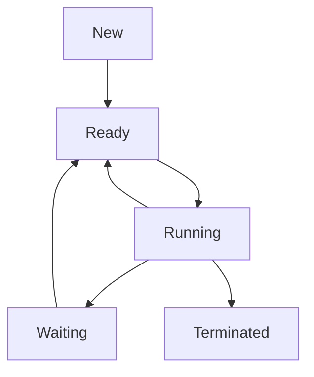

Links: [[06 CPU Scheduling]]
___
# Process

A process is a program that is in execution.

A process is much more than a program code, it is an active entity that also includes the **program counter**, a **process stack** (for temporary data), and a **data section** (for global variables).

> [!TIP] > Analogy: Program vs. Process
>
> - **Program** = **A Recipe Book**. It's just text on a page. It's passive. It sits on the shelf (Disk).
> - **Process** = **The Act of Cooking**. It's the recipe _in execution_. You are reading it, you have pots on the stove (CPU), ingredients on the counter (Memory), and you are keeping track of which step you are on (Program Counter).

### Process State

The state of a process is defined by its current activity. A process can only be in one state at a time.

- **New:** The process is being created. The OS is setting up its PCB.
- **Ready:** The process is in main memory (RAM) and is waiting to be assigned to a processor. It is in the **Ready Queue**.
- **Running:** Instructions are being executed on the CPU.
- **Waiting:** The process is waiting for some event to occur (such as an I/O completion, a signal, or a lock).
- **Terminated:** The process has finished execution. Its resources are being reclaimed by the OS.

#### Process State Transition Diagram

- **New -> Ready:** The OS has finished setting up the process.
- **Ready -> Running:** The **Short-Term Scheduler** (Dispatcher) chooses this process to run.
- **Running -> Ready:** The process's time slice (quantum) expires, or a higher-priority process arrives (preemption).
- **Running -> Waiting:** The process requests an I/O operation or calls `wait()`.
- **Waiting -> Ready:** The I/O operation completes, or the event the process was waiting for occurs.
- **Running -> Terminated:** The process calls `exit()` or is terminated by the OS.

### Process Control Block (PCB)

**PCB:** Process Control Block is a data structure in the kernel where the OS stores all information _about_ a specific process.

Each process is represented in the OS by its PCB. It is the "brain" of the process from the OS's perspective.

A PCB contains all info associated with a process:

- **Process State:** (New, Ready, Running, Waiting, Terminated).
- **Process ID (PID):** A unique identifier for the process.
- **Program Counter:** The address of the next instruction to be executed.
- **CPU Registers:** The set of values for all CPU registers (like accumulators, index registers) that must be saved when an interrupt occurs.
- **CPU Scheduling Info:** Process priority, pointers to scheduling queues.
- **Memory Management Info:** Pointers to the page table or segment table, base and limit registers.
- **Accounting Info:** CPU time used, time limits, etc.
- **I/O Status Info:** A list of I/O devices allocated to the process, open files, etc.

### Threads and their Management

A **thread** is a lightweight process. It is a basic unit of CPU utilization.

A traditional (heavyweight) process has one thread of control. If a process has multiple threads, it can perform multiple tasks at the same time.

#### Process vs. Thread

- **Threads** within the same process share:
  - Code section
  - Data section
  - Open files (and other OS resources)
- **Each thread** has its _own_:
  - **Program Counter**
  - **Register set**
  - **Stack**

#### Advantages of Threads

- **Responsiveness:** Allows a program to remain responsive even if part of it is blocked (e.g., UI thread vs. a background calculation thread).
- **Resource Sharing:** Threads share memory by default, which is simpler than IPC.
- **Economy:** It's cheaper (faster) to create and context-switch threads than processes.

#### Thread Models (User vs. Kernel)

This describes the relationship between user-level threads (managed by a library) and kernel-level threads (managed by the OS).

- **Many-to-One Model:** Many user-level threads are mapped to a single kernel thread.
  - _Pro:_ Fast thread management (no system calls).
  - _Con:_ If one thread makes a blocking system call, the entire process blocks.
- **One-to-One Model:** Each user-level thread is mapped to one kernel thread.
  - _Pro:_ True parallelism. A blocking call doesn't stop other threads.
  - _Con:_ More overhead. Creating a user thread requires creating a kernel thread.
  - _This is the model used by Windows, Linux, and modern OSes._
- **Many-to-Many Model:** A pool of user threads is mapped to a smaller or equal-sized pool of kernel threads.
  - _Pro:_ A balance of both models.
  - _Con:_ Very complex to implement.
