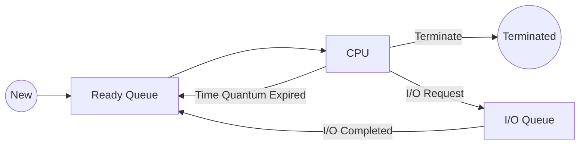

Links: [[04 Process]]
___
# Process Scheduling

The OS must decide which process to run. This selection is done by a scheduler.

#### Process Mix

There are two main types of processes:

- **I/O Bound:** Spends more time doing I/O than computation (e.g., text editor).
- **CPU Bound:** Spends more time doing computations (e.g., video rendering).

A good **process mix** (a mix of I/O and CPU-bound processes in the ready queue) is needed to keep both the CPU and I/O devices busy.

#### Scheduling Queues

The OS maintains queues for processes.

- **Ready Queue:** Contains all processes in the 'Ready' state, waiting for CPU time.
- **I/O Device Queues:** A separate queue for each I/O device (e.g., disk, network), containing processes in the 'Waiting' state, waiting for that device.

#### Scheduling Queues Diagram

#### Types of Schedulers

- **Long-Term Scheduler (Job Scheduler):**

  - Selects processes from a "job pool" on the disk and loads them into main memory (RAM) to be run.
  - It controls the **degree of multiprogramming** (how many processes are in memory).
  - It is responsible for maintaining a good process mix (I/O and CPU bound).
  - It runs infrequently (seconds or minutes).

- **Short-Term Scheduler (CPU Scheduler):**

  - Selects a process from the **Ready Queue** (in memory) and allocates the CPU to it.
  - It runs very frequently (milliseconds), every time a context switch needs to happen.
  - This is what [[06 CPU Scheduling]] algorithms (like FCFS, SJF, Round Robin) are for.

- **Medium-Term Scheduler:**
  - This is an intermediate scheduler, often used in time-sharing systems.
  - It is responsible for **swapping**. It can remove a process from memory (swap it out to disk) to reduce the degree of multiprogramming and free up RAM.
  - Later, it can "swap in" the process to continue execution.
