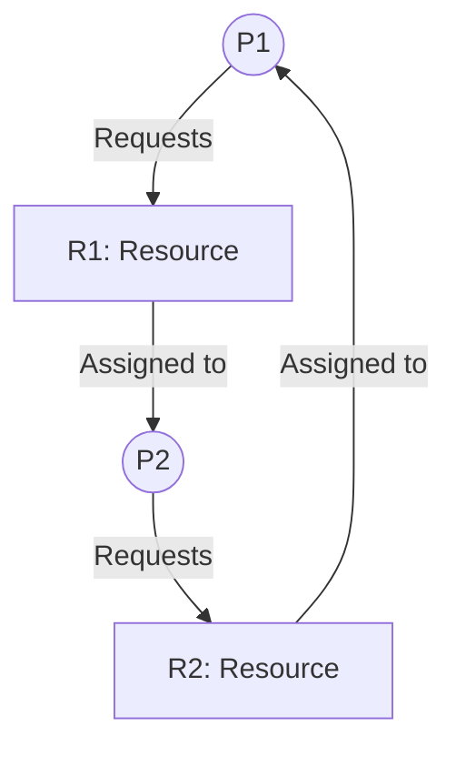

Links: [[04 Process]]
___
# Deadlocks

A deadlock is a situation where a set of two or more processes are permanently blocked, each holding a resource and waiting to acquire a resource held by another process in the set.

> [!TIP] > Analogy: Traffic Jam at a 4-Way Intersection
>
> - **Resource**: The road space in the intersection.
> - **Process**: A Car.
> - **Deadlock**: Four cars arrive simultaneously. Each car moves into the intersection (Holds Resource) and needs to move forward (Wait for Resource), but the car in front is blocking it.
> - **Result**: No one can move. The only way to fix it is to reverse a car (Preemption/Rollback) or lift it out (Process Termination).

### System Model

For a deadlock to occur, we must be in a system with a finite number of resources, which are partitioned into several resource types (e.g., CPU, Memory, Printers, Files).

- Each resource type $R_{i}$ has $W_{i}$ instances.
- A process must `Request`, `Use`, and then `Release` a resource.

### Deadlock Characterization

A deadlock can arise if and only if **four conditions** hold simultaneously in a system:

1.  **Mutual Exclusion:** At least one resource must be non-shareable. Only one process can use the resource at a time.
2.  **Hold and Wait:** A process must be holding at least one resource and be waiting to acquire additional resources that are currently held by other processes.
3.  **No Preemption:** Resources cannot be forcibly taken away. A resource can only be released _voluntarily_ by the process holding it.
4.  **Circular Wait:** A set of waiting processes ${P_{0}, P_{0}, ..., P_{n}}$ exists such that P0 is waiting for a resource held by $P_{1}$, $P_{1}$ is waiting for a resource held by $P_{2}$, ..., $P_{n-1}$ is waiting for a resource held by $P_{n}$, and $P_{n}$ is waiting for a resource held by $P_{0}$.

#### Resource-Allocation Graph (RAG)

This is a directed graph used to visualize the state of resources.

- **Nodes:**
  - Processes are circles (P).
  - Resource types are squares (R). Dots inside the square represent instances.
- **Edges:**
  - **Request Edge:** A directed edge from a process to a resource (`P -> R`).
  - **Assignment Edge:** A directed edge from a resource _instance_ to a process (`R -> P`).

#### Resource Allocation Graph Example



**How to read it:**

- If the graph contains **no cycles**, the system is **not** in a deadlocked state.
- If the graph **contains a cycle**:
  - If each resource has only **one instance**, a cycle **guarantees** a deadlock.
  - If resources have **multiple instances**, a cycle **might** indicate a deadlock.

### Deadlock Prevention

This strategy involves ensuring that at least one of the four necessary conditions can _never_ hold, thus making deadlocks structurally impossible.

1. **Breaking Mutual Exclusion:** Make resources shareable. This is often impossible (e.g., a printer cannot be shared by two processes at the same time).
2. **Breaking Hold and Wait:**
   - **Method A:** Require a process to request _all_ its needed resources before it starts execution.
   - **Method B:** A process can only request resources when it is holding no other resources.
   - _Disadvantage:_ Low resource utilization; potential for starvation.
3. **Breaking No Preemption:** If a process `P1` requests a resource that is not available, `P1` must release all resources it is currently holding. These released resources are added to the list of resources for which other processes may be waiting.
   - _Disadvantage:_ Difficult to implement, and high overhead.
4. **Breaking Circular Wait:** Impose a total ordering (a hierarchy) on all resource types (e.g., R1=Disk, R2=Tape, R3=Printer).
   - A process can only request resources in an _increasing_ order. If a process holds `R2`, it can request `R3`, but it _cannot_ request `R1`.
   - _This is the most practical prevention technique._

### Deadlock Avoidance

This strategy requires the OS to be given advance information about the **maximum** number of resources each process will _ever_ need.

The OS uses this information to make decisions. When a process requests a resource, the OS checks if granting it would leave the system in a **safe state**.

**Safe State:** A system is in a safe state if there is _some sequence_ of process execution (a "safe sequence") that allows all processes to finish, even if they all request their maximum resources.

If granting a request leads to an **unsafe state**, the process must wait, even if the resource is currently available.

#### Banker's Algorithm

This is the classic avoidance algorithm. It requires several data structures:

- `Available`: Vector of length `m` (number of resource types) indicating available instances.
- `Max`: `n x m` matrix defining the maximum resources needed by each process `n`.
- `Allocation`: `n x m` matrix defining the resources currently held by each process.
- `Need`: `n x m` matrix (`Max - Allocation`) defining the remaining resources needed.

**1. Safety Algorithm (Checks if system is safe):**

1. Work = Available
   `Finish = [false, false, ..., false]`
2. Find an i such that:
   `Finish[i] == false AND Need[i] <= Work`
3. If no such i, go to step 5
4. Work = Work + Allocation[i]
   `Finish[i] = true`
   `Go to step 2`
5. If Finish is true for all i, the system is in a safe state.

**2. Resource-Request Algorithm (Handles a request `R` from `Pi`):**

```
1. If Request[i] > Need[i]: Error (process exceeded its max claim)

2. If Request[i] > Available: Pi must wait

3. Pretend to grant the request:

    Available = Available - Request[i]
    Allocation[i] = Allocation[i] + Request[i]
    Need[i] = Need[i] - Request[i]

4. Run the Safety Algorithm.

5. If the resulting state is SAFE:

    Grant the request.
    Else (state is UNSAFE):
    Roll back the "pretend" changes and make Pi wait.
```

### Deadlock Detection

This strategy allows the system to enter a deadlock state. It uses an algorithm that runs periodically to check if a deadlock has occurred.

- **Detection Algorithm:**
  - This algorithm is almost identical to the Banker's Safety Algorithm, but it uses the _current_ `Request` of a process instead of its `Need`.
  - It checks if a safe sequence _can_ be found.
  - If `Finish[i]` is `false` for any process `Pi` after the algorithm completes, that process is part of a deadlock.

### Recovery from Deadlock

Once a deadlock is detected, the system must recover.

1. **Process Termination:**
   - **Abort all deadlocked processes:** This is the "hammer" approach. It's simple but expensive, as all work is lost.
   - **Abort one process at a time:** Select and abort one process, then re-run the detection algorithm. Repeat until the deadlock is broken.
   - _Selection criteria:_ Which process to abort? (Lowest priority? Least progress? Most resources held?)
2. **Resource Preemption:**
   - Forcibly take a resource from one process (the "victim") and give it to another.
   - This is complex and has three main problems:
     1. **Victim selection:** Which resource and which process to preempt?
     2. **Rollback:** The victim process is now in an inconsistent state. It must be rolled back to a previous safe state, which requires saving checkpoints.
     3. **Starvation:** The same process might be chosen as the victim repeatedly, preventing it from ever finishing.
