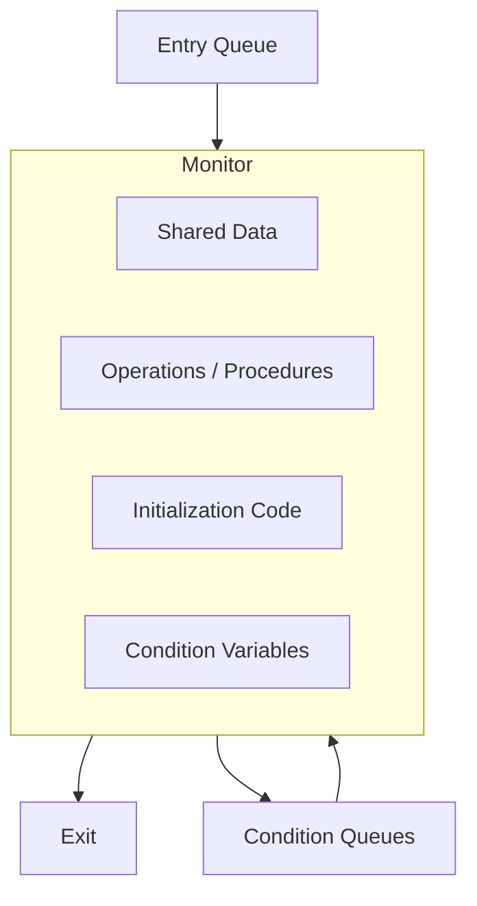

Links: [[College/Operating System/08 Concurrency]], [[09 Critical Section Problem]]
___
# Process Synchronization Mechanisms

To solve the Critical Section Problem and manage concurrent processes, we use various mechanisms ranging from low-level hardware instructions to high-level software constructs.

### Test-and-Set Operation

This is a **hardware solution** to the synchronization problem. It is a special machine instruction that is executed **atomically** (non-interruptible).

If two `TestAndSet` instructions are executed simultaneously (on different CPUs), they will be executed sequentially in some arbitrary order.

**Definition of the instruction:**
The hardware performs the following steps as a single unit of work:

1.  Read the current value of a boolean variable.
2.  Set the variable to `TRUE`.
3.  Return the _original_ value.

```c
boolean TestAndSet(boolean *target) {
    boolean rv = *target;
    *target = TRUE;
    return rv;
}
```

Implementing Mutual Exclusion with Test-and-Set:

We use a shared boolean variable lock, initialized to FALSE.

```c
do {
    // Entry Section
    // Keep looping (busy wait) as long as TestAndSet returns TRUE.
    // It returns TRUE only if the lock was ALREADY held by someone else.
    while (TestAndSet(&lock));

    // Critical Section
    // ... access shared resources ...

    // Exit Section
    lock = FALSE;

    // Remainder Section
} while (TRUE);
```

- **Advantage:** Simple to implement if the hardware supports it.

- **Disadvantage:** **Busy Waiting** (Spinlock). The process consumes CPU cycles while waiting for the lock.

### Semaphores

A **Semaphore** is a synchronization tool provided by the Operating System (unlike Test-and-Set which is hardware). It is an integer variable that, apart from initialization, is accessed only through two standard atomic operations: `wait()` and `signal()`.

Historically, these were called `P()` (Proberen - to test) and `V()` (Verhogen - to increment).

**Operations:**

- **`wait(S)`:** Decrements the semaphore value. If the value becomes negative, the process blocks.
- **`signal(S)`:** Increments the semaphore value. If there are blocked processes, one is woken up.

#### Types of Semaphores

1. **Binary Semaphore (Mutex):**
   - Can only range between 0 and 1.
   - Used to solve the Critical Section problem (locking).
   - Initialized to 1.
2. **Counting Semaphore:**
   - Can range over an unrestricted domain.
   - Used to control access to a resource that has multiple instances (e.g., 5 printers).
   - Initialized to the number of available resources (e.g., `S = 5`).

Implementation with Blocking (No Busy Wait):
To avoid busy waiting, the semaphore keeps a waiting queue.

```c
typedef struct {
    int value;
    struct process *list; // Queue of waiting processes
} semaphore;

void wait(semaphore *S) {
    S->value--;
    if (S->value < 0) {
        // Add this process to S->list
        block(); // System call to suspend process
    }
}

void signal(semaphore *S) {
    S->value++;
    if (S->value <= 0) {
        // Remove a process P from S->list
        wakeup(P); // System call to resume process
    }
}
```

**Example: Protecting Critical Section**

```c
semaphore mutex = 1;

do {
    wait(&mutex); // If mutex is 1, it becomes 0 and we enter.
                  // If mutex is 0, it becomes -1 and we block.

    // Critical Section

    signal(&mutex); // Increment mutex, waking up next process if any.

    // Remainder Section
} while (TRUE);
```

### Monitors

A **Monitor** is a high-level synchronization construct (a programming language concept) that is easier to use than semaphores.

A monitor is an **Abstract Data Type (ADT)** or a class that groups together:

1. Shared data (variables).
2. Procedures (methods) that operate on the data.
3. Initialization code.

**Key Property:** The monitor construct ensures that **only one process can be active within the monitor at a time**. Mutual exclusion is provided automatically by the compiler/language.

#### Monitor Architecture



#### Condition Variables

Since the monitor handles mutual exclusion, we need a way for processes to wait for specific conditions (e.g., "buffer is not full"). We use **Condition Variables** (e.g., `x`, `y`) with two operations:

1. **`x.wait()`:** The process invoking this is suspended and placed in a queue associated with condition `x`. It effectively "leaves" the monitor so another process can enter.
2. **`x.signal()`:** Resumes exactly one suspended process from `x`'s queue. If no process is waiting, the signal has no effect.

### Comparison

| Feature              | Test-and-Set                | Semaphore                   | Monitor                            |
| -------------------- | --------------------------- | --------------------------- | ---------------------------------- |
| **Level**            | Hardware Instruction        | OS Primitive                | High-level Language Construct      |
| **Implementation**   | Complex logic in user code  | `wait()` and `signal()`     | Procedures and Condition Variables |
| **Mutual Exclusion** | Must be programmed manually | Must be programmed manually | Automatic (Implicit)               |
| **Waiting Style**    | Busy Waiting (Spinlock)     | Blocking (Sleep)            | Blocking (Sleep)                   |
| **Error Prone**      | High (Hard to debug)        | Medium (Timing errors)      | Low (Structured)                   |
