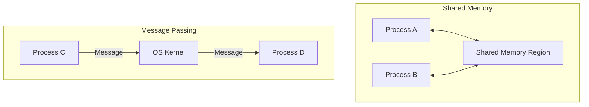

Links: [[College/Operating System/08 Concurrency]], [[09 Critical Section Problem]]
___
# Inter-Process Communication (IPC)

Processes executing concurrently in the operating system may be either **independent** processes or **cooperating** processes.

- **Independent:** Cannot affect or be affected by other processes.
- **Cooperating:** Can affect or be affected by other processes.

**Inter-Process Communication (IPC)** is a mechanism that allows cooperating processes to exchange data and information.

#### Reasons for IPC

- **Information Sharing:** Several users may be interested in the same piece of information (e.g., a shared file).
- **Computation Speedup:** If we want a task to run faster, we can break it into sub-tasks and run them in parallel.
- **Modularity:** Constructing the system in a modular fashion (e.g., separating the UI process from the database process).

There are two fundamental models of IPC:

1. **Shared Memory**
2. **Message Passing**

#### IPC Models Diagram

### Shared Memory Model

In this model, a region of memory that is shared by cooperating processes is established. Processes can then exchange information by reading and writing data to the shared region.

- **Mechanism:**
  1. A process creates a shared memory segment.
  2. Other processes "attach" this segment to their address space.
  3. Communication happens like normal memory access.
- **Role of OS:** The OS is only required to **establish** the memory. Once established, all accesses are treated as routine memory accesses, and no assistance from the kernel is required.
- **Advantage:** Very fast (memory speeds).
- **Disadvantage:**
  - The OS does not help with synchronization.
  - Processes are responsible for ensuring they are not writing to the same location simultaneously (Cache Coherency issues).

**The Producer-Consumer Problem** is the classic example used to illustrate shared memory challenges (See: [[Classical Problem in Concurrency- Producer / Consumer Problem]]).

### Message Passing Model

In this model, communication takes place by means of messages exchanged between the cooperating processes.

- **Mechanism:** Processes communicate with each other without resorting to shared variables.
- **Role of OS:** The OS provides the mechanism. Processes use **System Calls** (like `send()` and `receive()`).
- **Advantage:**
  - Easier to implement in a distributed environment (e.g., across a network).
  - No conflicts (OS handles the synchronization).
- **Disadvantage:** Slower than shared memory because every communication requires a **System Call** (kernel intervention).

IPC facility provides at least two operations:

- `send(message)`
- `receive(message)`

#### Implementation Issues

When implementing message passing, several design questions arise:

##### Naming (How do processes refer to each other?)

1. **Direct Communication:**
   - Each process must explicitly name the recipient or sender.
   - `send(P, message)`: Send a message to process P.
   - `receive(Q, message)`: Receive a message from process Q.
   - _Properties:_ A link is established automatically; the link is associated with exactly two processes.
2. **Indirect Communication (Mailboxes/Ports):**
   - Messages are sent to and received from **mailboxes** (or ports).
   - Each mailbox has a unique ID.
   - `send(A, message)`: Send a message to mailbox A.
   - `receive(A, message)`: Receive a message from mailbox A.
   - _Properties:_ A link is established only if processes share a mailbox; a link may be associated with more than two processes.

##### Synchronization (Blocking vs. Non-Blocking)

Message passing may be either blocking or non-blocking.

1. **Blocking (Synchronous):**
   - **Blocking Send:** The sender is blocked until the message is received.
   - **Blocking Receive:** The receiver is blocked until a message is available.
2. **Non-Blocking (Asynchronous):**
   - **Non-Blocking Send:** The sender sends the message and continues.
   - **Non-Blocking Receive:** The receiver retrieves a valid message or a null.

##### Buffering

Messages exchanged by communicating processes reside in a temporary queue.

1. **Zero Capacity:** The queue has a maximum length of 0. The link cannot have any messages waiting in it. The sender must block until the recipient receives the message (Rendezvous).
2. **Bounded Capacity:** The queue has finite length $N$. If the queue is not full, the new message is placed in the queue, and the sender continues. If the queue is full, the sender must block.
3. **Unbounded Capacity:** The queue's length is potentially infinite. The sender never blocks.

### Comparison: Shared Memory vs. Message Passing

| Feature            | Shared Memory                            | Message Passing                               |
| ------------------ | ---------------------------------------- | --------------------------------------------- |
| **Speed**          | Faster (Memory access speed)             | Slower (System call overhead)                 |
| **Implementation** | Complex (Needs explicit synchronization) | Simple (OS handles synchronization)           |
| **Data Volume**    | Efficient for large amounts of data      | Inefficient for large data (copying overhead) |
| **Environment**    | Best for single-computer systems         | Best for distributed systems (Network)        |
| **OS Involvement** | Only during setup                        | During every read/write operation             |
