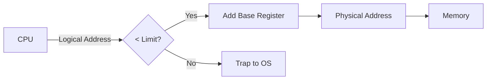
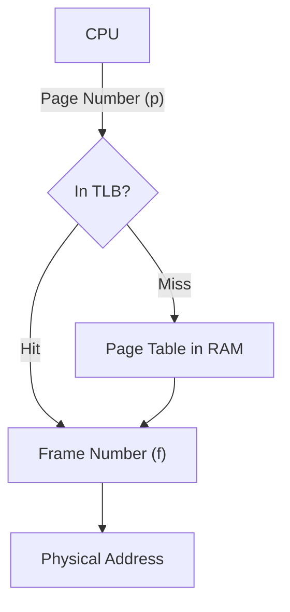

Links: [[14 Memory Management]], [[15 Multiprogramming MM]]
___
# Memory Protection Schemes

As we move to multiprogramming (multiple processes in RAM), it becomes critical to prevent one process from accessing or modifying the memory of another process or the Operating System.

#### Hardware Support: Base and Limit Registers

The CPU uses two special hardware registers to define the **valid range** of addresses a process can access.

1. **Base Register:** Holds the smallest legal physical memory address (the starting point).
2. **Limit Register:** Holds the size of the range (how much memory the process owns).

**Mechanism:**
Every time the CPU tries to access a memory address, the hardware checks:

$$\ce{ Base \leq Address < (Base + Limit) }$$

- If the check passes: Access granted.
- If the check fails: **Trap** to the OS (Segmentation Fault).

#### Hardware Protection Diagram

> [!TIP] Analogy
>
> Think of a Hotel.
>
> - **Base:** Room 101 (Where your section starts).
> - **Limit:** 2 Rooms (You rented 101 and 102).
> - If you try to open Room 105, your keycard won't work (Hardware trap).

## Paging

Paging is a memory management scheme that eliminates the need for contiguous allocation of physical memory. It solves the problem of **External Fragmentation**.

##### Key Concepts

1. **Frames (Physical):** We break physical memory (RAM) into fixed-sized blocks called **Frames** (e.g., 4 KB each).
2. **Pages (Logical):** We break the logical memory (User Program) into blocks of the _same_ size called **Pages**.

#### The Mechanism

When a process is to be executed, its **Pages** are loaded into any available **Frames** in memory. They do not need to be next to each other.

**The Page Table:** Since pages are scattered all over RAM, the OS needs a map to find them. This map is the Page Table.

- It translates **Logical Address** (Page Number) $\to$ **Physical Address** (Frame Number).

**Address Translation:** An address generated by the CPU is divided into:

- **Page Number (p):** Used as an index into the page table.
- **Page Offset (d):** The specific location inside that page.

> [!TIP] Analogy
>
> A Book.
>
> - **Logical View:** A book is a continuous story.
> - **Paging:** You tear all the pages out of the book.
> - **Physical View:** You stuff these pages into random empty slots in a bookshelf.
> - **Page Table:** The Index at the start of the book that tells you: "Page 1 is on Shelf 3", "Page 2 is on Shelf 9".

**Pros:** No External Fragmentation. Simple allocation.

**Cons:** Internal Fragmentation (The last page of a process might not be full).

![[Pasted image 20251119012802.png]]

### Hardware Implementation of the Page Table

The major performance issue with paging is that **every memory access requires two physical memory accesses:**

1. One access to read the **Page Table Entry** (PTE) from memory.
2. A second access to read the **actual data** from memory.

This effectively cuts the memory access speed in half. Hardware is needed to address this.

### Basic Implementation (PTBR)

For most systems, the Page Table is too large to fit into fast CPU registers and must reside in main memory (RAM).

- **Page-Table Base Register (PTBR):** This register holds the **starting physical address** of the page table in RAM.
- When a logical address is generated, the CPU uses the PTBR combined with the Page Number (`p`) to find the location of the corresponding Frame Number (`f`) in the Page Table.
- Once `f` is found, the physical address is calculated as `f` + `d` (offset).

### Hierarchical Paging (Multilevel)

For systems with very large logical address spaces (e.g., 64-bit systems), the page table itself can be huge (millions of entries) and consume excessive memory.

- **Mechanism:** The page table is divided into smaller pieces. The Page Number is partitioned into multiple parts (e.g., P1, P2).
- The first page number (`P1`) points to an outer page table, and the value from that table points to the base of an inner page table (indexed by `P2`).
- This structure saves memory because we only allocate page tables for the portions of the address space that are actually being used.

### Translation Look-Aside Buffer (TLB)

The TLB is a high-speed, small, associative memory (a cache) used to overcome the performance penalty of having to access memory twice per instruction (once for the page table, once for the data).

#### Mechanism

1. **Simultaneous Lookup:** The logical address's Page Number (`p`) is simultaneously sent to both the **TLB** and the main memory Page Table.
2. **TLB Hit:** If the Page Number is found in the TLB (a **TLB Hit**), the corresponding Frame Number (`f`) is retrieved instantly (one cycle), and the translation completes without accessing main memory's page table.
3. **TLB Miss:** If the Page Number is not in the TLB (a **TLB Miss**), the system must continue to access the Page Table in main memory (via PTBR) to get the Frame Number. Once retrieved, the entry is written to the TLB so that future accesses are fast.

4. **TLB Miss:** If the Page Number is not in the TLB (a **TLB Miss**), the system must continue to access the Page Table in main memory (via PTBR) to get the Frame Number. Once retrieved, the entry is written to the TLB so that future accesses are fast.

#### TLB Logic Diagram

#### Performance Impact (Effective Access Time - EAT)

The TLB dramatically reduces memory access time, measured by the **TLB Hit Ratio** (α): the percentage of times the Page Number is found in the TLB.

$$\ce{ EAT=(α×T_{ TLB​ }) + ((1− α)×(T_{ TLB​ } + 2 \times T_{ RAM​ })) }$$

Where:

- $\ce{ T_{ TLB } }$​: Time to access TLB (very fast, often 0 or 1 CPU cycle).
- $\ce{ T_{ RAM } }$​: Time to access main memory (disk latency excluded).
- **Ideal Scenario:** If α=98%, the EAT is very close to the single RAM access time.

#### Context Switching and TLB

When a **context switch** occurs (the CPU switches from Process A to Process B), the TLB is immediately **flushed** (cleared). This is necessary because the Page Numbers for Process A are meaningless to Process B, and leaving them in the cache would cause incorrect address translation.

## Segmentation

Paging separates memory blindly (fixed size). **Segmentation** supports the **user view** of memory. A user doesn't think of memory as a linear array of bytes, they think of it as a collection of logical units.

### Key Concepts

A program is a collection of **Segments**. A segment is a logical unit such as:

- Main program
- Function/Procedure
- Stack
- Symbol Table

Segments are of **variable length.**

**The Segment Table:** Maps logical two-dimensional addresses (Segment Number, Offset) to physical addresses.

- **Base:** Starting physical address.
- **Limit:** Length of the segment.

> Analogy:
>
> A House.
>
> You don't view your house as "2000 square feet of concrete." You view it as Segments: Kitchen, Bedroom, Bathroom.
>
> - They are different sizes.
> - They serve different purposes.
> - You refer to things like "The 3rd drawer (offset) in the Kitchen (segment)."

**Pros:** No Internal Fragmentation. reflects logical structure. protection is easier (e.g., "Read-only" on the Code segment).

**Cons:** External Fragmentation (Hard to find a contiguous space for a large segment).

## Paged Segmentation

This is a hybrid approach used in systems like MULTICS and Intel x86. It combines the advantages of both to solve their respective fragmentation problems.

- **Problem with Segmentation:** External Fragmentation.
- **Solution:** Paging.

**Mechanism:**

1. The Logical Memory is divided into **Segments** (Code, Data, Stack).
2. Each **Segment** is then divided into fixed-size **Pages**.
3. Ideally, the pages of a segment do not need to be contiguous in RAM.

To access memory, the CPU uses: **(Segment Number, Page Number, Offset)**.
